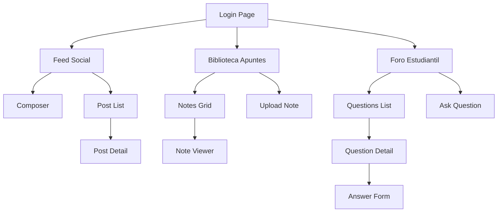

# CRUNEVO - Transformación a Módulos Dinámicos

## 1. Product Overview

Transformación de las páginas estáticas de CRUNEVO (Feed Social, Biblioteca de Apuntes y Foro Estudiantil) en módulos dinámicos y funcionales conectados a un backend real con Next.js API Routes, Prisma y React Query.

El objetivo es eliminar completamente los datos mock y crear un sistema robusto de interacción social académica que permita a los estudiantes compartir contenido, hacer preguntas y acceder a recursos educativos de manera dinámica.

## 2. Core Features

### 2.1 User Roles

| Role | Registration Method | Core Permissions |
|------|---------------------|------------------|
| Estudiante | NextAuth.js (email/OAuth) | Crear posts, subir apuntes, hacer preguntas, votar, comentar |
| Usuario Verificado | Verificación universitaria | Todas las funciones + badge de verificación |

### 2.2 Feature Module

Nuestro sistema de módulos dinámicos consiste en las siguientes páginas principales:

1. **Feed Social (/feed)**: composer de posts, lista infinita de posts, sistema de reacciones y comentarios.
2. **Biblioteca de Apuntes (/notes)**: subida de archivos, visualización con filtros, sistema de descargas y ratings.
3. **Foro Estudiantil (/forum)**: creación de preguntas, sistema de respuestas, votación y mejor respuesta.

### 2.3 Page Details

| Page Name | Module Name | Feature description |
|-----------|-------------|---------------------|
| Feed Social | Composer | Crear posts de texto, notas o preguntas con validación y autenticación |
| Feed Social | PostList | Mostrar posts con scroll infinito, reacciones 🔥, comentarios y bookmarks |
| Feed Social | Interactions | Like/unlike posts, agregar comentarios, guardar posts favoritos |
| Biblioteca Apuntes | Upload System | Subir archivos PDF/imágenes con metadata (título, descripción, tags, materia) |
| Biblioteca Apuntes | Notes Grid | Visualizar apuntes con filtros por carrera, materia, rating y búsqueda |
| Biblioteca Apuntes | Note Viewer | Ver detalles del apunte, descargar archivos, sistema de rating y comentarios |
| Foro Estudiantil | Question Creator | Crear preguntas con título, contenido, tags y sistema de bounty opcional |
| Foro Estudiantil | Questions List | Listar preguntas con filtros, ordenamiento y búsqueda avanzada |
| Foro Estudiantil | Question Detail | Ver pregunta completa con respuestas, sistema de votación y mejor respuesta |
| Foro Estudiantil | Answer System | Responder preguntas, votar respuestas, marcar como mejor respuesta |

## 3. Core Process

### Flujo de Usuario Estudiante:
1. **Autenticación**: Login con NextAuth.js → Acceso a todas las funcionalidades
2. **Feed Social**: Crear post → Interactuar con posts (like, comentar, guardar) → Ver feed personalizado
3. **Biblioteca**: Buscar apuntes → Ver detalles → Descargar/Rating → Subir propios apuntes
4. **Foro**: Buscar preguntas → Ver detalles → Responder/Votar → Crear nuevas preguntas

## 4. User Interface Design

### 4.1 Design Style
- **Colores primarios**: Gradientes púrpura-azul (#8B5CF6 a #3B82F6)
- **Colores secundarios**: Grises neutros (#F8FAFC, #64748B)
- **Estilo de botones**: Redondeados con gradientes y efectos hover
- **Tipografía**: Inter, tamaños 12px-32px según jerarquía
- **Layout**: Card-based con espaciado generoso, navegación top fija
- **Iconos**: Lucide React con emojis para categorías

### 4.2 Page Design Overview

| Page Name | Module Name | UI Elements |
|-----------|-------------|-------------|
| Feed Social | Composer | Card blanca con avatar, textarea expandible, botones de acción con iconos, contador de caracteres |
| Feed Social | PostList | Cards con gradiente sutil, avatares circulares, badges de tipo de post, botones de interacción con contadores |
| Biblioteca Apuntes | Notes Grid | Grid responsivo, cards con thumbnails, ratings con estrellas, badges de materia y precio |
| Biblioteca Apuntes | Upload Form | Drag & drop area, progress bars, formulario multi-step con validación visual |
| Foro Estudiantil | Questions List | Lista con avatares, badges de estado (resuelto/abierto), contadores de votos y respuestas |
| Foro Estudiantil | Question Detail | Layout de dos columnas, sistema de votación lateral, respuestas anidadas con highlighting |

### 4.3 Responsiveness
Diseño mobile-first con breakpoints en 768px y 1024px. Navegación adaptativa con sidebar colapsable en desktop y bottom navigation en mobile. Optimización táctil para interacciones de like, vote y bookmark.