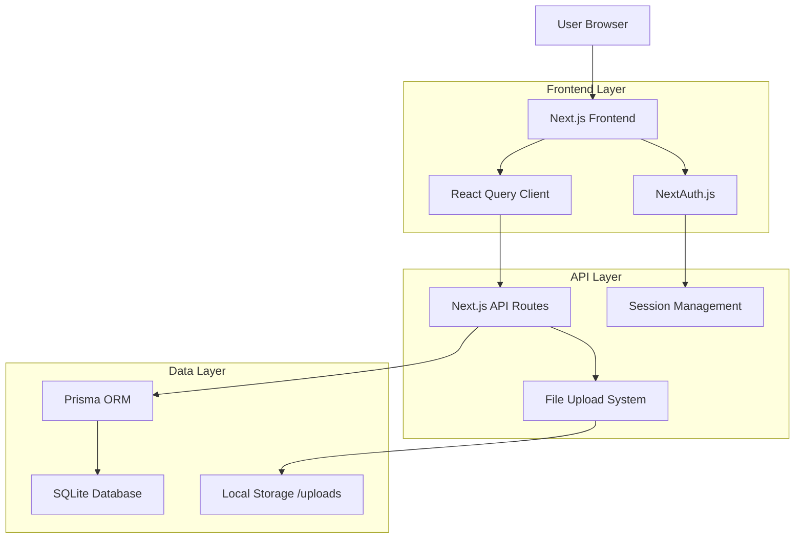
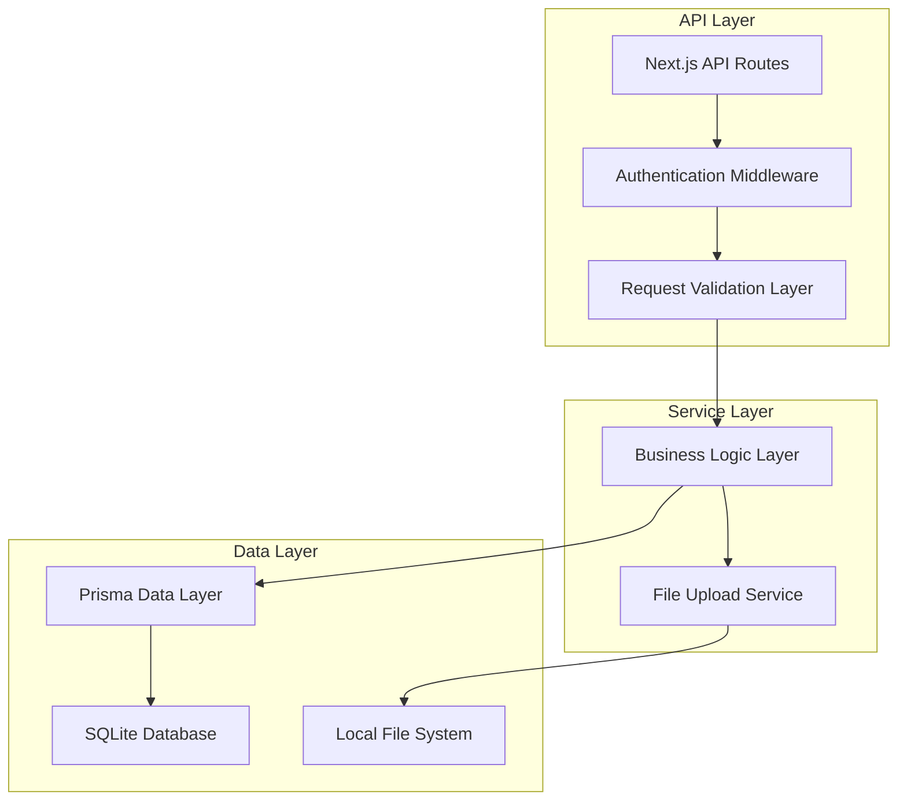
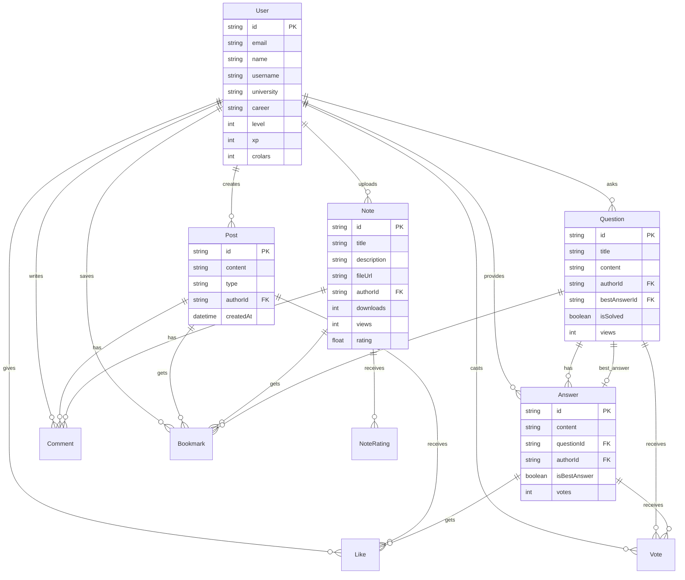

# CRUNEVO - Arquitectura Técnica para Módulos Dinámicos

## 1. Architecture Design



## 2. Technology Description

* Frontend: React\@18 + Next.js\@14 + TailwindCSS\@3 + shadcn/ui + React Query\@5

* Backend: Next.js API Routes + NextAuth.js

* Database: Prisma\@5 + SQLite

* File Storage: Local filesystem (/uploads)

* Validation: Zod\@3

## 3. Route Definitions

| Route          | Purpose                                   |
| -------------- | ----------------------------------------- |
| /feed          | Feed social con composer y lista de posts |
| /notes         | Biblioteca de apuntes con grid y filtros  |
| /notes/upload  | Formulario de subida de apuntes           |
| /forum         | Foro estudiantil con lista de preguntas   |
| /forum/ask     | Formulario para crear preguntas           |
| /auth/login    | Página de autenticación                   |
| /auth/register | Página de registro                        |

## 4. API Definitions

### 4.1 Feed Social APIs

**Crear Post**

```
POST /api/feed
```

Request:

| Param Name | Param Type | isRequired | Description                        |
| ---------- | ---------- | ---------- | ---------------------------------- |
| content    | string     | true       | Contenido del post (max 500 chars) |
| type       | string     | true       | Tipo: 'TEXT', 'NOTE', 'QUESTION'   |
| tags       | string\[]  | false      | Array de tags                      |

Response:

| Param Name | Param Type | Description            |
| ---------- | ---------- | ---------------------- |
| success    | boolean    | Estado de la operación |
| post       | Post       | Objeto post creado     |

Example:

```json
{
  "content": "¿Alguien tiene apuntes de Cálculo II?",
  "type": "QUESTION",
  "tags": ["matematicas", "calculo"]
}
```

**Obtener Feed**

```
GET /api/feed?page=1&limit=10
```

Response:

```json
{
  "posts": [
    {
      "id": "clx123",
      "content": "Contenido del post",
      "type": "TEXT",
      "author": {
        "id": "user123",
        "name": "Juan Pérez",
        "image": "/avatars/user123.jpg"
      },
      "createdAt": "2024-01-20T10:30:00Z",
      "_count": {
        "likes": 5,
        "comments": 2,
        "bookmarks": 1
      },
      "isLiked": false,
      "isBookmarked": false
    }
  ],
  "hasMore": true,
  "nextPage": 2
}
```

**Reaccionar a Post**

```
POST /api/feed/[id]/react
```

Request:

| Param Name | Param Type | isRequired | Description              |
| ---------- | ---------- | ---------- | ------------------------ |
| type       | string     | true       | Tipo de reacción: 'fire' |

**Comentarios**

```
GET /api/feed/[id]/comments
POST /api/feed/[id]/comments
```

**Guardar Post**

```
POST /api/feed/[id]/bookmark
```

### 4.2 Biblioteca de Apuntes APIs

**Subir Apunte**

```
POST /api/notes
```

Request (multipart/form-data):

| Param Name  | Param Type | isRequired | Description                    |
| ----------- | ---------- | ---------- | ------------------------------ |
| title       | string     | true       | Título del apunte              |
| description | string     | false      | Descripción                    |
| file        | File       | true       | Archivo PDF/imagen             |
| subject     | string     | true       | Materia                        |
| career      | string     | true       | Carrera                        |
| tags        | string     | false      | Tags separados por coma        |
| price       | number     | false      | Precio en Crolars (0 = gratis) |

**Obtener Apuntes**

```
GET /api/notes?category=matematicas&career=ingenieria&page=1
```

**Detalle de Apunte**

```
GET /api/notes/[id]
```

### 4.3 Foro APIs

**Crear Pregunta**

```
POST /api/forum/questions
```

Request:

| Param Name | Param Type | isRequired | Description           |
| ---------- | ---------- | ---------- | --------------------- |
| title      | string     | true       | Título de la pregunta |
| content    | string     | true       | Contenido detallado   |
| subject    | string     | false      | Materia relacionada   |
| tags       | string\[]  | false      | Tags de la pregunta   |
| bounty     | number     | false      | Recompensa en Crolars |

**Listar Preguntas**

```
GET /api/forum/questions?subject=matematicas&sort=recent
```

**Detalle de Pregunta**

```
GET /api/forum/questions/[id]
```

**Responder Pregunta**

```
POST /api/forum/questions/[id]/answers
```

**Votar Respuesta**

```
POST /api/forum/answers/[id]/vote
```

Request:

| Param Name | Param Type | isRequired | Description                     |
| ---------- | ---------- | ---------- | ------------------------------- |
| value      | number     | true       | 1 para upvote, -1 para downvote |

**Marcar Mejor Respuesta**

```
POST /api/forum/questions/[id]/accept
```

Request:

| Param Name | Param Type | isRequired | Description                 |
| ---------- | ---------- | ---------- | --------------------------- |
| answerId   | string     | true       | ID de la respuesta a marcar |

## 5. Server Architecture Diagram



## 6. Data Model

### 6.1 Data Model Definition



### 6.2 Data Definition Language

**Extensiones al Schema Prisma Existente**

```prisma
// Agregar al modelo User existente
model User {
  // ... campos existentes ...
  
  // Nuevas relaciones para módulos dinámicos
  feedPosts     Post[]        @relation("UserPosts")
  feedLikes     Like[]        @relation("UserLikes")
  feedComments  Comment[]     @relation("UserComments")
  feedBookmarks Bookmark[]    @relation("UserBookmarks")
  
  forumQuestions Question[]   @relation("UserQuestions")
  forumAnswers   Answer[]     @relation("UserAnswers")
  forumVotes     Vote[]       @relation("UserVotes")
}

// Extender modelo Post existente
model Post {
  // ... campos existentes ...
  
  // Campos adicionales para feed dinámico
  tags        String?       // JSON array de tags
  attachments String?       // JSON array de archivos adjuntos
  
  // Relaciones para interacciones
  feedLikes     Like[]      @relation("PostLikes")
  feedComments  Comment[]   @relation("PostComments")
  feedBookmarks Bookmark[]  @relation("PostBookmarks")
}

// Nuevos modelos para funcionalidad dinámica
model Like {
  id        String   @id @default(cuid())
  userId    String
  postId    String?
  answerId  String?
  
  user      User     @relation("UserLikes", fields: [userId], references: [id], onDelete: Cascade)
  post      Post?    @relation("PostLikes", fields: [postId], references: [id], onDelete: Cascade)
  answer    Answer?  @relation("AnswerLikes", fields: [answerId], references: [id], onDelete: Cascade)
  
  createdAt DateTime @default(now())
  
  @@unique([userId, postId])
  @@unique([userId, answerId])
  @@map("feed_likes")
}

model Comment {
  id        String   @id @default(cuid())
  content   String
  userId    String
  postId    String?
  noteId    String?
  
  user      User     @relation("UserComments", fields: [userId], references: [id], onDelete: Cascade)
  post      Post?    @relation("PostComments", fields: [postId], references: [id], onDelete: Cascade)
  note      Note?    @relation(fields: [noteId], references: [id], onDelete: Cascade)
  
  createdAt DateTime @default(now())
  
  @@map("feed_comments")
}

model Bookmark {
  id         String    @id @default(cuid())
  userId     String
  postId     String?
  noteId     String?
  questionId String?
  
  user       User      @relation("UserBookmarks", fields: [userId], references: [id], onDelete: Cascade)
  post       Post?     @relation("PostBookmarks", fields: [postId], references: [id], onDelete: Cascade)
  note       Note?     @relation(fields: [noteId], references: [id], onDelete: Cascade)
  question   Question? @relation(fields: [questionId], references: [id], onDelete: Cascade)
  
  createdAt  DateTime  @default(now())
  
  @@unique([userId, postId])
  @@unique([userId, noteId])
  @@unique([userId, questionId])
  @@map("bookmarks")
}

model Vote {
  id         String    @id @default(cuid())
  value      Int       // 1 for upvote, -1 for downvote
  userId     String
  questionId String?
  answerId   String?
  
  user       User      @relation("UserVotes", fields: [userId], references: [id], onDelete: Cascade)
  question   Question? @relation(fields: [questionId], references: [id], onDelete: Cascade)
  answer     Answer?   @relation(fields: [answerId], references: [id], onDelete: Cascade)
  
  createdAt  DateTime  @default(now())
  
  @@unique([userId, questionId])
  @@unique([userId, answerId])
  @@map("votes")
}

// Extender modelos Question y Answer existentes
model Question {
  // ... campos existentes ...
  
  // Nuevas relaciones
  forumVotes     Vote[]      @relation
  forumBookmarks Bookmark[]  @relation
}

model Answer {
  // ... campos existentes ...
  
  // Nuevas relaciones
  forumVotes Vote[]  @relation
  answerLikes Like[] @relation("AnswerLikes")
}
```

**Script de Migración**

```bash
# Generar migración
npx prisma migrate dev --name add_dynamic_modules

# Aplicar cambios
npx prisma generate

# Ejecutar seed
npx prisma db seed
```

**Datos de Seed (prisma/seed.ts)**

```typescript
import { PrismaClient } from '@prisma/client'
import bcrypt from 'bcryptjs'

const prisma = new PrismaClient()

async function main() {
  // Crear usuarios de prueba
  const hashedPassword = await bcrypt.hash('password123', 10)
  
  const user1 = await prisma.user.create({
    data: {
      email: 'maria@unmsm.edu.pe',
      name: 'María González',
      username: 'maria_gonzalez',
      password: hashedPassword,
      university: 'Universidad Nacional Mayor de San Marcos',
      career: 'Ingeniería de Sistemas',
      level: 3,
      xp: 1250,
      crolars: 500
    }
  })
  
  const user2 = await prisma.user.create({
    data: {
      email: 'carlos@pucp.edu.pe',
      name: 'Carlos Mendoza',
      username: 'carlos_mendoza',
      password: hashedPassword,
      university: 'Universidad Católica del Perú',
      career: 'Ingeniería de Sistemas',
      level: 2,
      xp: 890,
      crolars: 300
    }
  })
  
  // Crear posts de ejemplo
  const post1 = await prisma.post.create({
    data: {
      content: 'Acabo de terminar mi proyecto de Algoritmos. ¿Alguien quiere revisar el código?',
      type: 'TEXT',
      authorId: user1.id,
      tags: JSON.stringify(['algoritmos', 'programacion', 'proyecto'])
    }
  })
  
  // Crear apuntes de ejemplo
  const note1 = await prisma.note.create({
    data: {
      title: 'Cálculo Diferencial - Límites y Continuidad',
      description: 'Apuntes completos sobre límites, continuidad y derivadas',
      fileUrl: '/uploads/calculo_diferencial.pdf',
      fileName: 'calculo_diferencial.pdf',
      fileType: 'application/pdf',
      subject: 'Matemáticas',
      career: 'Ingeniería',
      university: 'UNMSM',
      authorId: user1.id,
      downloads: 156,
      views: 342,
      rating: 4.8,
      ratingCount: 25
    }
  })
  
  // Crear preguntas de ejemplo
  const question1 = await prisma.question.create({
    data: {
      title: '¿Cómo resolver ecuaciones cuadráticas paso a paso?',
      content: 'Necesito ayuda para entender el método de factorización y la fórmula cuadrática. ¿Podrían explicarme con ejemplos?',
      subject: 'Matemáticas',
      career: 'Ingeniería',
      university: 'UNMSM',
      authorId: user2.id,
      views: 45
    }
  })
  
  // Crear respuesta de ejemplo
  const answer1 = await prisma.answer.create({
    data: {
      content: 'Para resolver ecuaciones cuadráticas, tienes tres métodos principales: 1) Factorización, 2) Completar el cuadrado, 3) Fórmula cuadrática...',
      questionId: question1.id,
      authorId: user1.id,
      votes: 8
    }
  })
  
  // Marcar como mejor respuesta
  await prisma.question.update({
    where: { id: question1.id },
    data: { 
      bestAnswerId: answer1.id,
      status: 'SOLVED'
    }
  })
  
  // Crear interacciones de ejemplo
  await prisma.like.create({
    data: {
      userId: user2.id,
      postId: post1.id
    }
  })
  
  await prisma.vote.create({
    data: {
      userId: user2.id,
      answerId: answer1.id,
      value: 1
    }
  })
  
  await prisma.bookmark.create({
    data: {
      userId: user2.id,
      noteId: note1.id
    }
  })
  
  console.log('✅ Seed data created successfully!')
}

main()
  .catch((e) => {
    console.error(e)
    process.exit(1)
  })
  .finally(async () => {
    await prisma.$disconnect()
  })
```

