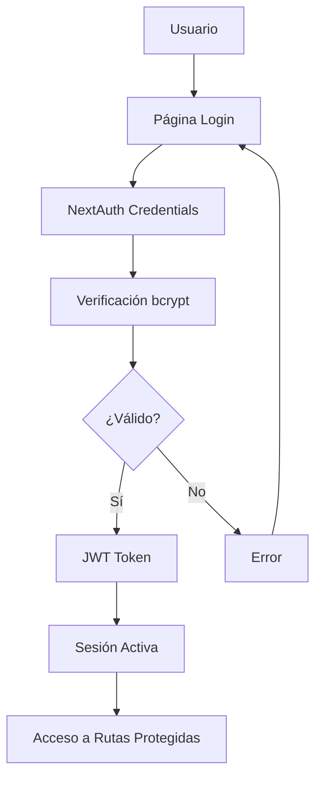

# Sistema de Autenticación CRUNEVO

## 📋 Análisis del Estado Actual

### ✅ Componentes Ya Implementados

* **NextAuth.js configurado** con Credentials Provider

* **Prisma Schema** con modelos de autenticación (Account, Session, User, VerificationToken)

* **Páginas de autenticación** básicas:

  * `/auth/login` - Página de inicio de sesión completa

  * `/auth/register` - Página de registro

  * `/auth/forgot-password` - Página de recuperación de contraseña

* **Funciones de utilidad** para hash/verificación de contraseñas con bcrypt

* **Configuración de sesión JWT** con callbacks personalizados

* **Modelo User extendido** con campos de gamificación y configuraciones de privacidad

### ❌ Componentes Faltantes

* **Middleware de protección de rutas** (`middleware.ts`)

* **Sistema de visibilidad** para posts (PUBLIC/FOLLOWERS/PRIVATE)

* **Perfiles públicos** en `/u/[username]`

* **Reset password** funcional con tokens temporales

* **Rate limiting** para APIs de autenticación

* **Google OAuth** (opcional)

* **Scripts de validación** (`check-auth.js`)

## 🏗️ Arquitectura de Autenticación

### Flujo de Autenticación



### Componentes del Sistema

1. **NextAuth.js** - Manejo de sesiones y autenticación
2. **Prisma** - ORM y gestión de base de datos
3. **bcrypt** - Hash seguro de contraseñas
4. **JWT** - Tokens de sesión
5. **Middleware** - Protección de rutas
6. **Rate Limiting** - Protección contra ataques

## 🗄️ Estructura de Base de Datos

### Modelos Principales

```prisma
// Autenticación NextAuth
model Account {
  id                String  @id @default(cuid())
  userId            String
  type              String
  provider          String
  providerAccountId String
  refresh_token     String?
  access_token      String?
  expires_at        Int?
  token_type        String?
  scope             String?
  id_token          String?
  session_state     String?
  user User @relation(fields: [userId], references: [id], onDelete: Cascade)
  @@unique([provider, providerAccountId])
}

model Session {
  id           String   @id @default(cuid())
  sessionToken String   @unique
  userId       String
  expires      DateTime
  user         User     @relation(fields: [userId], references: [id], onDelete: Cascade)
}

model User {
  id            String    @id @default(cuid())
  name          String?
  email         String    @unique
  emailVerified DateTime?
  image         String?
  username      String    @unique
  password      String?   // Hash bcrypt
  
  // Configuraciones de privacidad
  isPrivate     Boolean   @default(false)
  allowMessages Boolean   @default(true)
  showAchievements Boolean @default(true)
  showActivity     Boolean @default(true)
  
  // Configuraciones de notificaciones
  emailNotifications Boolean @default(true)
  pushNotifications Boolean @default(true)
  forumNotifications Boolean @default(true)
  
  // Relaciones
  accounts      Account[]
  sessions      Session[]
  posts         Post[]
  // ... otras relaciones
}

// Token para reset de contraseña
model PasswordResetToken {
  id        String   @id @default(cuid())
  email     String
  token     String   @unique
  expires   DateTime
  used      Boolean  @default(false)
  createdAt DateTime @default(now())
  
  @@unique([email, token])
}
```

### Sistema de Visibilidad

```prisma
enum Visibility {
  PUBLIC     // Visible para todos
  FOLLOWERS  // Solo para seguidores
  PRIVATE    // Solo para el autor
}

model Post {
  id         String     @id @default(cuid())
  content    String
  visibility Visibility @default(PUBLIC)
  authorId   String
  author     User       @relation(fields: [authorId], references: [id])
  // ... otros campos
}
```

## 🛡️ Protección de Rutas

### Middleware Configuration

```typescript
// middleware.ts
import { withAuth } from 'next-auth/middleware';

export default withAuth(
  function middleware(req) {
    // Lógica adicional si es necesaria
  },
  {
    callbacks: {
      authorized: ({ token, req }) => {
        const { pathname } = req.nextUrl;
        
        // Rutas públicas - no requieren autenticación
        const publicRoutes = [
          '/',
          '/about',
          '/help',
          '/terms',
          '/privacy',
          '/cookies',
          '/auth/login',
          '/auth/register',
          '/auth/forgot-password',
          '/auth/reset-password'
        ];
        
        // Rutas de perfil público
        if (pathname.startsWith('/u/')) return true;
        if (pathname.startsWith('/post/')) return true;
        if (pathname.startsWith('/notes/')) return true;
        
        // Verificar si es ruta pública
        if (publicRoutes.some(route => pathname.startsWith(route))) {
          return true;
        }
        
        // Rutas protegidas requieren token
        return !!token;
      }
    }
  }
);

export const config = {
  matcher: [
    '/((?!api/auth|_next/static|_next/image|favicon.ico).*)',
  ]
};
```

### Rutas Protegidas vs Públicas

#### 🔒 Rutas Protegidas (Requieren Autenticación)

* `/feed` - Feed principal

* `/workspace` - Espacio de trabajo

* `/settings` - Configuraciones

* `/notifications` - Notificaciones

* `/messages` - Mensajes

* `/composer` - Crear contenido

* Todas las APIs de escritura (`POST`, `PUT`, `DELETE`)

#### 🌐 Rutas Públicas (Acceso Libre)

* `/` - Página principal

* `/u/[username]` - Perfiles públicos

* `/post/[id]` - Posts públicos

* `/notes/[id]` - Notas públicas

* `/about`, `/help`, `/terms`, `/privacy` - Páginas informativas

* `/auth/*` - Páginas de autenticación

## 🔐 APIs de Autenticación

### Estructura de APIs

```typescript
// /api/auth/register
export async function POST(request: NextRequest) {
  const { email, password, username, name } = await request.json();
  
  // Validaciones
  if (!email || !password || !username) {
    return NextResponse.json({ error: 'Campos requeridos' }, { status: 400 });
  }
  
  // Verificar usuario único
  const existingUser = await prisma.user.findFirst({
    where: {
      OR: [{ email }, { username }]
    }
  });
  
  if (existingUser) {
    return NextResponse.json({ error: 'Usuario ya existe' }, { status: 409 });
  }
  
  // Hash password y crear usuario
  const hashedPassword = await hashPassword(password);
  const user = await prisma.user.create({
    data: {
      email,
      password: hashedPassword,
      username,
      name
    }
  });
  
  return NextResponse.json({ success: true, userId: user.id });
}
```

### Reset Password Flow

```typescript
// /api/auth/forgot-password
export async function POST(request: NextRequest) {
  const { email } = await request.json();
  
  const user = await prisma.user.findUnique({ where: { email } });
  if (!user) {
    // No revelar si el email existe
    return NextResponse.json({ success: true });
  }
  
  // Generar token único
  const token = crypto.randomUUID();
  const expires = new Date(Date.now() + 3600000); // 1 hora
  
  await prisma.passwordResetToken.create({
    data: {
      email,
      token,
      expires
    }
  });
  
  // En desarrollo: log a consola
  if (process.env.NODE_ENV === 'development') {
    console.log(`Reset token para ${email}: ${token}`);
    console.log(`URL: http://localhost:3000/auth/reset-password?token=${token}`);
  } else {
    // En producción: enviar email real
    await sendResetEmail(email, token);
  }
  
  return NextResponse.json({ success: true });
}
```

## 👤 Perfiles Públicos

### Estructura de Página `/u/[username]`

```typescript
// app/u/[username]/page.tsx
export default async function PublicProfilePage({
  params
}: {
  params: { username: string }
}) {
  const user = await prisma.user.findUnique({
    where: { username: params.username },
    select: {
      id: true,
      name: true,
      username: true,
      bio: true,
      image: true,
      verified: true,
      isPrivate: true,
      showAchievements: true,
      showActivity: true,
      university: true,
      career: true,
      location: true,
      website: true,
      createdAt: true,
      _count: {
        select: {
          posts: { where: { visibility: 'PUBLIC' } },
          followers: true,
          following: true
        }
      }
    }
  });
  
  if (!user) {
    notFound();
  }
  
  // Solo mostrar posts públicos
  const posts = await prisma.post.findMany({
    where: {
      authorId: user.id,
      visibility: 'PUBLIC'
    },
    orderBy: { createdAt: 'desc' },
    take: 20
  });
  
  return (
    <PublicProfileView 
      user={user} 
      posts={posts}
      isPublicView={true}
    />
  );
}
```

## ⚙️ Configuración del Proyecto

### Variables de Entorno

```env
# .env.local
DATABASE_URL="file:./prisma/dev.db"
NEXTAUTH_URL="http://localhost:3000"
NEXTAUTH_SECRET="tu-secret-muy-seguro-aqui"
AUTH_TRUST_HOST=true

# Opcional - Google OAuth
GOOGLE_CLIENT_ID="tu-google-client-id"
GOOGLE_CLIENT_SECRET="tu-google-client-secret"

# Desarrollo
DEV_MOCK_SESSION=false

# Email (Producción)
SMTP_HOST="smtp.gmail.com"
SMTP_PORT=587
SMTP_USER="tu-email@gmail.com"
SMTP_PASS="tu-app-password"
```

### Scripts de Package.json

```json
{
  "scripts": {
    "dev": "next dev",
    "build": "next build",
    "start": "next start",
    "db:push": "prisma db push",
    "db:seed": "tsx scripts/seed.ts",
    "db:migrate": "prisma migrate dev",
    "check-auth": "node scripts/check-auth.js"
  }
}
```

## 🧪 Plan de Implementación

### Fase 1: Middleware y Protección de Rutas

1. Crear `middleware.ts` con configuración de rutas
2. Implementar protección automática
3. Configurar redirecciones a `/auth/login`

### Fase 2: Sistema de Visibilidad

1. Actualizar Prisma schema con enum `Visibility`
2. Modificar APIs de lectura para respetar visibilidad
3. Actualizar componentes de UI

### Fase 3: Perfiles Públicos

1. Crear página `/u/[username]`
2. Implementar componente `PublicProfileView`
3. Configurar SSR/ISR para SEO

### Fase 4: Reset Password

1. Crear modelo `PasswordResetToken`
2. Implementar APIs de forgot/reset
3. Configurar envío de emails

### Fase 5: Rate Limiting

1. Implementar middleware de rate limiting
2. Configurar límites por endpoint
3. Añadir logging y monitoreo

### Fase 6: Google OAuth (Opcional)

1. Configurar Google Provider
2. Actualizar UI de login
3. Manejar cuentas vinculadas

### Fase 7: Validación y Testing

1. Crear script `check-auth.js`
2. Implementar tests automatizados
3. Validar todos los flujos

## 📝 Scripts de Validación

### check-auth.js

```javascript
// scripts/check-auth.js
const fetch = require('node-fetch');

const BASE_URL = 'http://localhost:3000';

async function checkAuth() {
  console.log('🔍 Validando sistema de autenticación...');
  
  // 1. Verificar API de sesión
  try {
    const sessionRes = await fetch(`${BASE_URL}/api/auth/session`);
    console.log(`✅ GET /api/auth/session: ${sessionRes.status}`);
  } catch (error) {
    console.log(`❌ GET /api/auth/session: Error - ${error.message}`);
  }
  
  // 2. Verificar redirección sin sesión
  try {
    const feedRes = await fetch(`${BASE_URL}/feed`, { redirect: 'manual' });
    if (feedRes.status === 307 || feedRes.status === 302) {
      console.log('✅ /feed redirige correctamente sin sesión');
    } else {
      console.log(`❌ /feed no redirige (status: ${feedRes.status})`);
    }
  } catch (error) {
    console.log(`❌ /feed: Error - ${error.message}`);
  }
  
  // 3. Verificar perfiles públicos
  try {
    const profileRes = await fetch(`${BASE_URL}/u/admin`);
    console.log(`✅ GET /u/admin: ${profileRes.status}`);
  } catch (error) {
    console.log(`❌ GET /u/admin: Error - ${error.message}`);
  }
  
  // 4. Test de login y creación de post
  try {
    // Login
    const loginRes = await fetch(`${BASE_URL}/api/auth/callback/credentials`, {
      method: 'POST',
      headers: { 'Content-Type': 'application/json' },
      body: JSON.stringify({
        email: 'admin@local.test',
        password: 'admin123'
      })
    });
    
    if (loginRes.ok) {
      console.log('✅ Login exitoso');
      
      // Crear post (requiere implementar)
      // const postRes = await fetch(`${BASE_URL}/api/posts`, {
      //   method: 'POST',
      //   headers: { 
      //     'Content-Type': 'application/json',
      //     'Cookie': loginRes.headers.get('set-cookie')
      //   },
      //   body: JSON.stringify({
      //     content: 'Post de prueba desde script de validación'
      //   })
      // });
      // console.log(`✅ POST crear post: ${postRes.status}`);
    } else {
      console.log('❌ Login falló');
    }
  } catch (error) {
    console.log(`❌ Test de login: Error - ${error.message}`);
  }
  
  console.log('\n🎉 Validación completada');
}

checkAuth().catch(console.error);
```

## 🔒 Consideraciones de Seguridad

### Rate Limiting

* Login: 5 intentos por IP cada 15 minutos

* Registro: 3 cuentas por IP cada hora

* Reset password: 3 intentos por email cada hora

### Validaciones

* Contraseñas: mínimo 8 caracteres, al menos 1 mayúscula, 1 número

* Usernames: únicos, 3-30 caracteres, solo alfanuméricos y guiones

* Emails: validación RFC compliant

### Tokens

* JWT: expiración 30 días, rotación automática

* Reset tokens: expiración 1 hora, uso único

* CSRF protection habilitado

## 📚 Criterios de Aceptación

### ✅ Funcionalidad Básica

* [ ] Login/logout funcional con email/username + contraseña

* [ ] Registro con validaciones completas

* [ ] Reset password con tokens temporales

* [ ] Middleware protegiendo rutas correctamente

### ✅ Visibilidad y Perfiles

* [ ] Posts con visibilidad PUBLIC/FOLLOWERS/PRIVATE

* [ ] Perfiles públicos en `/u/[username]` (solo lectura)

* [ ] APIs respetan visibilidad en lectura

* [ ] Sin botones de edición en vistas públicas

### ✅ Seguridad

* [ ] Rate limiting en APIs de auth

* [ ] Contraseñas hasheadas con bcrypt

* [ ] Sesiones JWT seguras

* [ ] Mock session desactivado por defecto

### ✅ Configuración

* [ ] Variables de entorno configuradas

* [ ] Scripts de validación funcionando

* [ ] Seeds con usuario demo y posts públicos

* [ ] Documentación completa

## 🚀 Comandos de Desarrollo

```bash
# Configuración inicial
npm install
npm run db:push
npm run db:seed

# Desarrollo
npm run dev

# Validación
npm run check-auth

# Base de datos
npm run db:push      # Aplicar cambios de schema
npm run db:seed      # Poblar con datos de prueba
```

## 📖 Recursos Adicionales

* [NextAuth.js Documentation](https://next-auth.js.org/)

* [Prisma Documentation](https://www.prisma.io/docs/)

* [Next.js Middleware](https://nextjs.org/docs/app/building-your-application/routing/middleware)

* [bcrypt Security Best Practices](https://github.com/kelektiv/node.bcrypt.js#security-issues-and-concerns)

***

**Nota**: Esta documentación debe actualizarse conforme se implementen las func
