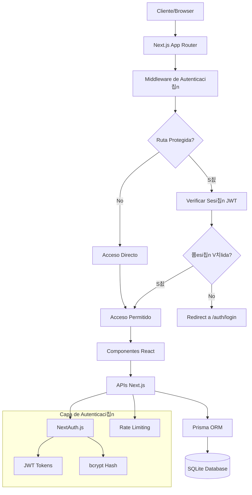

# Arquitectura Técnica - Sistema de Autenticación CRUNEVO

## 1. Arquitectura General



## 2. Tecnologías y Dependencias

### Frontend
- **Next.js 15** - Framework React con App Router
- **NextAuth.js 4.24** - Autenticación y manejo de sesiones
- **React 18** - Biblioteca de UI
- **TypeScript** - Tipado estático
- **Tailwind CSS** - Estilos y diseño
- **Radix UI** - Componentes accesibles
- **React Query** - Gestión de estado del servidor
- **Zod** - Validación de esquemas

### Backend
- **Next.js API Routes** - Endpoints del servidor
- **Prisma 6.14** - ORM y gestión de base de datos
- **SQLite** - Base de datos (desarrollo)
- **bcryptjs** - Hash de contraseñas
- **JWT** - Tokens de sesión
- **Rate Limiting** - Protección contra ataques

### Autenticación
- **NextAuth.js** - Core de autenticación
- **Prisma Adapter** - Integración con base de datos
- **Credentials Provider** - Login con email/contraseña
- **Google OAuth** - Autenticación social (opcional)

## 3. Definiciones de Rutas

### Rutas de Frontend

| Ruta | Propósito | Protección | Descripción |
|------|-----------|------------|-------------|
| `/` | Página principal | Pública | Landing page con información general |
| `/auth/login` | Inicio de sesión | Pública | Formulario de login con email/contraseña |
| `/auth/register` | Registro | Pública | Formulario de registro de nuevos usuarios |
| `/auth/forgot-password` | Recuperar contraseña | Pública | Solicitud de reset de contraseña |
| `/auth/reset-password` | Reset contraseña | Pública | Formulario para nueva contraseña con token |
| `/u/[username]` | Perfil público | Pública | Vista de solo lectura del perfil de usuario |
| `/post/[id]` | Post público | Condicional | Post visible si es PUBLIC |
| `/notes/[id]` | Nota pública | Condicional | Nota visible si es PUBLIC |
| `/feed` | Feed principal | Protegida | Timeline de posts del usuario |
| `/workspace` | Espacio de trabajo | Protegida | Herramientas de productividad |
| `/settings` | Configuraciones | Protegida | Ajustes de cuenta y privacidad |
| `/notifications` | Notificaciones | Protegida | Centro de notificaciones |
| `/messages` | Mensajes | Protegida | Sistema de mensajería |
| `/composer` | Crear contenido | Protegida | Editor para posts y notas |

## 4. Definiciones de APIs

### 4.1 APIs de Autenticación

#### Registro de Usuario
```
POST /api/auth/register
```

**Request:**
| Campo | Tipo | Requerido | Descripción |
|-------|------|-----------|-------------|
| email | string | Sí | Email único del usuario |
| password | string | Sí | Contraseña (mín. 8 caracteres) |
| username | string | Sí | Username único (3-30 caracteres) |
| name | string | Sí | Nombre completo |
| dateOfBirth | string | No | Fecha de nacimiento (ISO) |
| gender | enum | No | MALE, FEMALE, OTHER |

**Response:**
```json
{
  "success": true,
  "userId": "clx1234567890",
  "message": "Usuario creado exitosamente"
}
```

#### Login de Usuario
```
POST /api/auth/callback/credentials
```

**Request:**
| Campo | Tipo | Requerido | Descripción |
|-------|------|-----------|-------------|
| email | string | Sí | Email o username |
| password | string | Sí | Contraseña del usuario |

**Response:**
```json
{
  "url": "http://localhost:3000/",
  "user": {
    "id": "clx1234567890",
    "email": "user@example.com",
    "username": "username",
    "name": "User Name"
  }
}
```

#### Recuperar Contraseña
```
POST /api/auth/forgot-password
```

**Request:**
| Campo | Tipo | Requerido | Descripción |
|-------|------|-----------|-------------|
| email | string | Sí | Email del usuario |

**Response:**
```json
{
  "success": true,
  "message": "Si el email existe, recibirás instrucciones"
}
```

#### Reset Contraseña
```
POST /api/auth/reset-password
```

**Request:**
| Campo | Tipo | Requerido | Descripción |
|-------|------|-----------|-------------|
| token | string | Sí | Token de reset recibido |
| password | string | Sí | Nueva contraseña |

**Response:**
```json
{
  "success": true,
  "message": "Contraseña actualizada exitosamente"
}
```

### 4.2 APIs de Sesión

#### Obtener Sesión Actual
```
GET /api/auth/session
```

**Response:**
```json
{
  "user": {
    "id": "clx1234567890",
    "email": "user@example.com",
    "username": "username",
    "name": "User Name",
    "image": "/avatar.jpg"
  },
  "expires": "2025-02-28T10:00:00.000Z"
}
```

#### Cerrar Sesión
```
POST /api/auth/signout
```

**Response:**
```json
{
  "url": "http://localhost:3000/auth/login"
}
```

### 4.3 APIs de Perfil Público

#### Obtener Perfil Público
```
GET /api/users/[username]/public
```

**Response:**
```json
{
  "id": "clx1234567890",
  "username": "username",
  "name": "User Name",
  "bio": "Descripción del usuario",
  "image": "/avatar.jpg",
  "verified": true,
  "university": "Universidad Nacional",
  "career": "Ingeniería de Sistemas",
  "location": "Lima, Perú",
  "website": "https://example.com",
  "joinDate": "2024-01-15T00:00:00.000Z",
  "stats": {
    "posts": 42,
    "followers": 128,
    "following": 89
  },
  "isPrivate": false
}
```

## 5. Arquitectura del Servidor


## 6. Modelo de Datos

### 6.1 Diagrama de Entidades


### 6.2 DDL (Data Definition Language)

#### Tabla de Usuarios
```sql
CREATE TABLE users (
    id TEXT PRIMARY KEY,
    name TEXT,
    email TEXT UNIQUE NOT NULL,
    emailVerified DATETIME,
    image TEXT,
    username TEXT UNIQUE NOT NULL,
    password TEXT,
    firstName TEXT,
    lastName TEXT,
    birthDate DATETIME,
    gender TEXT CHECK (gender IN ('MALE', 'FEMALE', 'OTHER')),
    bio TEXT,
    location TEXT,
    website TEXT,
    verified BOOLEAN DEFAULT FALSE,
    role TEXT DEFAULT 'STUDENT' CHECK (role IN ('STUDENT', 'TEACHER', 'ADMIN')),
    status TEXT DEFAULT 'ACTIVE' CHECK (status IN ('ACTIVE', 'INACTIVE', 'BANNED')),
    
    -- Configuraciones de privacidad
    isPrivate BOOLEAN DEFAULT FALSE,
    allowMessages BOOLEAN DEFAULT TRUE,
    showAchievements BOOLEAN DEFAULT TRUE,
    showActivity BOOLEAN DEFAULT TRUE,
    
    -- Configuraciones de notificaciones
    emailNotifications BOOLEAN DEFAULT TRUE,
    pushNotifications BOOLEAN DEFAULT TRUE,
    forumNotifications BOOLEAN DEFAULT TRUE,
    
    -- Gamificación
    level INTEGER DEFAULT 1,
    xp INTEGER DEFAULT 0,
    crolars INTEGER DEFAULT 0,
    streak INTEGER DEFAULT 0,
    lastActivity DATETIME DEFAULT CURRENT_TIMESTAMP,
    
    createdAt DATETIME DEFAULT CURRENT_TIMESTAMP,
    updatedAt DATETIME DEFAULT CURRENT_TIMESTAMP
);

-- Índices para performance
CREATE INDEX idx_users_email ON users(email);
CREATE INDEX idx_users_username ON users(username);
CREATE INDEX idx_users_created_at ON users(createdAt DESC);
```

#### Tabla de Posts con Visibilidad
```sql
CREATE TABLE posts (
    id TEXT PRIMARY KEY,
    content TEXT NOT NULL,
    type TEXT DEFAULT 'TEXT' CHECK (type IN ('TEXT', 'IMAGE', 'VIDEO', 'POLL')),
    imageUrl TEXT,
    videoUrl TEXT,
    attachments TEXT, -- JSON string
    tags TEXT, -- Comma-separated
    visibility TEXT DEFAULT 'PUBLIC' CHECK (visibility IN ('PUBLIC', 'FOLLOWERS', 'PRIVATE')),
    isPinned BOOLEAN DEFAULT FALSE,
    authorId TEXT NOT NULL,
    createdAt DATETIME DEFAULT CURRENT_TIMESTAMP,
    updatedAt DATETIME DEFAULT CURRENT_TIMESTAMP,
    
    FOREIGN KEY (authorId) REFERENCES users(id) ON DELETE CASCADE
);

-- Índices para performance
CREATE INDEX idx_posts_author_id ON posts(authorId);
CREATE INDEX idx_posts_created_at ON posts(createdAt DESC);
CREATE INDEX idx_posts_visibility ON posts(visibility);
CREATE INDEX idx_posts_type ON posts(type);
```

#### Tabla de Tokens de Reset
```sql
CREATE TABLE password_reset_tokens (
    id TEXT PRIMARY KEY,
    email TEXT NOT NULL,
    token TEXT UNIQUE NOT NULL,
    expires DATETIME NOT NULL,
    used BOOLEAN DEFAULT FALSE,
    createdAt DATETIME DEFAULT CURRENT_TIMESTAMP,
    
    UNIQUE(email, token)
);

-- Índices
CREATE INDEX idx_password_reset_tokens_token ON password_reset_tokens(token);
CREATE INDEX idx_password_reset_tokens_email ON password_reset_tokens(email);
CREATE INDEX idx_password_reset_tokens_expires ON password_reset_tokens(expires);
```

#### Datos Iniciales
```sql
-- Usuario administrador de prueba
INSERT INTO users (
    id, email, username, password, name, verified, role,
    crolars, level, xp, createdAt
) VALUES (
    'admin-user-id',
    'admin@local.test',
    'admin',
    '$2a$12$hash_de_admin123', -- Hash de 'admin123'
    'Admin Local',
    TRUE,
    'ADMIN',
    5000,
    5,
    2500,
    CURRENT_TIMESTAMP
);

-- Usuario demo
INSERT INTO users (
    id, email, username, password, name, bio, university, career,
    crolars, level, xp, createdAt
) VALUES (
    'demo-user-id',
    'demo@local.test',
    'demo_user',
    '$2a$12$hash_de_demo123', -- Hash de 'demo123'
    'Usuario Demo',
    'Estudiante de ingeniería apasionado por la tecnología',
    'Universidad Nacional Mayor de San Marcos',
    'Ingeniería de Sistemas',
    1000,
    2,
    750,
    CURRENT_TIMESTAMP
);

-- Posts públicos de ejemplo
INSERT INTO posts (id, content, visibility, authorId, createdAt) VALUES
('post-1', '¡Bienvenidos a CRUNEVO! 🎉 La nueva red social educativa para universitarios peruanos.', 'PUBLIC', 'admin-user-id', CURRENT_TIMESTAMP),
('post-2', 'Compartiendo mis apuntes de Algoritmos y Estructuras de Datos. 쮸lguien más está llevando este curso?', 'PUBLIC', 'demo-user-id', CURRENT_TIMESTAMP),
('post-3', 'Recordatorio: La fecha límite para el proyecto final es el próximo viernes. ¡No se olviden! 📚', 'PUBLIC', 'admin-user-id', CURRENT_TIMESTAMP);
```

## 7. Configuración de Seguridad

### Rate Limiting Configuration

```typescript
// lib/rate-limit.ts
import { NextRequest } from 'next/server';

interface RateLimitConfig {
  windowMs: number;
  maxRequests: number;
  keyGenerator?: (req: NextRequest) => string;
}

const rateLimitConfigs: Record<string, RateLimitConfig> = {
  '/api/auth/register': {
    windowMs: 60 * 60 * 1000, // 1 hora
    maxRequests: 3, // 3 registros por IP por hora
    keyGenerator: (req) => req.ip || 'unknown'
  },
  '/api/auth/callback/credentials': {
    windowMs: 15 * 60 * 1000, // 15 minutos
    maxRequests: 5, // 5 intentos de login por IP
    keyGenerator: (req) => req.ip || 'unknown'
  },
  '/api/auth/forgot-password': {
    windowMs: 60 * 60 * 1000, // 1 hora
    maxRequests: 3, // 3 intentos por email por hora
    keyGenerator: (req) => {
      const body = req.body as any;
      return body?.email || req.ip || 'unknown';
    }
  }
};
```

### Middleware de Autenticación

```typescript
// middleware.ts
import { withAuth } from 'next-auth/middleware';
import { NextResponse } from 'next/server';

export default withAuth(
  function middleware(req) {
    const { pathname } = req.nextUrl;
    const token = req.nextauth.token;
    
    // Log de accesos para auditoría
    console.log(`[${new Date().toISOString()}] ${req.method} ${pathname} - User: ${token?.username || 'anonymous'}`);
    
    // Verificar permisos especiales para rutas admin
    if (pathname.startsWith('/admin') && token?.role !== 'ADMIN') {
      return NextResponse.redirect(new URL('/unauthorized', req.url));
    }
    
    return NextResponse.next();
  },
  {
    callbacks: {
      authorized: ({ token, req }) => {
        const { pathname } = req.nextUrl;
        
        // Rutas completamente públicas
        const publicRoutes = [
          '/',
          '/about',
          '/help',
          '/terms',
          '/privacy',
          '/cookies',
          '/contact'
        ];
        
        // Rutas de autenticación
        const authRoutes = [
          '/auth/login',
          '/auth/register',
          '/auth/forgot-password',
          '/auth/reset-password',
          '/auth/error'
        ];
        
        // Rutas dinámicas públicas
        const publicDynamicRoutes = [
          /^\/u\/[^/]+$/, // /u/[username]
          /^\/post\/[^/]+$/, // /post/[id]
          /^\/notes\/[^/]+$/ // /notes/[id]
        ];
        
        // Verificar rutas públicas estáticas
        if (publicRoutes.includes(pathname) || authRoutes.includes(pathname)) {
          return true;
        }
        
        // Verificar rutas dinámicas públicas
        if (publicDynamicRoutes.some(pattern => pattern.test(pathname))) {
          return true;
        }
        
        // Todas las demás rutas requieren autenticación
        return !!token;
      }
    }
  }
);

export const config = {
  matcher: [
    /*
     * Match all request paths except for the ones starting with:
     * - api/auth (NextAuth endpoints)
     * - _next/static (static files)
     * - _next/image (image optimization files)
     * - favicon.ico (favicon file)
     * - public files (images, etc.)
     */
    '/((?!api/auth|_next/static|_next/image|favicon.ico|.*\\.).*)',
  ]
};
```

## 8. Consideraciones de Performance

### Optimizaciones de Base de Datos
- Índices en campos frecuentemente consultados
- Paginación en listados de posts
- Lazy loading de relaciones
- Cache de consultas frecuentes

### Optimizaciones de Frontend
- Server-side rendering para perfiles públicos
- Incremental static regeneration para posts populares
- Code splitting por rutas
- Optimización de imágenes con Next.js Image

### Monitoreo y Logging
- Logs estructurados para auditoría
- Métricas de performance de APIs
- Alertas para intentos de acceso no autorizado
- Dashboard de uso y estadísticas

---

**Nota**: Esta arquitectura está diseñada para ser escalable y mantenible, siguiendo las mejores prácticas de seguridad y performance para aplicaciones web modernas.