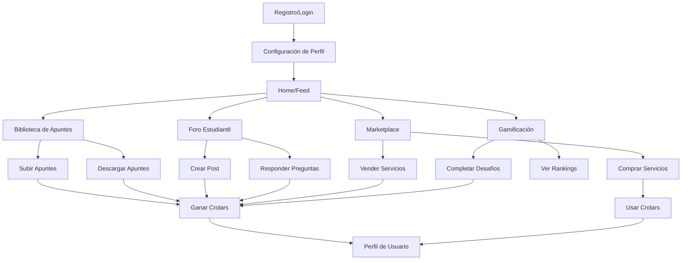

# CRUNEVO - Plataforma Estudiantil Universitaria

## 1. Product Overview

CRUNEVO es una plataforma estudiantil integral que conecta a estudiantes universitarios peruanos para compartir apuntes, participar en foros académicos, acceder a un marketplace de servicios estudiantiles y ganar recompensas a través de un sistema de gamificación con moneda virtual (Crolars).

- Resuelve la fragmentación de recursos académicos y la falta de colaboración entre estudiantes universitarios, creando un ecosistema centralizado donde pueden compartir conocimiento, encontrar servicios y ser recompensados por su participación activa.
- Dirigido principalmente a estudiantes universitarios en Perú, con potencial de expansión a toda Latinoamérica, generando valor a través de transacciones en el marketplace y engagement estudiantil.

## 2. Core Features

### 2.1 User Roles

| Role | Registration Method | Core Permissions |
|------|---------------------|------------------|
| Estudiante | Email universitario + verificación | Puede compartir apuntes, participar en foros, comprar/vender servicios, ganar Crolars |
| Moderador | Invitación por administradores | Puede moderar contenido, gestionar reportes, aplicar sanciones |
| Administrador | Acceso interno del sistema | Control total del sistema, analytics, configuración de políticas |

### 2.2 Feature Module

Nuestra plataforma CRUNEVO consta de las siguientes páginas principales:

1. **Home/Feed**: feed personalizado de actividades, apuntes destacados, notificaciones en tiempo real
2. **Biblioteca de Apuntes**: exploración, búsqueda, subida y descarga de apuntes académicos
3. **Foro Estudiantil**: discusiones por carrera, preguntas y respuestas, hilos temáticos
4. **Marketplace**: servicios estudiantiles, tutorías, venta de materiales, sistema de pagos
5. **Perfil de Usuario**: estadísticas personales, historial de Crolars, logros y badges
6. **Panel de Gamificación**: ranking de usuarios, desafíos, sistema de recompensas
7. **Notificaciones**: centro de notificaciones en tiempo real, configuración de alertas
8. **Panel de Administración**: moderación de contenido, analytics, gestión de usuarios

### 2.3 Page Details

| Page Name | Module Name | Feature description |
|-----------|-------------|---------------------|
| Home/Feed | Feed Personalizado | Mostrar actividades recientes, apuntes trending, posts del foro relevantes basados en carrera del usuario |
| Home/Feed | Notificaciones en Tiempo Real | Recibir y mostrar notificaciones instantáneas de mensajes, nuevos apuntes, respuestas en foros |
| Home/Feed | Quick Actions | Acceso rápido a subir apuntes, crear post en foro, buscar servicios |
| Biblioteca de Apuntes | Exploración y Búsqueda | Filtrar por carrera, curso, tipo de documento, calificación, buscar por contenido usando OpenSearch |
| Biblioteca de Apuntes | Gestión de Documentos | Subir archivos (PDF, Word, imágenes), generar previews automáticos, sistema de versionado |
| Biblioteca de Apuntes | Sistema de Calificación | Valorar apuntes, comentarios, sistema de reputación para contribuidores |
| Foro Estudiantil | Discusiones por Carrera | Crear hilos organizados por facultad y carrera, sistema de tags y categorías |
| Foro Estudiantil | Q&A System | Preguntas y respuestas con votación, marcar respuestas como solución, gamificación por ayudar |
| Foro Estudiantil | Moderación | Reportar contenido inapropiado, sistema automático de detección de spam |
| Marketplace | Catálogo de Servicios | Listar servicios de tutoría, venta de libros, servicios académicos, filtros por precio y categoría |
| Marketplace | Sistema de Transacciones | Pagos con Crolars o dinero real (Stripe/Culqi), sistema de escrow, calificaciones de vendedores |
| Marketplace | Gestión de Pedidos | Seguimiento de órdenes, comunicación comprador-vendedor, resolución de disputas |
| Perfil de Usuario | Dashboard Personal | Estadísticas de actividad, Crolars ganados/gastados, apuntes subidos, participación en foros |
| Perfil de Usuario | Sistema de Logros | Badges por actividades (primer apunte, 100 Crolars, top contributor), progreso hacia objetivos |
| Perfil de Usuario | Configuración | Preferencias de notificaciones, privacidad, configuración de carrera y cursos |
| Panel de Gamificación | Ranking Global | Leaderboards por diferentes métricas (Crolars, contribuciones, ayuda en foros) |
| Panel de Gamificación | Desafíos y Misiones | Tareas semanales/mensuales para ganar Crolars extra, eventos especiales |
| Panel de Gamificación | Sistema de Recompensas | Canje de Crolars por beneficios, descuentos en marketplace, items virtuales |
| Notificaciones | Centro de Notificaciones | Historial de todas las notificaciones, marcar como leído, filtros por tipo |
| Notificaciones | Configuración de Alertas | Personalizar qué notificaciones recibir (email, push, in-app) por categoría |
| Panel de Administración | Moderación de Contenido | Revisar reportes, aplicar sanciones, gestionar contenido flaggeado |
| Panel de Administración | Analytics y Métricas | Dashboard con KPIs de la plataforma, engagement, transacciones, crecimiento |
| Panel de Administración | Gestión de Usuarios | Administrar cuentas, verificaciones, sistema de roles y permisos |

## 3. Core Process

**Flujo del Estudiante Regular:**
1. El usuario se registra con email universitario y completa verificación
2. Configura su perfil con carrera, cursos de interés y preferencias
3. Explora el feed personalizado con contenido relevante a su carrera
4. Puede subir apuntes y ganar Crolars por cada descarga/valoración positiva
5. Participa en foros haciendo preguntas o respondiendo, ganando más Crolars
6. Usa Crolars para acceder a servicios premium en el marketplace
7. Completa desafíos de gamificación para obtener badges y recompensas

**Flujo del Moderador:**
1. Recibe notificaciones de contenido reportado o detectado automáticamente
2. Revisa el contenido usando herramientas de moderación
3. Aplica acciones correctivas (advertencia, eliminación, suspensión)
4. Mantiene comunicación con usuarios afectados
5. Reporta patrones y métricas al equipo administrativo

## 4. User Interface Design

### 4.1 Design Style

- **Colores primarios:** Azul universitario (#1E40AF) y verde académico (#059669) para transmitir confianza y crecimiento
- **Colores secundarios:** Gris claro (#F8FAFC) para fondos, naranja (#EA580C) para Crolars y recompensas
- **Estilo de botones:** Redondeados con sombras sutiles, estilo moderno y accesible
- **Tipografía:** Inter como fuente principal (14-16px para texto, 18-24px para títulos)
- **Layout:** Diseño tipo card con espaciado generoso, navegación lateral fija en desktop
- **Iconografía:** Lucide icons con estilo minimalista, emojis para gamificación y reacciones

### 4.2 Page Design Overview

| Page Name | Module Name | UI Elements |
|-----------|-------------|-------------|
| Home/Feed | Feed Personalizado | Cards con sombra sutil, infinite scroll, skeleton loading, colores suaves con acentos en azul |
| Home/Feed | Notificaciones | Toast notifications en esquina superior derecha, badge rojo para no leídas, animaciones suaves |
| Biblioteca de Apuntes | Exploración | Grid layout responsivo, filtros en sidebar, preview modal con thumbnails generados |
| Biblioteca de Apuntes | Upload | Drag & drop area con indicador visual, progress bar para subida, validación en tiempo real |
| Foro Estudiantil | Discusiones | Layout tipo Reddit con voting arrows, threading visual, syntax highlighting para código |
| Marketplace | Catálogo | Cards de producto con imágenes, rating stars, precio en Crolars destacado en naranja |
| Perfil de Usuario | Dashboard | Gráficos con Chart.js, progress bars para logros, timeline de actividades recientes |
| Gamificación | Rankings | Tablas con alternating colors, badges animados, progress indicators circulares |

### 4.3 Responsiveness

La plataforma es mobile-first con adaptación completa a desktop. Incluye optimizaciones táctiles para móviles, navegación por gestos, y componentes específicos para cada breakpoint usando Tailwind CSS. El diseño se adapta desde 320px (móvil pequeño) hasta 1920px (desktop grande) con breakpoints en 768px (tablet) y 1024px (desktop).