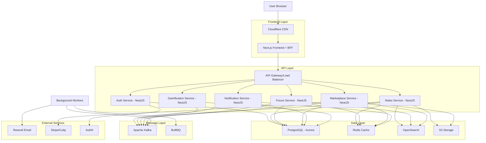
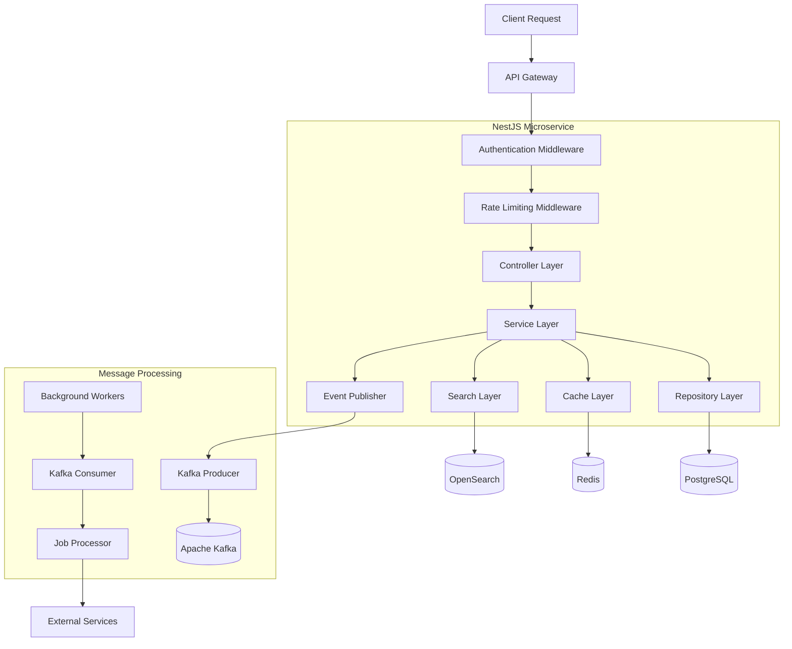
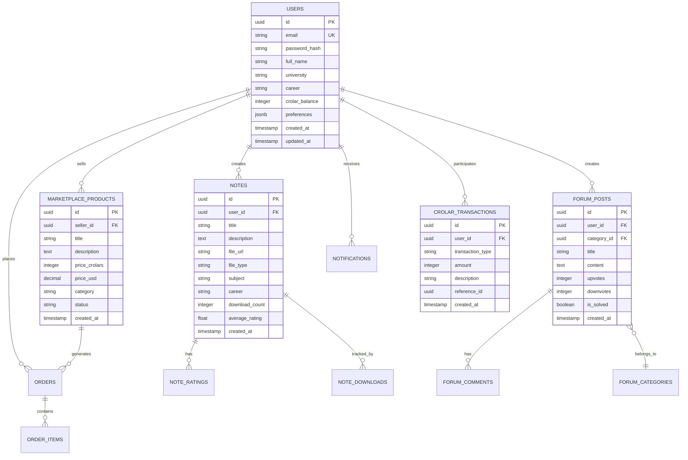

# CRUNEVO - Arquitectura Técnica

## 1. Architecture Design



## 2. Technology Description

* **Frontend:** Next.js\@14 + TypeScript\@5 + Tailwind CSS\@3 + shadcn/ui + React Query\@5 + Vite

* **Backend:** NestJS\@10 + Node.js\@20 LTS + TypeScript\@5

* **Database:** PostgreSQL\@16 (Aurora) + Redis\@7 (ElastiCache)

* **Search:** OpenSearch\@2.11

* **Message Queue:** Apache Kafka (MSK) + BullMQ\@4

* **Storage:** AWS S3 + CloudFront

* **Authentication:** Auth0 + NextAuth.js

* **Payments:** Stripe + Culqi (Perú)

* **Email:** Resend

* **Infrastructure:** AWS EKS + Terraform + ArgoCD

## 3. Route Definitions

| Route                | Purpose                                                    |
| -------------------- | ---------------------------------------------------------- |
| /                    | Home page con feed personalizado y navegación principal    |
| /auth/login          | Página de autenticación con Auth0 integration              |
| /auth/register       | Registro de nuevos usuarios con verificación universitaria |
| /notes               | Biblioteca de apuntes con búsqueda y filtros               |
| /notes/upload        | Subida de nuevos apuntes con preview                       |
| /notes/\[id]         | Vista detallada de apunte individual                       |
| /forum               | Foro principal con categorías por carrera                  |
| /forum/\[category]   | Foro específico por categoría                              |
| /forum/post/\[id]    | Vista de post individual con comentarios                   |
| /marketplace         | Catálogo de servicios y productos estudiantiles            |
| /marketplace/\[id]   | Detalle de producto/servicio                               |
| /marketplace/sell    | Crear nueva oferta en marketplace                          |
| /profile/\[username] | Perfil público de usuario                                  |
| /profile/settings    | Configuración personal del usuario                         |
| /gamification        | Panel de rankings y desafíos                               |
| /notifications       | Centro de notificaciones                                   |
| /admin               | Panel de administración (solo admins)                      |

## 4. API Definitions

### 4.1 Core API

**Authentication Service**

```
POST /api/auth/login
```

Request:

| Param Name | Param Type | isRequired | Description                     |
| ---------- | ---------- | ---------- | ------------------------------- |
| email      | string     | true       | Email universitario del usuario |
| password   | string     | true       | Contraseña del usuario          |

Response:

| Param Name     | Param Type  | Description                    |
| -------------- | ----------- | ------------------------------ |
| access\_token  | string      | JWT token para autenticación   |
| refresh\_token | string      | Token para renovar sesión      |
| user           | UserProfile | Información básica del usuario |

**Notes Service**

```
GET /api/notes
POST /api/notes
GET /api/notes/:id
PUT /api/notes/:id
DELETE /api/notes/:id
```

**Forum Service**

```
GET /api/forum/categories
GET /api/forum/posts
POST /api/forum/posts
GET /api/forum/posts/:id
POST /api/forum/posts/:id/comments
```

**Marketplace Service**

```
GET /api/marketplace/products
POST /api/marketplace/products
GET /api/marketplace/products/:id
POST /api/marketplace/orders
GET /api/marketplace/orders/:id
```

**Notification Service**

```
GET /api/notifications
PUT /api/notifications/:id/read
POST /api/notifications/preferences
```

**Gamification Service**

```
GET /api/gamification/leaderboard
GET /api/gamification/challenges
POST /api/gamification/challenges/:id/complete
GET /api/gamification/user/:id/stats
```

### 4.2 WebSocket Events

**Real-time Notifications**

```typescript
// Client to Server
interface JoinRoomEvent {
  event: 'join_room';
  data: { userId: string; rooms: string[] };
}

// Server to Client
interface NotificationEvent {
  event: 'notification';
  data: {
    id: string;
    type: 'new_note' | 'forum_reply' | 'marketplace_order' | 'crolar_earned';
    title: string;
    message: string;
    timestamp: string;
  };
}
```

## 5. Server Architecture Diagram



## 6. Data Model

### 6.1 Data Model Definition



### 6.2 Data Definition Language

**Users Table**

```sql
-- Create users table
CREATE TABLE users (
    id UUID PRIMARY KEY DEFAULT gen_random_uuid(),
    email VARCHAR(255) UNIQUE NOT NULL,
    password_hash VARCHAR(255),
    full_name VARCHAR(255) NOT NULL,
    university VARCHAR(255) NOT NULL,
    career VARCHAR(255) NOT NULL,
    crolar_balance INTEGER DEFAULT 0,
    preferences JSONB DEFAULT '{}',
    email_verified BOOLEAN DEFAULT false,
    is_active BOOLEAN DEFAULT true,
    role VARCHAR(50) DEFAULT 'student',
    created_at TIMESTAMP WITH TIME ZONE DEFAULT NOW(),
    updated_at TIMESTAMP WITH TIME ZONE DEFAULT NOW()
);

-- Create indexes
CREATE INDEX idx_users_email ON users(email);
CREATE INDEX idx_users_university_career ON users(university, career);
CREATE INDEX idx_users_created_at ON users(created_at DESC);
```

**Notes Table**

```sql
-- Create notes table
CREATE TABLE notes (
    id UUID PRIMARY KEY DEFAULT gen_random_uuid(),
    user_id UUID NOT NULL REFERENCES users(id) ON DELETE CASCADE,
    title VARCHAR(500) NOT NULL,
    description TEXT,
    file_url VARCHAR(1000) NOT NULL,
    file_type VARCHAR(50) NOT NULL,
    file_size BIGINT,
    subject VARCHAR(255) NOT NULL,
    career VARCHAR(255) NOT NULL,
    university VARCHAR(255) NOT NULL,
    download_count INTEGER DEFAULT 0,
    average_rating DECIMAL(3,2) DEFAULT 0,
    rating_count INTEGER DEFAULT 0,
    is_approved BOOLEAN DEFAULT false,
    created_at TIMESTAMP WITH TIME ZONE DEFAULT NOW(),
    updated_at TIMESTAMP WITH TIME ZONE DEFAULT NOW()
);

-- Create indexes
CREATE INDEX idx_notes_user_id ON notes(user_id);
CREATE INDEX idx_notes_subject_career ON notes(subject, career);
CREATE INDEX idx_notes_created_at ON notes(created_at DESC);
CREATE INDEX idx_notes_rating ON notes(average_rating DESC);
CREATE INDEX idx_notes_downloads ON notes(download_count DESC);
```

**Forum Tables**

```sql
-- Create forum categories
CREATE TABLE forum_categories (
    id UUID PRIMARY KEY DEFAULT gen_random_uuid(),
    name VARCHAR(255) NOT NULL,
    description TEXT,
    career VARCHAR(255),
    is_active BOOLEAN DEFAULT true,
    created_at TIMESTAMP WITH TIME ZONE DEFAULT NOW()
);

-- Create forum posts
CREATE TABLE forum_posts (
    id UUID PRIMARY KEY DEFAULT gen_random_uuid(),
    user_id UUID NOT NULL REFERENCES users(id) ON DELETE CASCADE,
    category_id UUID NOT NULL REFERENCES forum_categories(id),
    title VARCHAR(500) NOT NULL,
    content TEXT NOT NULL,
    upvotes INTEGER DEFAULT 0,
    downvotes INTEGER DEFAULT 0,
    comment_count INTEGER DEFAULT 0,
    is_solved BOOLEAN DEFAULT false,
    is_pinned BOOLEAN DEFAULT false,
    created_at TIMESTAMP WITH TIME ZONE DEFAULT NOW(),
    updated_at TIMESTAMP WITH TIME ZONE DEFAULT NOW()
);

-- Create indexes
CREATE INDEX idx_forum_posts_category ON forum_posts(category_id);
CREATE INDEX idx_forum_posts_user ON forum_posts(user_id);
CREATE INDEX idx_forum_posts_created_at ON forum_posts(created_at DESC);
CREATE INDEX idx_forum_posts_upvotes ON forum_posts(upvotes DESC);
```

**Marketplace Tables**

```sql
-- Create marketplace products
CREATE TABLE marketplace_products (
    id UUID PRIMARY KEY DEFAULT gen_random_uuid(),
    seller_id UUID NOT NULL REFERENCES users(id) ON DELETE CASCADE,
    title VARCHAR(500) NOT NULL,
    description TEXT NOT NULL,
    price_crolars INTEGER,
    price_usd DECIMAL(10,2),
    category VARCHAR(100) NOT NULL,
    status VARCHAR(50) DEFAULT 'active',
    image_urls TEXT[],
    view_count INTEGER DEFAULT 0,
    created_at TIMESTAMP WITH TIME ZONE DEFAULT NOW(),
    updated_at TIMESTAMP WITH TIME ZONE DEFAULT NOW()
);

-- Create orders table
CREATE TABLE orders (
    id UUID PRIMARY KEY DEFAULT gen_random_uuid(),
    buyer_id UUID NOT NULL REFERENCES users(id),
    seller_id UUID NOT NULL REFERENCES users(id),
    product_id UUID NOT NULL REFERENCES marketplace_products(id),
    total_crolars INTEGER,
    total_usd DECIMAL(10,2),
    status VARCHAR(50) DEFAULT 'pending',
    payment_method VARCHAR(50),
    created_at TIMESTAMP WITH TIME ZONE DEFAULT NOW(),
    updated_at TIMESTAMP WITH TIME ZONE DEFAULT NOW()
);

-- Create indexes
CREATE INDEX idx_marketplace_products_seller ON marketplace_products(seller_id);
CREATE INDEX idx_marketplace_products_category ON marketplace_products(category);
CREATE INDEX idx_orders_buyer ON orders(buyer_id);
CREATE INDEX idx_orders_seller ON orders(seller_id);
```

**Crolar Transactions**

```sql
-- Create crolar transactions
CREATE TABLE crolar_transactions (
    id UUID PRIMARY KEY DEFAULT gen_random_uuid(),
    user_id UUID NOT NULL REFERENCES users(id) ON DELETE CASCADE,
    transaction_type VARCHAR(50) NOT NULL, -- 'earned', 'spent', 'bonus', 'penalty'
    amount INTEGER NOT NULL,
    description VARCHAR(500) NOT NULL,
    reference_type VARCHAR(50), -- 'note_upload', 'note_download', 'forum_help', 'marketplace_purchase'
    reference_id UUID,
    created_at TIMESTAMP WITH TIME ZONE DEFAULT NOW()
);

-- Create indexes
CREATE INDEX idx_crolar_transactions_user ON crolar_transactions(user_id);
CREATE INDEX idx_crolar_transactions_type ON crolar_transactions(transaction_type);
CREATE INDEX idx_crolar_transactions_created_at ON crolar_transactions(created_at DESC);
```

**Initial Data**

```sql
-- Insert forum categories
INSERT INTO forum_categories (name, description, career) VALUES
('Ingeniería de Sistemas', 'Discusiones sobre programación, algoritmos y tecnología', 'Ingeniería de Sistemas'),
('Medicina', 'Temas médicos, anatomía y casos clínicos', 'Medicina'),
('Derecho', 'Discusiones jurídicas y casos legales', 'Derecho'),
('Administración', 'Temas de gestión empresarial y negocios', 'Administración'),
('General', 'Discusiones generales para todos los estudiantes', NULL);

-- Insert sample admin user
INSERT INTO users (email, full_name, university, career, role, email_verified, crolar_balance) VALUES
('admin@crunevo.edu.pe', 'Administrador Sistema', 'Universidad Nacional Mayor de San Marcos', 'Administración', 'admin', true, 10000);
```

