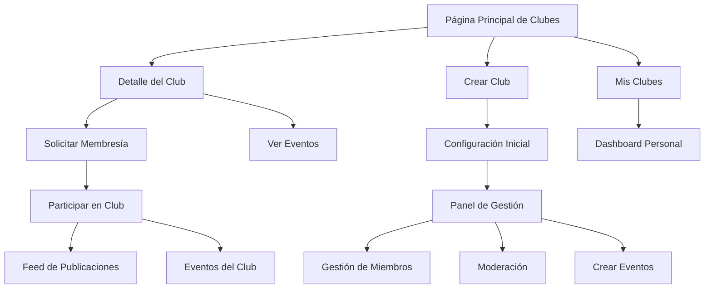

# Documento de Requerimientos del Producto - Sistema de Clubes Estudiantiles

## 1. Descripción General del Producto

Sistema integral de clubes estudiantiles que permite a los usuarios crear, unirse y gestionar comunidades de aprendizaje dentro de la plataforma educativa. El sistema facilita la colaboración entre estudiantes con intereses similares y proporciona herramientas para la organización de actividades académicas y extracurriculares.

El objetivo es crear una experiencia social enriquecedora que fomente el aprendizaje colaborativo y el desarrollo de habilidades interpersonales, aumentando el engagement y la retención de usuarios en la plataforma.

## 2. Características Principales

### 2.1 Roles de Usuario

| Rol | Método de Registro | Permisos Principales |
|-----|-------------------|---------------------|
| Miembro | Unión directa o por invitación | Puede ver contenido, participar en discusiones, asistir a eventos |
| Moderador | Promoción por presidente | Puede moderar contenido, gestionar miembros, organizar eventos |
| Presidente | Creador del club o transferencia | Control total del club, gestión de roles, configuración del club |
| Administrador | Rol del sistema | Supervisión de todos los clubes, moderación global |

### 2.2 Módulo de Características

Nuestro sistema de clubes consta de las siguientes páginas principales:

1. **Página Principal de Clubes**: exploración de clubes, búsqueda avanzada, filtros por categoría, estadísticas generales
2. **Página de Detalle del Club**: información completa, lista de miembros, publicaciones, eventos próximos, solicitud de membresía
3. **Panel de Gestión del Club**: configuración del club, gestión de miembros, moderación de contenido, creación de eventos
4. **Página de Mis Clubes**: clubes unidos, actividad reciente, notificaciones, accesos rápidos
5. **Página de Creación de Club**: formulario de creación, configuración inicial, invitación de miembros fundadores

### 2.3 Detalles de Páginas

| Nombre de Página | Nombre del Módulo | Descripción de Características |
|------------------|-------------------|-------------------------------|
| Página Principal | Exploración de Clubes | Mostrar clubes destacados, búsqueda en tiempo real, filtros por categoría/materia/nivel, ordenamiento múltiple |
| Página Principal | Estadísticas Generales | Mostrar métricas de clubes activos, miembros totales, eventos próximos con actualización en tiempo real |
| Página Principal | Sistema de Recomendaciones | Sugerir clubes basados en intereses del usuario, historial de actividad y conexiones sociales |
| Detalle del Club | Información del Club | Mostrar descripción, categoría, tags, presidente, estadísticas de miembros y actividad |
| Detalle del Club | Feed de Publicaciones | Mostrar publicaciones del club con sistema de likes, comentarios y reacciones en tiempo real |
| Detalle del Club | Lista de Miembros | Mostrar miembros activos con roles, fecha de unión y nivel de participación |
| Detalle del Club | Eventos del Club | Mostrar eventos próximos y pasados con sistema de asistencia y recordatorios |
| Panel de Gestión | Configuración del Club | Editar información básica, configurar privacidad, gestionar tags y categorías |
| Panel de Gestión | Gestión de Miembros | Aprobar solicitudes, asignar roles, expulsar miembros, enviar invitaciones |
| Panel de Gestión | Moderación de Contenido | Revisar y moderar publicaciones, gestionar reportes, configurar reglas del club |
| Panel de Gestión | Creación de Eventos | Crear eventos del club, configurar detalles, gestionar asistencia y notificaciones |
| Mis Clubes | Dashboard Personal | Mostrar actividad reciente de clubes unidos, notificaciones pendientes, accesos rápidos |
| Mis Clubes | Gestión de Membresías | Ver estado de solicitudes, abandonar clubes, configurar notificaciones por club |
| Creación de Club | Formulario de Creación | Configurar información básica, seleccionar categoría, establecer reglas y privacidad |
| Creación de Club | Configuración Inicial | Invitar miembros fundadores, configurar roles iniciales, establecer objetivos del club |

## 3. Proceso Principal

### Flujo de Usuario Regular
1. El usuario navega a la página de clubes y explora las opciones disponibles
2. Utiliza filtros y búsqueda para encontrar clubes de interés
3. Revisa los detalles del club y solicita membresía
4. Una vez aceptado, participa en discusiones y eventos
5. Puede crear su propio club si tiene una idea específica

### Flujo de Presidente de Club
1. Crea un nuevo club con información detallada
2. Configura las reglas y privacidad del club
3. Invita miembros fundadores y gestiona solicitudes
4. Modera contenido y organiza eventos
5. Analiza métricas de participación y crecimiento

## 4. Diseño de Interfaz de Usuario

### 4.1 Estilo de Diseño

- **Colores primarios**: Gradiente púrpura a azul (#8B5CF6 a #3B82F6) para elementos principales
- **Colores secundarios**: Tonos suaves de gris (#F8FAFC, #E2E8F0) para fondos y elementos neutros
- **Estilo de botones**: Botones redondeados con gradientes y efectos hover suaves
- **Tipografía**: Inter como fuente principal, tamaños de 14px para texto base, 18px para títulos de sección
- **Estilo de layout**: Diseño basado en tarjetas con sombras suaves y bordes redondeados
- **Iconos**: Lucide React con estilo minimalista y consistente

### 4.2 Resumen de Diseño de Páginas

| Nombre de Página | Nombre del Módulo | Elementos de UI |
|------------------|-------------------|----------------|
| Página Principal | Header de Exploración | Título con gradiente, estadísticas en tarjetas con iconos coloridos, fondo con gradiente sutil |
| Página Principal | Filtros de Búsqueda | Barra de búsqueda con icono, selectores dropdown estilizados, chips de filtros activos |
| Página Principal | Grid de Clubes | Tarjetas con imágenes, badges de categoría, avatares de presidentes, botones de acción |
| Detalle del Club | Header del Club | Banner de imagen, avatar del club, información básica con iconos, botón de unirse destacado |
| Detalle del Club | Tabs de Navegación | Pestañas estilizadas para publicaciones, miembros, eventos, información |
| Detalle del Club | Feed de Contenido | Publicaciones con sistema de reacciones, comentarios anidados, timestamps relativos |
| Panel de Gestión | Sidebar de Navegación | Menú lateral con iconos, indicadores de notificaciones, accesos rápidos |
| Panel de Gestión | Formularios de Gestión | Campos de entrada estilizados, switches para configuraciones, botones de acción coloridos |
| Mis Clubes | Dashboard Cards | Tarjetas de resumen por club, indicadores de actividad, notificaciones con badges |
| Creación de Club | Wizard de Pasos | Indicador de progreso, formularios por pasos, validación en tiempo real |

### 4.3 Responsividad

Diseño mobile-first con adaptación completa para tablets y desktop. Optimización táctil para dispositivos móviles con botones de tamaño adecuado y navegación por gestos. Grid responsivo que se adapta de 1 columna en móvil a 3 columnas en desktop.