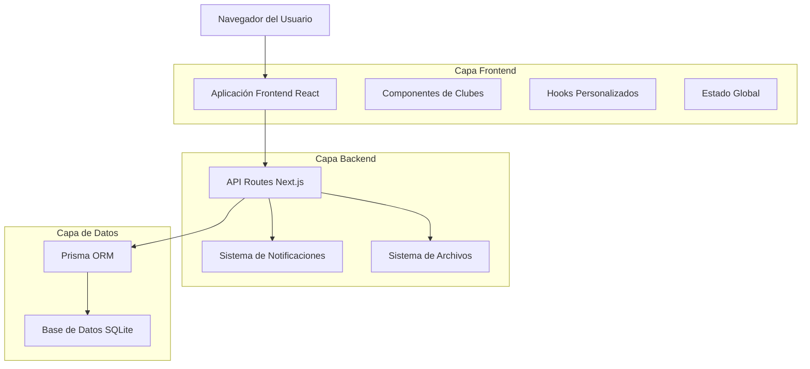
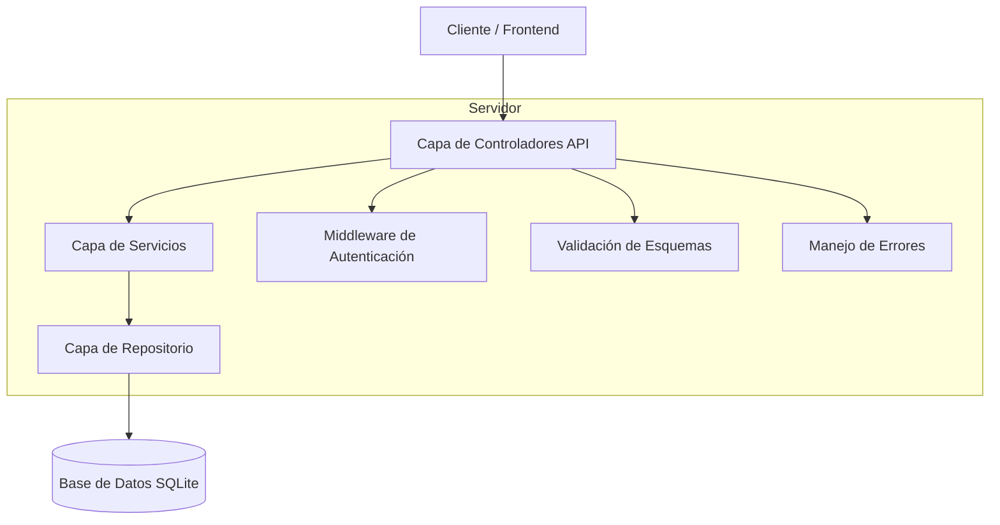
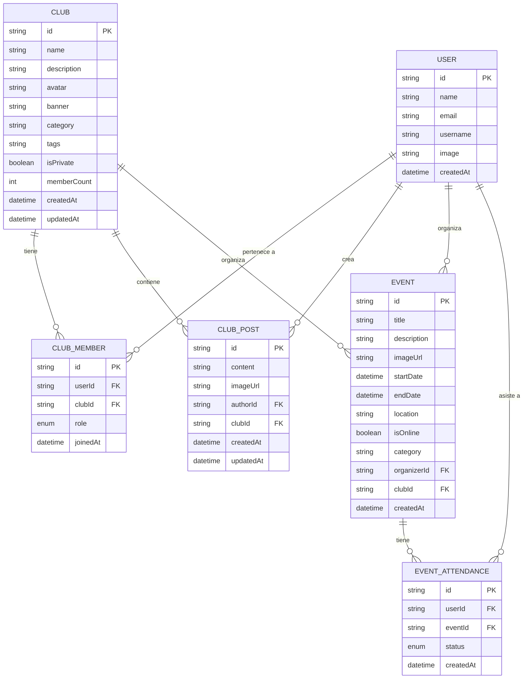

# Documento de Arquitectura Técnica - Sistema de Clubes Estudiantiles

## 1. Diseño de Arquitectura



## 2. Descripción de Tecnologías

* Frontend: React\@18 + TypeScript + Tailwind CSS\@3 + Next.js\@14

* Backend: Next.js API Routes + Prisma ORM

* Base de Datos: SQLite (existente con esquema Prisma)

* Estado: React Context + Custom Hooks

* UI: Shadcn/ui + Lucide React Icons

* Validación: Zod para validación de esquemas

## 3. Definiciones de Rutas

| Ruta                | Propósito                                     |
| ------------------- | --------------------------------------------- |
| /clubs              | Página principal de exploración de clubes     |
| /clubs/\[id]        | Página de detalle de un club específico       |
| /clubs/create       | Página de creación de nuevo club              |
| /clubs/manage/\[id] | Panel de gestión para presidentes/moderadores |
| /clubs/my-clubs     | Dashboard personal de clubes del usuario      |
| /clubs/join/\[id]   | Página de solicitud de membresía              |

## 4. Definiciones de API

### 4.1 API Principal de Clubes

**Obtener todos los clubes**

```
GET /api/clubs
```

Query Parameters:

| Nombre del Parámetro | Tipo   | Requerido | Descripción                      |
| -------------------- | ------ | --------- | -------------------------------- |
| search               | string | false     | Término de búsqueda              |
| category             | string | false     | Filtro por categoría             |
| page                 | number | false     | Número de página para paginación |
| limit                | number | false     | Límite de resultados por página  |

Respuesta:

| Nombre del Parámetro | Tipo    | Descripción                 |
| -------------------- | ------- | --------------------------- |
| clubs                | Club\[] | Array de clubes             |
| total                | number  | Total de clubes encontrados |
| hasMore              | boolean | Indica si hay más páginas   |

**Crear nuevo club**

```
POST /api/clubs
```

Request:

| Nombre del Parámetro | Tipo      | Requerido | Descripción           |
| -------------------- | --------- | --------- | --------------------- |
| name                 | string    | true      | Nombre del club       |
| description          | string    | true      | Descripción del club  |
| category             | string    | true      | Categoría del club    |
| tags                 | string\[] | false     | Tags del club         |
| isPrivate            | boolean   | false     | Si el club es privado |

**Obtener detalle de club**

```
GET /api/clubs/[id]
```

**Unirse a club**

```
POST /api/clubs/[id]/join
```

**Abandonar club**

```
DELETE /api/clubs/[id]/leave
```

**Gestionar miembros**

```
POST /api/clubs/[id]/members
DELETE /api/clubs/[id]/members/[userId]
PUT /api/clubs/[id]/members/[userId]/role
```

**Publicaciones del club**

```
GET /api/clubs/[id]/posts
POST /api/clubs/[id]/posts
DELETE /api/clubs/[id]/posts/[postId]
```

**Eventos del club**

```
GET /api/clubs/[id]/events
POST /api/clubs/[id]/events
PUT /api/clubs/[id]/events/[eventId]
```

### 4.2 Tipos TypeScript Compartidos

```typescript
interface Club {
  id: string;
  name: string;
  description: string;
  avatar?: string;
  banner?: string;
  category: string;
  tags?: string[];
  isPrivate: boolean;
  memberCount: number;
  createdAt: Date;
  updatedAt: Date;
  members?: ClubMember[];
  posts?: ClubPost[];
  events?: Event[];
}

interface ClubMember {
  id: string;
  role: 'MEMBER' | 'MODERATOR' | 'PRESIDENT';
  userId: string;
  clubId: string;
  joinedAt: Date;
  user: {
    id: string;
    name: string;
    username: string;
    image?: string;
  };
}

interface ClubPost {
  id: string;
  content: string;
  imageUrl?: string;
  authorId: string;
  clubId: string;
  createdAt: Date;
  updatedAt: Date;
  author: {
    name: string;
    username: string;
    image?: string;
  };
}
```

## 5. Arquitectura del Servidor



## 6. Modelo de Datos

### 6.1 Definición del Modelo de Datos



### 6.2 Lenguaje de Definición de Datos

Las tablas ya existen en el esquema Prisma actual. Se utilizarán las siguientes consultas para inicializar datos de ejemplo:

```sql
-- Crear clubes de ejemplo
INSERT INTO clubs (id, name, description, category, tags, isPrivate, memberCount, createdAt, updatedAt)
VALUES 
  ('club_1', 'Matemáticas Avanzadas', 'Club dedicado al estudio de matemáticas universitarias', 'Académico', 'matemáticas,cálculo,álgebra', false, 0, datetime('now'), datetime('now')),
  ('club_2', 'Ciencias Naturales', 'Exploramos biología, química y física', 'Académico', 'ciencias,experimentos,laboratorio', false, 0, datetime('now'), datetime('now')),
  ('club_3', 'Debate y Oratoria', 'Desarrollamos habilidades de comunicación', 'Extracurricular', 'debate,oratoria,comunicación', false, 0, datetime('now'), datetime('now'));

-- Crear índices para optimización
CREATE INDEX idx_club_members_user_id ON club_members(userId);
CREATE INDEX idx_club_members_club_id ON club_members(clubId);
CREATE INDEX idx_club_posts_club_id ON club_posts(clubId);
CREATE INDEX idx_club_posts_created_at ON club_posts(createdAt DESC);
CREATE INDEX idx_events_club_id ON events(clubId);
CREATE INDEX idx_events_start_date ON events(startDate);

-- Configurar permisos para roles anónimos y autenticados (si se usa Supabase)
-- GRANT SELECT ON clubs TO anon;
-- GRANT ALL PRIVILEGES ON clubs TO authenticated;
-- GRANT ALL PRIVILEGES ON club_members TO authenticated;
-- GRANT ALL PRIVILEGES ON club_posts TO authenticated;
```

## 7. Consideraciones de Implementación

### 7.1 Seguridad

* Autenticación requerida para todas las operaciones de clubes

* Validación de roles para operaciones de gestión

* Sanitización de contenido en publicaciones

* Rate limiting en APIs públicas

### 7.2 Performance

* Paginación en listados de clubes y publicaciones

* Caching de datos frecuentemente accedidos

* Optimización de consultas con índices apropiados

* Lazy loading de imágenes y contenido

### 7.3 Escalabilidad

* Estructura modular de componentes React

* Separación clara entre lógica de negocio y presentación

* APIs RESTful bien definidas

* Posibilidad de migrar a base de datos más robusta en el futuro

