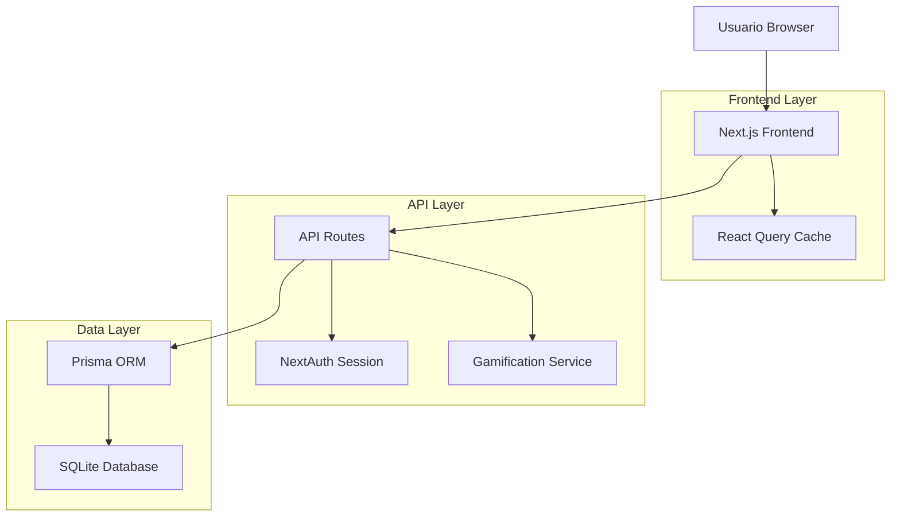
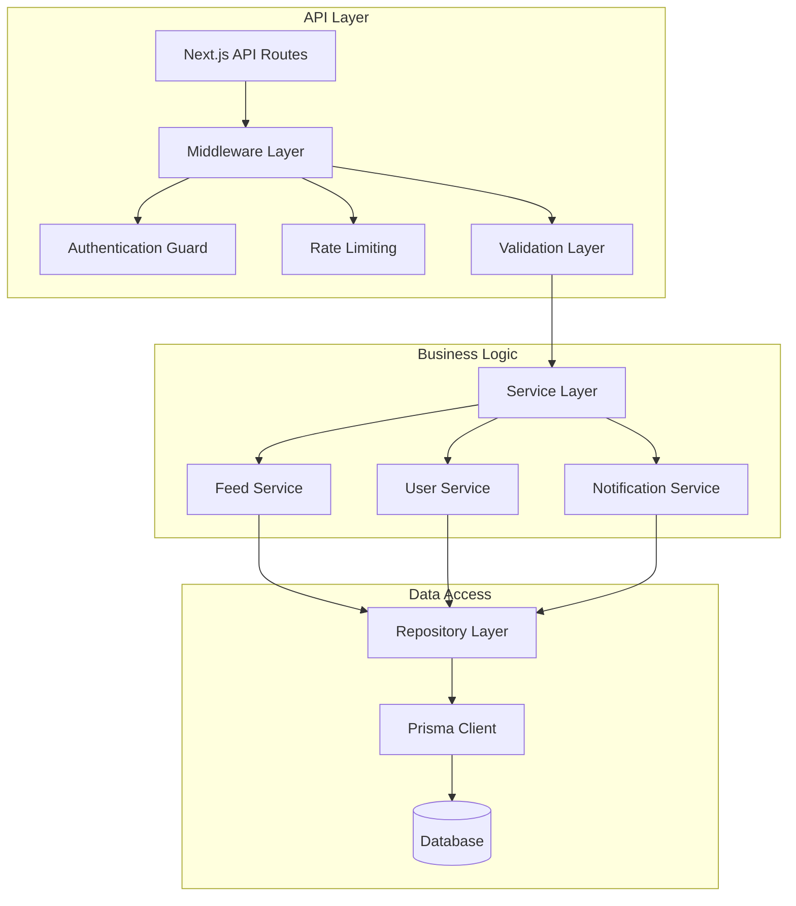
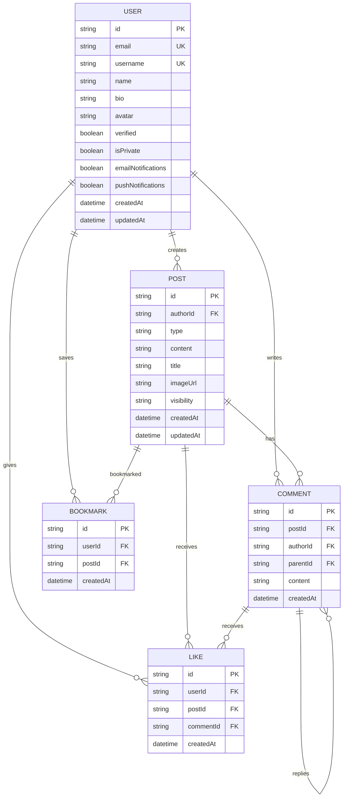

# Arquitectura Técnica: Unificación Feed, Settings y Perfil - CRUNEVO

## 1. Diseño de Arquitectura



## 2. Descripción de Tecnologías

* **Frontend**: React\@18 + Next.js\@14 + TailwindCSS\@3 + TypeScript

* **Estado**: React Query (TanStack Query) + React Hook Form

* **Base de Datos**: Prisma ORM + SQLite (desarrollo) / PostgreSQL (producción)

* **Autenticación**: NextAuth.js con sesiones JWT

* **UI Components**: Radix UI + Lucide React icons

* **Validación**: Zod para schemas de validación

## 3. Definiciones de Rutas

| Ruta                     | Propósito                                                                            |
| ------------------------ | ------------------------------------------------------------------------------------ |
| `/feed`                  | Feed principal con composer y lista de posts dinámicos                               |
| `/settings`              | Página de configuraciones con pestañas (General, Privacidad, Notificaciones, Cuenta) |
| `/perfil`                | Perfil de usuario con vista unificada pública/privada                                |
| `/u/[username]`          | Perfil público de otros usuarios                                                     |
| `/api/feed`              | API para obtener y crear posts                                                       |
| `/api/feed/[id]/react`   | API para reacciones de posts                                                         |
| `/api/feed/[id]/comment` | API para comentarios                                                                 |
| `/api/settings`          | API para configuraciones de usuario                                                  |

## 4. Definiciones de API

### 4.1 APIs Principales

**Feed Management**

```
GET /api/feed
```

Request:

| Parámetro | Tipo   | Requerido | Descripción                              |
| --------- | ------ | --------- | ---------------------------------------- |
| cursor    | string | false     | Cursor para paginación                   |
| limit     | number | false     | Límite de posts (default: 10)            |
| ranking   | string | false     | Tipo de ranking (home, recent, trending) |
| author    | string | false     | Filtrar por autor específico             |

Response:

| Campo      | Tipo        | Descripción                             |
| ---------- | ----------- | --------------------------------------- |
| posts      | FeedPost\[] | Array de posts con autor y estadísticas |
| nextCursor | string      | Cursor para siguiente página            |
| hasMore    | boolean     | Indica si hay más posts                 |

Ejemplo Response:

```json
{
  "posts": [
    {
      "id": "clx123",
      "kind": "question",
      "author": {
        "id": "user1",
        "name": "María González",
        "username": "maria_g",
        "avatar": "https://...",
        "verified": true
      },
      "title": "¿Cómo optimizar algoritmos?",
      "text": "Estoy estudiando diferentes algoritmos...",
      "createdAt": "2024-01-15T10:30:00Z",
      "stats": {
        "fires": 24,
        "comments": 8,
        "shares": 3,
        "saves": 5,
        "views": 120
      },
      "viewerState": {
        "fired": false,
        "saved": true,
        "shared": false
      }
    }
  ],
  "nextCursor": "clx124",
  "hasMore": true
}
```

**Crear Post**

```
POST /api/feed
```

Request:

| Campo      | Tipo      | Requerido | Descripción                                        |
| ---------- | --------- | --------- | -------------------------------------------------- |
| kind       | string    | true      | Tipo de post (post, question, note)                |
| title      | string    | false     | Título (requerido para question/note)              |
| text       | string    | true      | Contenido del post                                 |
| imageUrl   | string    | false     | URL de imagen opcional                             |
| visibility | string    | false     | Visibilidad (public, university, friends, private) |
| hashtags   | string\[] | false     | Array de hashtags                                  |

Response:

| Campo   | Tipo     | Descripción                 |
| ------- | -------- | --------------------------- |
| success | boolean  | Estado de la operación      |
| post    | FeedPost | Post creado con ID generado |

**Reaccionar a Post**

```
POST /api/feed/[id]/react
```

Request:

| Campo  | Tipo   | Requerido | Descripción      |
| ------ | ------ | --------- | ---------------- |
| action | string | true      | "add" o "remove" |

Response:

| Campo   | Tipo    | Descripción                |
| ------- | ------- | -------------------------- |
| success | boolean | Estado de la operación     |
| fires   | number  | Nuevo conteo de reacciones |
| fired   | boolean | Estado actual del usuario  |

**Configuraciones de Usuario**

```
GET /api/settings
PUT /api/settings
```

Request (PUT):

| Campo              | Tipo    | Requerido | Descripción              |
| ------------------ | ------- | --------- | ------------------------ |
| name               | string  | false     | Nombre completo          |
| username           | string  | false     | Nombre de usuario        |
| bio                | string  | false     | Biografía                |
| location           | string  | false     | Ubicación                |
| university         | string  | false     | Universidad              |
| career             | string  | false     | Carrera                  |
| isPrivate          | boolean | false     | Perfil privado           |
| emailNotifications | boolean | false     | Notificaciones por email |
| pushNotifications  | boolean | false     | Notificaciones push      |

Response:

| Campo   | Tipo         | Descripción                  |
| ------- | ------------ | ---------------------------- |
| success | boolean      | Estado de la operación       |
| user    | UserSettings | Configuraciones actualizadas |

## 5. Arquitectura del Servidor



## 6. Modelo de Datos

### 6.1 Diagrama de Entidades



### 6.2 Definición de Datos (DDL)

**Extensiones al Schema Prisma existente:**

```prisma
// Agregar campos a User existente
model User {
  // ... campos existentes
  
  // Configuraciones de privacidad
  showAchievements Boolean @default(true)
  showActivity     Boolean @default(true)
  allowMessages    Boolean @default(true)
  
  // Configuraciones de notificaciones
  emailNotifications Boolean @default(true)
  pushNotifications  Boolean @default(true)
  forumNotifications Boolean @default(true)
  
  // Relaciones adicionales
  postReactions PostReaction[]
}

// Nueva tabla para tracking individual de reacciones
model PostReaction {
  id     String @id @default(cuid())
  userId String
  postId String
  type   String @default("fire") // fire, love, etc.
  
  user User @relation(fields: [userId], references: [id], onDelete: Cascade)
  post Post @relation(fields: [postId], references: [id], onDelete: Cascade)
  
  createdAt DateTime @default(now())
  
  @@unique([userId, postId, type])
  @@map("post_reactions")
}

// Extender modelo Post existente
model Post {
  // ... campos existentes
  
  // Campos adicionales para feed
  reactions PostReaction[]
  
  // Índices para performance
  @@index([createdAt(sort: Desc)])
  @@index([authorId])
  @@index([type])
}

// Extender modelo Comment existente
model Comment {
  // ... campos existentes
  
  // Índices para performance
  @@index([postId])
  @@index([createdAt])
}
```

**Script de Seed para Posts de Ejemplo:**

```typescript
// scripts/seed-feed.ts
import { PrismaClient } from '@prisma/client'

const prisma = new PrismaClient()

async function seedFeed() {
  // Crear usuarios de prueba
  const adminUser = await prisma.user.upsert({
    where: { email: 'admin@local.test' },
    update: {},
    create: {
      email: 'admin@local.test',
      username: 'admin',
      name: 'Administrador',
      bio: 'Administrador del sistema CRUNEVO',
      verified: true
    }
  })
  
  const mariaUser = await prisma.user.upsert({
    where: { email: 'mariafquispe@test.com' },
    update: {},
    create: {
      email: 'mariafquispe@test.com',
      username: 'mariafquispe',
      name: 'María Quispe',
      bio: 'Estudiante de Ingeniería de Sistemas',
      career: 'Ingeniería de Sistemas'
    }
  })
  
  // Crear posts de ejemplo
  const posts = [
    {
      authorId: mariaUser.id,
      type: 'QUESTION',
      content: 'Estoy estudiando diferentes algoritmos de ordenamiento y me gustaría saber cuáles son las mejores prácticas para optimizarlos. ¿Alguien tiene experiencia con QuickSort vs MergeSort?',
      visibility: 'PUBLIC'
    },
    {
      authorId: adminUser.id,
      type: 'TEXT',
      content: 'Comparto mis apuntes completos sobre el sistema cardiovascular. Incluye diagramas, funciones principales y patologías más comunes.',
      visibility: 'PUBLIC'
    },
    {
      authorId: mariaUser.id,
      type: 'TEXT',
      content: '¡Acabo de terminar mi tesis sobre neuroplasticidad! Ha sido un viaje increíble de 2 años. Gracias a todos los que me apoyaron en el proceso. 🧠✨',
      visibility: 'PUBLIC'
    }
  ]
  
  for (const postData of posts) {
    await prisma.post.create({ data: postData })
  }
  
  console.log('✅ Feed seed completed')
}

seedFeed()
  .catch(console.error)
  .finally(() => prisma.$disconnect())
```

**Índices de Base de Datos:**

```sql
-- Índices para optimización de queries del feed
CREATE INDEX idx_posts_created_at ON posts(created_at DESC);
CREATE INDEX idx_posts_author_id ON posts(author_id);
CREATE INDEX idx_posts_type ON posts(type);
CREATE INDEX idx_posts_visibility ON posts(visibility);

-- Índices para comentarios
CREATE INDEX idx_comments_post_id ON comments(post_id);
CREATE INDEX idx_comments_created_at ON comments(created_at DESC);

-- Índices para reacciones
CREATE INDEX idx_post_reactions_post_id ON post_reactions(post_id);
CREATE INDEX idx_post_reactions_user_id ON post_reactions(user_id);

-- Índices para bookmarks
CREATE INDEX idx_bookmarks_user_id ON bookmarks(user_id);
CREATE INDEX idx_bookmarks_post_id ON bookmarks(post_id);
```

## 7. Consideraciones de Performance

### 7.1 Optimizaciones Frontend

* **React Query**: Cache inteligente con invalidación automática

* **Infinite Scrolling**: Paginación eficiente para el feed

* **Image Optimization**: Next.js Image component con lazy loading

* **Code Splitting**: Lazy loading de componentes pesados

### 7.2 Optimizaciones Backend

* **Database Indexing**: Índices optimizados para queries frecuentes

* **Query Optimization**: Select específico de campos necesarios

* **Rate Limiting**: Prevención de spam y abuse

* **Caching**: Redis para cache de datos frecuentes (futuro)

### 7.3 Monitoreo y Métricas

* **API Response Times**: Tracking de performance de endpoints

* **Database Query Performance**: Monitoring de queries lentas

* **User Engagement**: Métricas de interacción con posts

* **Error Tracking**: Logging de errores y excepciones

