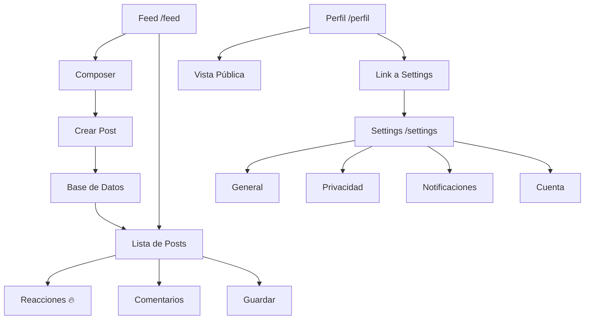

# Documento de Requerimientos: Unificación Feed, Settings y Perfil - CRUNEVO

## 1. Resumen del Proyecto

Unificar y mejorar el sistema de feed social, configuraciones de usuario y perfil público de CRUNEVO para crear una experiencia coherente y funcional. El proyecto transformará el feed estático actual en un sistema dinámico conectado a base de datos, consolidará las configuraciones en una página dedicada, y eliminará duplicaciones en las vistas de perfil.

## 2. Características Principales

### 2.1 Roles de Usuario

| Rol           | Método de Registro   | Permisos Principales                                 |
| ------------- | -------------------- | ---------------------------------------------------- |
| Estudiante    | Registro por email   | Crear posts, reaccionar, comentar, configurar perfil |
| Moderador     | Asignación por admin | Moderar contenido, gestionar reportes                |
| Administrador | Acceso directo       | Gestión completa del sistema                         |

### 2.2 Módulos de Funcionalidad

Nuestros requerimientos consisten en las siguientes páginas principales:

1. **Feed Dinámico (/feed)**: composer de posts, lista de publicaciones, sistema de reacciones
2. **Configuraciones (/settings)**: pestañas de general, privacidad, notificaciones, cuenta
3. **Perfil Unificado (/perfil)**: vista única para modo privado y público
4. **APIs de Soporte**: endpoints para feed, reacciones, comentarios, configuraciones

### 2.3 Detalles de Páginas

| Página               | Módulo          | Descripción de Funcionalidad                                                                                     |
| -------------------- | --------------- | ---------------------------------------------------------------------------------------------------------------- |
| Feed (/feed)         | Composer        | Crear posts con tipo (Pregunta/Apunte/Normal), texto, imagen opcional. Guardar en DB y mostrar instantáneamente  |
| Feed (/feed)         | Lista de Posts  | Cargar posts desde API en orden cronológico inverso. Mostrar autor, contenido, fecha, reacciones 🔥, comentarios |
| Feed (/feed)         | Interacciones   | Reaccionar con 🔥, guardar en favoritos, comentar con input y lista de respuestas                                |
| Settings (/settings) | General         | Editar nombre, username, email (readonly), ubicación, universidad, programa académico                            |
| Settings (/settings) | Privacidad      | Toggle perfil público/privado, mostrar/ocultar logros, configurar visibilidad de actividad                       |
| Settings (/settings) | Notificaciones  | Activar/desactivar notificaciones por email e internas, configurar tipos específicos                             |
| Settings (/settings) | Cuenta          | Cambiar contraseña con validación, opción eliminar cuenta con confirmación                                       |
| Perfil (/perfil)     | Vista Unificada | Mostrar banner, foto, bio, logros, estadísticas. Modo público sin botones de edición                             |
| Perfil (/perfil)     | Configuración   | Link "Ir a Configuración completa" que redirija a /settings                                                      |

## 3. Flujo Principal de Usuario

**Flujo de Estudiante:**

1. Usuario accede a /feed
2. Ve posts existentes cargados desde DB
3. Usa composer para crear nuevo post (selecciona tipo, escribe contenido, opcionalmente sube imagen)
4. Post se guarda en DB y aparece instantáneamente en el feed
5. Puede reaccionar con 🔥, guardar posts, y comentar
6. Accede a /settings para configurar perfil, privacidad y notificaciones
7. Desde /perfil puede ver su perfil como lo ven otros usuarios



## 4. Diseño de Interfaz de Usuario

### 4.1 Estilo de Diseño

* **Colores primarios**: Gradientes de CRUNEVO (crunevo-50 a crunevo-700)

* **Colores secundarios**: Grises para texto y fondos neutros

* **Estilo de botones**: Redondeados con efectos hover y gradientes sutiles

* **Tipografía**: Sistema de fuentes por defecto, tamaños 12px-24px

* **Layout**: Basado en cards con sombras suaves, navegación superior

* **Iconos**: Lucide React con estilo minimalista

### 4.2 Resumen de Diseño de Páginas

| Página   | Módulo      | Elementos UI                                                                        |
| -------- | ----------- | ----------------------------------------------------------------------------------- |
| Feed     | Composer    | Card con avatar, textarea expandible, botones tipo/imagen, gradientes crunevo       |
| Feed     | Posts       | Cards con hover effects, badges para tipos, avatars circulares, botones de reacción |
| Settings | Pestañas    | Tabs component, Cards para secciones, Inputs con labels, Switch toggles             |
| Settings | Formularios | Input fields con validación, botones Save con loading states                        |
| Perfil   | Header      | Banner con overlay, avatar grande, badges de verificación                           |
| Perfil   | Contenido   | Grid layout para estadísticas, cards para logros, sin botones edit en modo público  |

### 4.3 Responsividad

Diseño mobile-first con breakpoints para tablet y desktop. Navegación adaptativa con sidebar colapsable en móvil y navegación fija en desktop.

## 5. Especificaciones Técnicas

### 5.1 Arquitectura de Base de Datos

**Modelo Post (ya existe en Prisma):**

```prisma
model Post {
  id          String    @id @default(cuid())
  content     String
  type        PostType  @default(TEXT) // TEXT, IMAGE, VIDEO, POLL, QUESTION
  imageUrl    String?
  authorId    String
  author      User      @relation(fields: [authorId], references: [id])
  createdAt   DateTime  @default(now())
  updatedAt   DateTime  @updatedAt
  comments    Comment[]
  likes       Like[]
  bookmarks   Bookmark[]
}
```

**Extensiones necesarias:**

* Campo `reactions` (Int) para contar 🔥

* Relación con tabla `PostReactions` para tracking individual

* Índices en `createdAt` y `authorId` para performance

### 5.2 APIs Requeridas

**Feed APIs:**

* `GET /api/feed` - Obtener posts paginados con autor y estadísticas

* `POST /api/feed` - Crear nuevo post con validación

* `POST /api/feed/[id]/react` - Agregar/quitar reacción 🔥

* `POST /api/feed/[id]/comment` - Crear comentario

* `GET /api/feed/[id]/comments` - Obtener comentarios paginados

**Settings APIs:**

* `GET /api/settings` - Obtener configuraciones actuales del usuario

* `PUT /api/settings` - Actualizar configuraciones (general, privacidad, notificaciones)

* `POST /api/settings/password` - Cambiar contraseña con validación

* `DELETE /api/settings/account` - Eliminar cuenta (soft delete)

### 5.3 Componentes Frontend

**Nuevos componentes necesarios:**

* `FeedComposer` - Input para crear posts con selector de tipo

* `PostInteractions` - Botones de reacción, comentario, guardar

* `CommentSection` - Lista de comentarios con input para responder

* `SettingsLayout` - Layout con pestañas para /settings

* `PublicProfileView` - Vista de perfil sin controles de edición

**Modificaciones a componentes existentes:**

* `PostList.tsx` - Conectar con API real en lugar de mockData

* `Feed.tsx` - Integrar composer y sistema de reacciones

* `SettingsPanel.tsx` - Mover a página dedicada /settings

### 5.4 Gestión de Estado

**React Query para:**

* Cache de posts del feed con invalidación automática

* Mutaciones optimistas para reacciones y comentarios

* Paginación infinita para scroll del feed

* Cache de configuraciones de usuario

**Estado local para:**

* Formularios de settings con validación

* Estado de composer (tipo de post, contenido, imagen)

* UI states (loading, error, success)

### 5.5 Seed de Datos

**Script** **`scripts/seed-feed.ts`:**

```typescript
// Crear usuarios de prueba si no existen
// Crear 3-4 posts de ejemplo:
// 1. Pregunta: "¿Cómo optimizar algoritmos de ordenamiento?"
// 2. Apunte: "Sistema Cardiovascular - Anatomía"
// 3. Post normal: "Terminé mi tesis sobre neuroplasticidad"
// Asociar a usuarios admin@local.test y mariafquispe
```

## 6. Criterios de Validación

1. ✅ `npm run dev` inicia sin errores
2. ✅ `GET /api/feed` retorna posts con estructura correcta
3. ✅ Composer crea posts que aparecen instantáneamente
4. ✅ Reacciones 🔥 y comentarios persisten en base de datos
5. ✅ Seed automático pobla posts si DB está vacía
6. ✅ `/settings` accesible con 4 pestañas funcionales
7. ✅ Cambios en settings se guardan correctamente
8. ✅ Vista pública de perfil usa mismo layout sin duplicación
9. ✅ Navegación fluida entre feed, settings y perfil
10. ✅ Responsive design funciona en móvil y desktop

## 7. Consideraciones de Implementación

### 7.1 Prioridades de Desarrollo

1. **Alta**: APIs de feed y creación de posts
2. **Alta**: Conexión de PostList con base de datos
3. **Media**: Sistema de reacciones y comentarios
4. **Media**: Página de settings unificada
5. **Baja**: Optimizaciones de performance y UX

### 7.2 Riesgos y Mitigaciones

* **Riesgo**: Performance con muchos posts → **Mitigación**: Paginación e índices DB

* **Riesgo**: Spam de posts → **Mitigación**: Rate limiting y validación

* **Riesgo**: Pérdida de datos en settings → **Mitigación**: Validación client/server

### 7.3 Dependencias Técnicas

* Mantener compatibilidad con sistema de gamificación existente

* Preservar estructura de autenticación NextAuth

* Integrar con sistema de notificaciones actual

* Respetar permisos y roles de usuario establecidos

