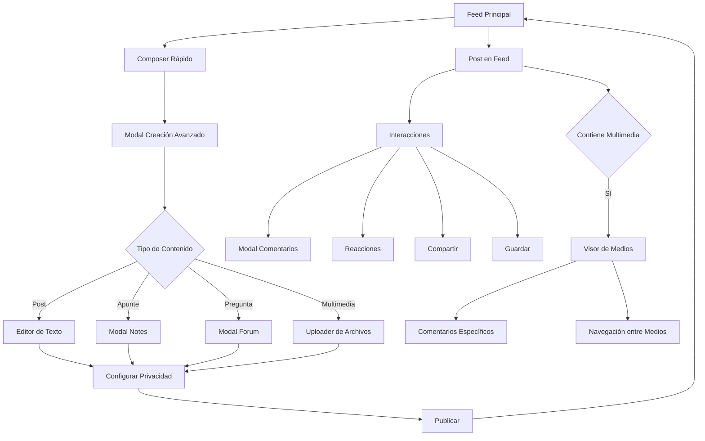

# Sistema de Feed Mejorado - CRUNEVO

## 1. Resumen del Producto

CRUNEVO es una red social académica que conecta estudiantes universitarios para compartir conocimiento, colaborar en proyectos y construir una comunidad educativa. El sistema de feed es el corazón de la plataforma, donde los usuarios comparten contenido, interactúan y descubren información relevante.

Este proyecto busca transformar el feed actual en un módulo completamente funcional con capacidades avanzadas de interacción social, manteniendo el enfoque académico y la experiencia de usuario fluida.

## 2. Características Principales

### 2.1 Roles de Usuario

| Rol | Método de Registro | Permisos Principales |
|-----|-------------------|---------------------|
| Estudiante | Registro con email universitario | Crear posts, comentar, seguir usuarios, unirse a clubes |
| Instructor | Verificación académica | Crear cursos, moderar contenido, acceso a analytics |
| Administrador | Invitación del sistema | Gestión completa de usuarios, contenido y configuraciones |

### 2.2 Módulos de Funcionalidad

Nuestro sistema de feed mejorado incluye las siguientes páginas principales:

1. **Feed Principal**: timeline personalizado, composer mejorado, interacciones en tiempo real
2. **Modal de Creación**: composer avanzado con opciones multimedia, etiquetado y privacidad
3. **Sistema de Comentarios**: modal de comentarios con hilos anidados y reacciones
4. **Visor de Medios**: galería de fotos/videos con navegación y comentarios específicos
5. **Perfil de Usuario**: gestión de seguidores, configuraciones de privacidad
6. **Panel de Notificaciones**: alertas de interacciones, nuevos seguidores y menciones

### 2.3 Detalles de Páginas

| Página | Módulo | Descripción de Funcionalidad |
|--------|--------|------------------------------|
| Feed Principal | Timeline | Mostrar posts de usuarios seguidos con algoritmo de relevancia, infinite scroll, filtros por tipo de contenido |
| Feed Principal | Composer Rápido | Input estilo Facebook para acceso rápido a creación de contenido |
| Feed Principal | Sidebar Trending | Mostrar hashtags populares, usuarios sugeridos, eventos próximos |
| Modal Creación | Editor Avanzado | Crear posts con texto enriquecido, subir multimedia, configurar privacidad |
| Modal Creación | Integración Módulos | Redireccionar a modales específicos de /notes y /forum según tipo de contenido |
| Modal Creación | Etiquetado Social | Mencionar usuarios (@usuario), agregar hashtags (#tema), configurar audiencia |
| Sistema Comentarios | Modal Comentarios | Abrir overlay con comentarios del post, permitir respuestas anidadas |
| Sistema Comentarios | Interacciones | Reaccionar a comentarios, mencionar usuarios, reportar contenido |
| Visor de Medios | Galería Modal | Mostrar imagen/video en pantalla completa con navegación entre medios |
| Visor de Medios | Comentarios Específicos | Comentarios únicos por cada foto/video, reacciones independientes |
| Perfil Usuario | Gestión Seguidores | Seguir/dejar de seguir, ver lista de seguidores y seguidos |
| Perfil Usuario | Configuración Feed | Personalizar qué tipo de contenido ver, notificaciones, privacidad |

## 3. Flujo Principal de Usuario

### Flujo de Estudiante Regular
1. Usuario ingresa al feed y ve contenido personalizado de usuarios seguidos
2. Puede crear nuevo contenido usando el composer rápido o modal avanzado
3. Interactúa con posts mediante reacciones, comentarios y compartir
4. Descubre nuevo contenido y usuarios a través del sidebar de tendencias
5. Gestiona sus conexiones sociales y configuraciones de privacidad

### Flujo de Creación de Contenido
1. Usuario hace clic en "¿Qué estás pensando?" para abrir modal
2. Selecciona tipo de contenido (Post, Apunte, Pregunta, Foto/Video)
3. Si es Apunte → redirige a modal de /notes
4. Si es Pregunta → redirige a modal de /forum
5. Si es multimedia → abre uploader con preview y edición
6. Configura privacidad, etiquetas y menciones antes de publicar

## 4. Diseño de Interfaz de Usuario

### 4.1 Estilo de Diseño

- **Colores Primarios**: Azul académico (#1e40af), Verde éxito (#10b981)
- **Colores Secundarios**: Gris neutro (#6b7280), Blanco (#ffffff)
- **Estilo de Botones**: Redondeados con sombras sutiles, estados hover animados
- **Tipografía**: Inter para textos principales, tamaños 14px-16px para contenido
- **Layout**: Diseño de tres columnas en desktop, stack vertical en móvil
- **Iconografía**: Lucide React icons con estilo minimalista y consistente

### 4.2 Resumen de Diseño por Página

| Página | Módulo | Elementos UI |
|--------|--------|-------------|
| Feed Principal | Timeline | Cards con bordes sutiles, avatares circulares, botones de acción con iconos, infinite scroll suave |
| Feed Principal | Composer | Input redondeado estilo Facebook, botones de acción coloridos, transiciones suaves al abrir modal |
| Modal Creación | Editor | Textarea expansible, toolbar de formato, preview de multimedia, chips para etiquetas |
| Modal Comentarios | Lista Comentarios | Comentarios anidados con líneas de conexión, avatares pequeños, timestamps relativos |
| Visor Medios | Galería | Overlay oscuro semi-transparente, controles de navegación flotantes, información contextual |
| Perfil Usuario | Stats Sociales | Contadores de seguidores con animaciones, botones de seguir con estados, grid de posts |

### 4.3 Responsividad

La aplicación está diseñada con enfoque mobile-first, adaptándose fluidamente desde 320px hasta 1920px. En móvil se prioriza la navegación táctil con botones de tamaño adecuado (44px mínimo) y gestos intuitivos para interacciones rápidas.

## 5. Integraciones con Otros Módulos

### 5.1 Módulos Existentes Integrados

- **Notes (/notes)**: Publicación directa de apuntes desde el feed, preview de documentos
- **Forum (/forum)**: Creación de preguntas desde composer, notificaciones de respuestas
- **Clubs (/clubs)**: Posts específicos de clubes, eventos en timeline
- **Events (/events)**: Promoción de eventos en feed, recordatorios automáticos
- **Gamification**: XP por interacciones, badges por actividad social
- **Notifications**: Sistema unificado de alertas para todas las interacciones

### 5.2 Flujo de Datos Entre Módulos

El feed actúa como hub central que consume y distribuye información de todos los módulos, manteniendo consistencia en la experiencia de usuario y optimizando el rendimiento mediante cache inteligente y actualizaciones en tiempo real.