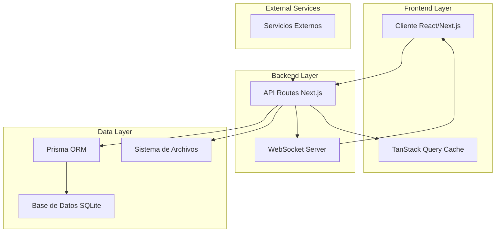
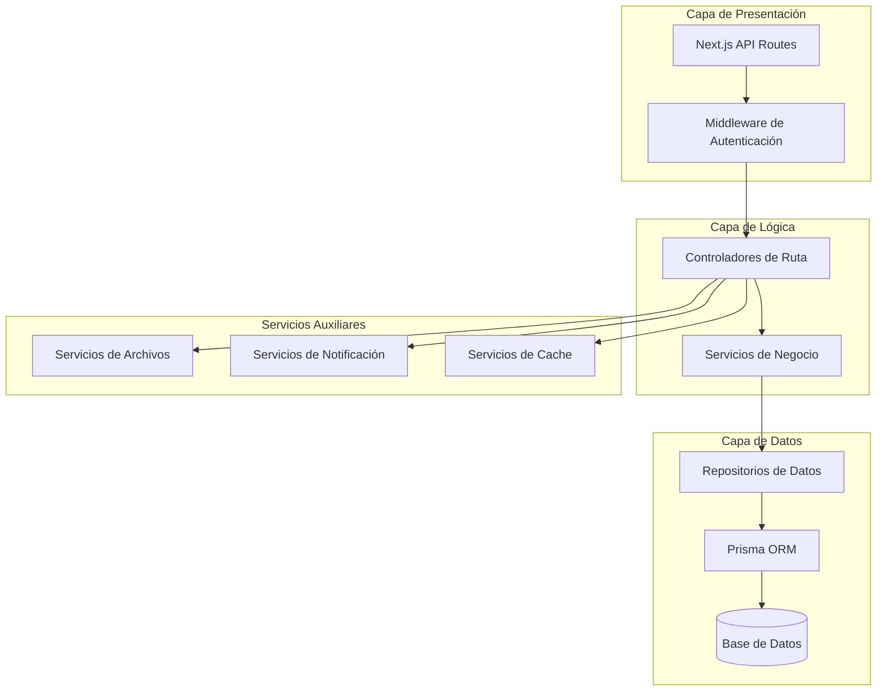
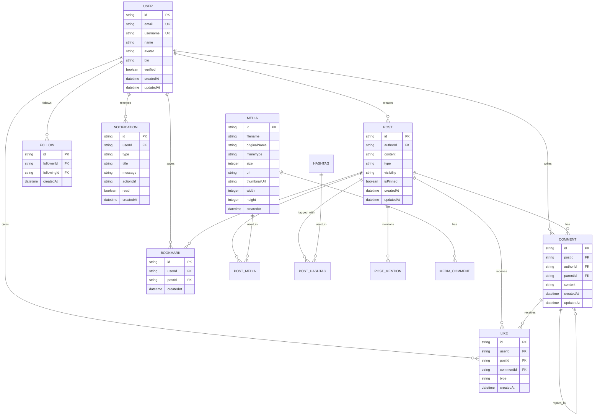

# Arquitectura Técnica - Sistema de Feed CRUNEVO

## 1. Diseño de Arquitectura



## 2. Descripción de Tecnologías

* **Frontend**: React\@18 + Next.js\@14 + TypeScript + Tailwind CSS + shadcn/ui

* **Backend**: Next.js API Routes + Prisma ORM + NextAuth.js

* **Base de Datos**: SQLite (desarrollo) / PostgreSQL (producción)

* **Cache y Estado**: TanStack Query + Zustand

* **Tiempo Real**: WebSockets + Server-Sent Events

* **Archivos**: Sistema de archivos local + Cloudinary (opcional)

## 3. Definiciones de Rutas

| Ruta                   | Propósito                                            |
| ---------------------- | ---------------------------------------------------- |
| /feed                  | Página principal del feed con timeline personalizado |
| /feed/\[postId]        | Vista detallada de un post específico                |
| /feed/media/\[mediaId] | Visor de medios con ID único                         |
| /profile/\[username]   | Perfil de usuario con posts y seguidores             |
| /notifications         | Centro de notificaciones unificado                   |
| /settings/feed         | Configuraciones específicas del feed                 |

## 4. Definiciones de API

### 4.1 APIs Principales del Feed

**Obtener Feed Personalizado**

```
GET /api/feed
```

Request:

| Parámetro | Tipo   | Requerido | Descripción                                   |
| --------- | ------ | --------- | --------------------------------------------- |
| cursor    | string | false     | Cursor para paginación infinita               |
| limit     | number | false     | Número de posts por página (default: 10)      |
| filter    | string | false     | Filtro: 'following', 'trending', 'recent'     |
| type      | string | false     | Tipo de post: 'all', 'text', 'image', 'video' |

Response:

| Parámetro  | Tipo    | Descripción                     |
| ---------- | ------- | ------------------------------- |
| posts      | Post\[] | Array de posts del feed         |
| nextCursor | string  | Cursor para la siguiente página |
| hasMore    | boolean | Indica si hay más contenido     |

Ejemplo:

```json
{
  "posts": [
    {
      "id": "post_123",
      "content": "Compartiendo mis apuntes de cálculo",
      "author": {
        "id": "user_456",
        "name": "María García",
        "username": "maria_garcia",
        "avatar": "/uploads/avatars/maria.jpg",
        "verified": true
      },
      "createdAt": "2024-01-15T10:30:00Z",
      "media": [
        {
          "id": "media_789",
          "type": "image",
          "url": "/uploads/posts/calculus_notes.jpg",
          "thumbnail": "/uploads/posts/thumbs/calculus_notes.jpg"
        }
      ],
      "stats": {
        "fires": 24,
        "comments": 8,
        "shares": 3,
        "saves": 12
      },
      "viewerState": {
        "fired": false,
        "saved": true,
        "following": true
      }
    }
  ],
  "nextCursor": "cursor_abc123",
  "hasMore": true
}
```

**Crear Nueva Publicación**

```
POST /api/feed
```

Request:

| Parámetro  | Tipo      | Requerido | Descripción                                        |
| ---------- | --------- | --------- | -------------------------------------------------- |
| content    | string    | true      | Contenido del post                                 |
| type       | string    | true      | Tipo: 'text', 'image', 'video', 'note', 'question' |
| media      | File\[]   | false     | Archivos multimedia                                |
| visibility | string    | false     | 'public', 'followers', 'private'                   |
| hashtags   | string\[] | false     | Array de hashtags                                  |
| mentions   | string\[] | false     | Array de IDs de usuarios mencionados               |

**Interacciones con Posts**

```
POST /api/feed/[postId]/fire
DELETE /api/feed/[postId]/fire
POST /api/feed/[postId]/save
DELETE /api/feed/[postId]/save
POST /api/feed/[postId]/share
```

**Sistema de Comentarios**

```
GET /api/feed/[postId]/comments
POST /api/feed/[postId]/comments
PUT /api/comments/[commentId]
DELETE /api/comments/[commentId]
POST /api/comments/[commentId]/fire
```

### 4.2 APIs de Gestión de Usuarios

**Seguir/Dejar de Seguir**

```
POST /api/users/[userId]/follow
DELETE /api/users/[userId]/follow
```

**Obtener Seguidores y Seguidos**

```
GET /api/users/[userId]/followers
GET /api/users/[userId]/following
```

### 4.3 APIs de Multimedia

**Subir Archivos**

```
POST /api/upload
```

Request:

| Parámetro | Tipo    | Requerido | Descripción               |
| --------- | ------- | --------- | ------------------------- |
| files     | File\[] | true      | Archivos a subir          |
| type      | string  | true      | 'post', 'avatar', 'cover' |
| postId    | string  | false     | ID del post asociado      |

**Obtener Información de Media**

```
GET /api/media/[mediaId]
```

## 5. Arquitectura del Servidor



## 6. Modelo de Datos

### 6.1 Diagrama de Entidades



### 6.2 Definiciones de Lenguaje de Datos (DDL)

**Extensiones al Esquema Prisma Existente**

```prisma
// Extensión del modelo Post existente
model Post {
  id          String    @id @default(cuid())
  content     String
  type        PostType  @default(TEXT)
  imageUrl    String?
  videoUrl    String?
  attachments String? // JSON string of file URLs
  tags        String? // Comma-separated hashtags
  visibility  Visibility @default(PUBLIC)
  isPinned    Boolean   @default(false)
  
  // Nuevos campos para funcionalidad avanzada
  editedAt    DateTime?
  shareCount  Int       @default(0)
  viewCount   Int       @default(0)
  
  authorId    String
  author      User      @relation(fields: [authorId], references: [id], onDelete: Cascade)
  
  createdAt   DateTime  @default(now())
  updatedAt   DateTime  @updatedAt
  
  // Relaciones existentes y nuevas
  comments    Comment[]
  likes       Like[]
  bookmarks   Bookmark[]
  reports     Report[]
  reactions   PostReaction[]
  media       PostMedia[]
  hashtags    PostHashtag[]
  mentions    PostMention[]
  shares      PostShare[]
  
  // Índices optimizados
  @@index([createdAt(sort: Desc)])
  @@index([authorId])
  @@index([type])
  @@index([visibility])
  @@index([shareCount(sort: Desc)])
  @@index([viewCount(sort: Desc)])
  @@map("posts")
}

// Nueva tabla para medios con metadatos completos
model Media {
  id            String   @id @default(cuid())
  filename      String
  originalName  String
  mimeType      String
  size          Int
  url           String
  thumbnailUrl  String?
  width         Int?
  height        Int?
  duration      Int?     // Para videos en segundos
  
  uploaderId    String
  uploader      User     @relation(fields: [uploaderId], references: [id])
  
  createdAt     DateTime @default(now())
  
  // Relaciones
  postMedia     PostMedia[]
  comments      MediaComment[]
  
  @@index([uploaderId])
  @@index([mimeType])
  @@map("media")
}

// Tabla de unión para posts y medios
model PostMedia {
  id      String @id @default(cuid())
  postId  String
  mediaId String
  order   Int    @default(0)
  
  post    Post   @relation(fields: [postId], references: [id], onDelete: Cascade)
  media   Media  @relation(fields: [mediaId], references: [id], onDelete: Cascade)
  
  @@unique([postId, mediaId])
  @@index([postId, order])
  @@map("post_media")
}

// Comentarios específicos para medios
model MediaComment {
  id        String   @id @default(cuid())
  mediaId   String
  authorId  String
  content   String
  
  media     Media    @relation(fields: [mediaId], references: [id], onDelete: Cascade)
  author    User     @relation(fields: [authorId], references: [id], onDelete: Cascade)
  
  createdAt DateTime @default(now())
  updatedAt DateTime @updatedAt
  
  @@index([mediaId])
  @@index([createdAt])
  @@map("media_comments")
}

// Hashtags normalizados
model Hashtag {
  id        String   @id @default(cuid())
  name      String   @unique
  useCount  Int      @default(0)
  
  posts     PostHashtag[]
  
  createdAt DateTime @default(now())
  
  @@index([useCount(sort: Desc)])
  @@map("hashtags")
}

// Relación posts-hashtags
model PostHashtag {
  id        String  @id @default(cuid())
  postId    String
  hashtagId String
  
  post      Post    @relation(fields: [postId], references: [id], onDelete: Cascade)
  hashtag   Hashtag @relation(fields: [hashtagId], references: [id], onDelete: Cascade)
  
  @@unique([postId, hashtagId])
  @@map("post_hashtags")
}

// Menciones en posts
model PostMention {
  id           String @id @default(cuid())
  postId       String
  mentionedId  String
  
  post         Post   @relation(fields: [postId], references: [id], onDelete: Cascade)
  mentioned    User   @relation("PostMentions", fields: [mentionedId], references: [id], onDelete: Cascade)
  
  createdAt    DateTime @default(now())
  
  @@unique([postId, mentionedId])
  @@map("post_mentions")
}

// Sistema de compartir posts
model PostShare {
  id        String   @id @default(cuid())
  postId    String
  userId    String
  comment   String?
  
  post      Post     @relation(fields: [postId], references: [id], onDelete: Cascade)
  user      User     @relation(fields: [userId], references: [id], onDelete: Cascade)
  
  createdAt DateTime @default(now())
  
  @@unique([postId, userId])
  @@index([createdAt])
  @@map("post_shares")
}

// Extensión del modelo Comment para hilos anidados
model Comment {
  id        String   @id @default(cuid())
  content   String
  editedAt  DateTime?
  
  authorId  String
  author    User     @relation(fields: [authorId], references: [id], onDelete: Cascade)
  
  postId    String?
  post      Post?    @relation(fields: [postId], references: [id], onDelete: Cascade)
  
  parentId  String?
  parent    Comment? @relation("CommentReplies", fields: [parentId], references: [id])
  replies   Comment[] @relation("CommentReplies")
  
  // Nuevos campos para funcionalidad avanzada
  depth     Int      @default(0)
  path      String?  // Para consultas eficientes de hilos
  
  createdAt DateTime @default(now())
  updatedAt DateTime @updatedAt
  
  // Relaciones
  likes     Like[]
  reports   Report[]
  mentions  CommentMention[]
  
  @@index([postId])
  @@index([parentId])
  @@index([createdAt])
  @@index([path])
  @@map("comments")
}

// Menciones en comentarios
model CommentMention {
  id          String  @id @default(cuid())
  commentId   String
  mentionedId String
  
  comment     Comment @relation(fields: [commentId], references: [id], onDelete: Cascade)
  mentioned   User    @relation("CommentMentions", fields: [mentionedId], references: [id], onDelete: Cascade)
  
  createdAt   DateTime @default(now())
  
  @@unique([commentId, mentionedId])
  @@map("comment_mentions")
}

// Extensión del modelo User para relaciones adicionales
model User {
  // ... campos existentes ...
  
  // Nuevas relaciones
  postMentions    PostMention[] @relation("PostMentions")
  commentMentions CommentMention[] @relation("CommentMentions")
  mediaUploads    Media[]
  mediaComments   MediaComment[]
  postShares      PostShare[]
  
  // Configuraciones de feed
  feedSettings    UserFeedSettings?
}

// Configuraciones personalizadas del feed por usuario
model UserFeedSettings {
  id                    String  @id @default(cuid())
  userId                String  @unique
  
  showFollowingFirst    Boolean @default(true)
  showMediaPosts        Boolean @default(true)
  showQuestionPosts     Boolean @default(true)
  showNotePosts         Boolean @default(true)
  autoplayVideos        Boolean @default(false)
  emailNotifications    Boolean @default(true)
  pushNotifications     Boolean @default(true)
  
  user                  User    @relation(fields: [userId], references: [id], onDelete: Cascade)
  
  createdAt             DateTime @default(now())
  updatedAt             DateTime @updatedAt
  
  @@map("user_feed_settings")
}
```

**Índices Adicionales para Optimización**

```sql
-- Índices compuestos para consultas frecuentes
CREATE INDEX idx_posts_author_created ON posts(authorId, createdAt DESC);
CREATE INDEX idx_posts_visibility_created ON posts(visibility, createdAt DESC);
CREATE INDEX idx_comments_post_created ON comments(postId, createdAt DESC);
CREATE INDEX idx_likes_user_post ON likes(userId, postId);
CREATE INDEX idx_follows_follower_created ON follows(followerId, createdAt DESC);

-- Índices para búsqueda de texto completo
CREATE INDEX idx_posts_content_fts ON posts USING gin(to_tsvector('spanish', content));
CREATE INDEX idx_hashtags_name_fts ON hashtags USING gin(to_tsvector('spanish', name));
```

**Datos Iniciales**

```sql
-- Hashtags populares iniciales
INSERT INTO hashtags (name, useCount) VALUES 
('#matematicas', 0),
('#programacion', 0),
('#fisica', 0),
('#quimica', 0),
('#ingenieria', 0),
('#medicina', 0),
('#derecho', 0),
('#economia', 0),
('#psicologia', 0),
('#historia', 0);

-- Configuraciones por defecto para usuarios existentes
INSERT INTO user_feed_settings (userId, showFollowingFirst, showMediaPosts, showQuestionPosts, showNotePosts)
SELECT id, true, true, true, true FROM users WHERE id NOT IN (SELECT userId FROM user_feed_settings);
```

## 7. Consideraciones de Rendimiento

### 7.1 Estrategias de Cache

* **TanStack Query**: Cache en cliente con invalidación inteligente

* **Redis**: Cache de sesiones y datos frecuentes (opcional)

* **CDN**: Distribución de archivos multimedia

* **Database Indexing**: Índices optimizados para consultas frecuentes

### 7.2 Optimizaciones de Base de Datos

* **Paginación Cursor-based**: Para infinite scroll eficiente

* **Lazy Loading**: Carga diferida de comentarios y medios

* **Batch Operations**: Agrupación de operaciones similares

* **Connection Pooling**: Gestión eficiente de conexiones

### 7.3 Optimizaciones de Frontend

* **Virtual Scrolling**: Para listas largas de posts

* **Image Optimization**: Lazy loading y responsive images

* **Code Splitting**: Carga bajo demanda de componentes

* **Service Workers**: Cache offline y actualizaciones en background

