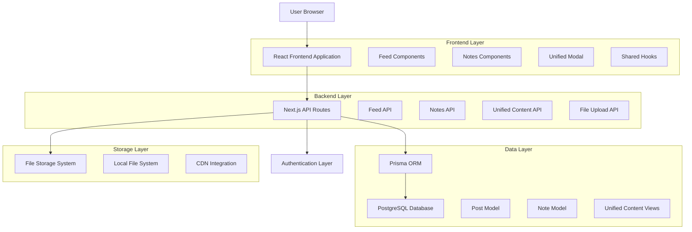
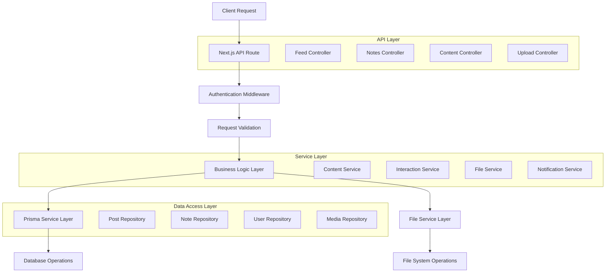
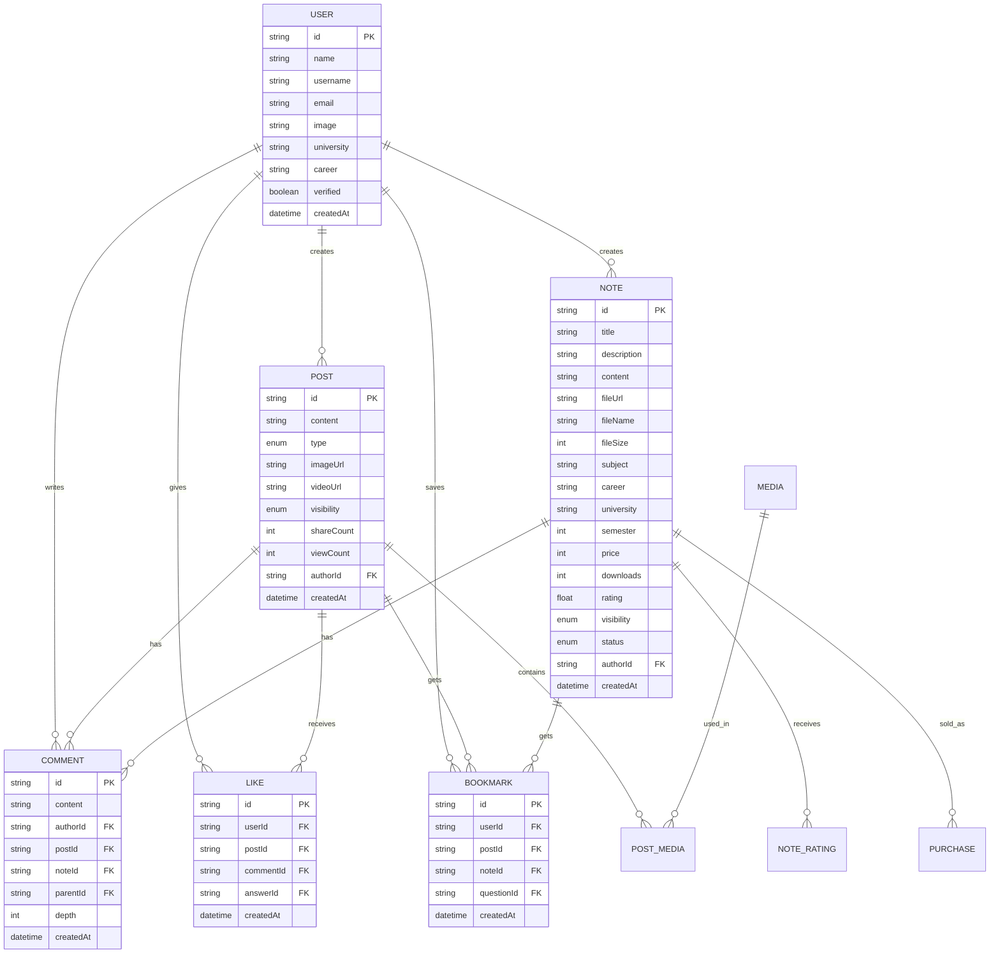

# Integración Sistema de Apuntes con Feed Social - Arquitectura Técnica

## 1. Architecture Design



## 2. Technology Description

* Frontend: React\@18 + Next.js\@14 + TypeScript + TailwindCSS\@3 + Framer Motion

* Backend: Next.js API Routes + Prisma ORM

* Database: PostgreSQL (via Prisma)

* File Storage: Local filesystem + future CDN integration

* Authentication: NextAuth.js

* State Management: TanStack Query + Zustand

* UI Components: Radix UI + Lucide React

## 3. Route Definitions

| Route                | Purpose                                               |
| -------------------- | ----------------------------------------------------- |
| /                    | Feed principal unificado con posts y apuntes          |
| /notes               | Vista especializada de apuntes con filtros académicos |
| /notes/\[id]         | Página de detalle de un apunte específico             |
| /profile/\[username] | Perfil de usuario con apuntes y posts                 |
| /upload              | Página dedicada de subida de apuntes (fallback)       |

## 4. API Definitions

### 4.1 Core API

#### Feed Unificado

```
GET /api/feed
```

Request:

| Param Name | Param Type | isRequired | Description                                           |
| ---------- | ---------- | ---------- | ----------------------------------------------------- |
| page       | number     | false      | Número de página (default: 1)                         |
| limit      | number     | false      | Elementos por página (default: 10)                    |
| type       | string     | false      | Filtro por tipo: 'all', 'posts', 'notes', 'questions' |
| sort       | string     | false      | Ordenamiento: 'recent', 'popular', 'trending'         |
| subject    | string     | false      | Filtro por materia (solo para apuntes)                |
| career     | string     | false      | Filtro por carrera                                    |
| university | string     | false      | Filtro por universidad                                |

Response:

| Param Name | Param Type | Description                  |
| ---------- | ---------- | ---------------------------- |
| items      | array      | Lista unificada de contenido |
| pagination | object     | Información de paginación    |
| filters    | object     | Filtros aplicados            |

Example Response:

```json
{
  "items": [
    {
      "id": "post_123",
      "type": "POST",
      "content": "Contenido del post",
      "author": {...},
      "stats": {...},
      "createdAt": "2024-01-15T10:30:00Z"
    },
    {
      "id": "note_456",
      "type": "NOTE",
      "title": "Apuntes de Cálculo I",
      "description": "Límites y derivadas",
      "subject": "Matemáticas",
      "fileUrl": "/uploads/notes/calc1.pdf",
      "author": {...},
      "stats": {...},
      "createdAt": "2024-01-15T09:15:00Z"
    }
  ],
  "pagination": {
    "page": 1,
    "limit": 10,
    "hasMore": true
  }
}
```

#### Creación de Contenido Unificado

```
POST /api/content
```

Request:

| Param Name  | Param Type | isRequired  | Description                       |
| ----------- | ---------- | ----------- | --------------------------------- |
| type        | string     | true        | Tipo: 'POST' o 'NOTE'             |
| content     | string     | conditional | Contenido (requerido para posts)  |
| title       | string     | conditional | Título (requerido para apuntes)   |
| description | string     | false       | Descripción del apunte            |
| subject     | string     | conditional | Materia (requerido para apuntes)  |
| career      | string     | false       | Carrera                           |
| university  | string     | false       | Universidad                       |
| semester    | number     | false       | Semestre                          |
| tags        | array      | false       | Tags del contenido                |
| visibility  | string     | false       | 'PUBLIC', 'FOLLOWERS', 'PRIVATE'  |
| files       | array      | conditional | Archivos (requerido para apuntes) |

#### Interacciones Unificadas

```
POST /api/content/[id]/like
DELETE /api/content/[id]/like
POST /api/content/[id]/bookmark
DELETE /api/content/[id]/bookmark
POST /api/content/[id]/comment
```

#### Subida de Archivos

```
POST /api/upload
```

Request (multipart/form-data):

| Param Name | Param Type | isRequired | Description                        |
| ---------- | ---------- | ---------- | ---------------------------------- |
| files      | File\[]    | true       | Archivos a subir                   |
| type       | string     | true       | Tipo de contenido: 'note', 'media' |

Response:

```json
{
  "files": [
    {
      "id": "file_123",
      "url": "/uploads/notes/document.pdf",
      "filename": "document.pdf",
      "size": 1024000,
      "mimeType": "application/pdf"
    }
  ]
}
```

## 5. Server Architecture Diagram



## 6. Data Model

### 6.1 Data Model Definition



### 6.2 Data Definition Language

#### Modificaciones al Schema Existente

```sql
-- Agregar campos para integración unificada
ALTER TABLE posts ADD COLUMN IF NOT EXISTS note_reference_id VARCHAR(255);
ALTER TABLE notes ADD COLUMN IF NOT EXISTS post_reference_id VARCHAR(255);

-- Índices para performance del feed unificado
CREATE INDEX IF NOT EXISTS idx_posts_created_at_type ON posts(created_at DESC, type);
CREATE INDEX IF NOT EXISTS idx_notes_created_at_status ON notes(created_at DESC, status);
CREATE INDEX IF NOT EXISTS idx_unified_content_timeline ON (
    (SELECT id, 'POST' as content_type, created_at, author_id FROM posts WHERE visibility = 'PUBLIC')
    UNION ALL
    (SELECT id, 'NOTE' as content_type, created_at, author_id FROM notes WHERE status = 'APPROVED' AND visibility = 'PUBLIC')
);

-- Vista para contenido unificado
CREATE OR REPLACE VIEW unified_content AS
SELECT 
    p.id,
    'POST' as content_type,
    p.content as title,
    p.content as description,
    NULL as subject,
    NULL as career,
    NULL as file_url,
    p.author_id,
    p.created_at,
    p.updated_at,
    p.visibility,
    'APPROVED' as status
FROM posts p
WHERE p.visibility = 'PUBLIC'

UNION ALL

SELECT 
    n.id,
    'NOTE' as content_type,
    n.title,
    n.description,
    n.subject,
    n.career,
    n.file_url,
    n.author_id,
    n.created_at,
    n.updated_at,
    n.visibility,
    n.status::text
FROM notes n
WHERE n.status = 'APPROVED' AND n.visibility = 'PUBLIC';

-- Función para obtener estadísticas unificadas
CREATE OR REPLACE FUNCTION get_content_stats(content_id VARCHAR, content_type VARCHAR)
RETURNS JSON AS $$
DECLARE
    result JSON;
BEGIN
    IF content_type = 'POST' THEN
        SELECT json_build_object(
            'likes', COALESCE(like_count, 0),
            'comments', COALESCE(comment_count, 0),
            'bookmarks', COALESCE(bookmark_count, 0),
            'shares', COALESCE(share_count, 0)
        ) INTO result
        FROM (
            SELECT 
                (SELECT COUNT(*) FROM likes WHERE post_id = content_id) as like_count,
                (SELECT COUNT(*) FROM comments WHERE post_id = content_id) as comment_count,
                (SELECT COUNT(*) FROM bookmarks WHERE post_id = content_id) as bookmark_count,
                (SELECT share_count FROM posts WHERE id = content_id) as share_count
        ) stats;
    ELSIF content_type = 'NOTE' THEN
        SELECT json_build_object(
            'downloads', COALESCE(downloads, 0),
            'rating', COALESCE(rating, 0),
            'comments', COALESCE(comment_count, 0),
            'bookmarks', COALESCE(bookmark_count, 0)
        ) INTO result
        FROM (
            SELECT 
                n.downloads,
                n.rating,
                (SELECT COUNT(*) FROM comments WHERE note_id = content_id) as comment_count,
                (SELECT COUNT(*) FROM bookmarks WHERE note_id = content_id) as bookmark_count
            FROM notes n WHERE n.id = content_id
        ) stats;
    END IF;
    
    RETURN result;
END;
$$ LANGUAGE plpgsql;

-- Trigger para mantener sincronizadas las referencias cruzadas
CREATE OR REPLACE FUNCTION sync_content_references()
RETURNS TRIGGER AS $$
BEGIN
    -- Lógica para sincronizar referencias entre posts y notes si es necesario
    RETURN NEW;
END;
$$ LANGUAGE plpgsql;
```

#### Datos Iniciales para Testing

```sql
-- Insertar datos de prueba para apuntes
INSERT INTO notes (id, title, description, subject, career, university, author_id, status, visibility)
VALUES 
    ('note_test_1', 'Apuntes de Cálculo Diferencial', 'Límites, derivadas y aplicaciones', 'Matemáticas', 'Ingeniería', 'Universidad Nacional', 'user_1', 'APPROVED', 'PUBLIC'),
    ('note_test_2', 'Fundamentos de Programación', 'Algoritmos básicos y estructuras de datos', 'Programación', 'Sistemas', 'Universidad Tecnológica', 'user_2', 'APPROVED', 'PUBLIC');

-- Insertar comentarios de prueba
INSERT INTO comments (id, content, author_id, note_id)
VALUES 
    ('comment_note_1', 'Excelentes apuntes, muy claros', 'user_3', 'note_test_1'),
    ('comment_note_2', '¿Podrías agregar más ejemplos?', 'user_4', 'note_test_1');

-- Insertar bookmarks de prueba
INSERT INTO bookmarks (id, user_id, note_id)
VALUES 
    ('bookmark_1', 'user_3', 'note_test_1'),
    ('bookmark_2', 'user_4', 'note_test_2');
```

