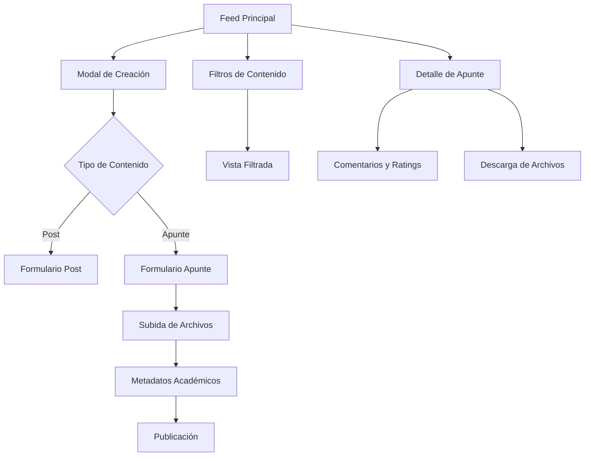

# Integración Sistema de Apuntes con Feed Social - PRD

## 1. Product Overview

Integración completa del sistema de apuntes académicos con el feed social principal, permitiendo que las notas sean parte integral de la experiencia social de la plataforma. Los usuarios podrán crear, compartir, descubrir y interactuar con apuntes directamente desde el feed principal, eliminando la separación entre contenido social y académico.

Esta integración transformará los apuntes de una funcionalidad aislada a un componente central del ecosistema social académico, aumentando el engagement y la utilidad de la plataforma.

## 2. Core Features

### 2.1 User Roles

| Role | Registration Method | Core Permissions |
|------|---------------------|------------------|
| Estudiante | Registro con email universitario | Puede crear, compartir y descargar apuntes gratuitos, interactuar socialmente |
| Estudiante Premium | Upgrade mediante pago | Acceso a apuntes premium, funciones avanzadas de organización |
| Creador de Contenido | Verificación académica | Puede monetizar apuntes, acceso a analytics avanzados |

### 2.2 Feature Module

Nuestra integración de apuntes-feed consiste en las siguientes páginas principales:

1. **Feed Principal**: timeline unificado, modal de creación, filtros de contenido, sistema de reacciones
2. **Página de Apuntes**: vista especializada, filtros académicos, sistema de categorías
3. **Perfil de Usuario**: apuntes publicados, estadísticas académicas, logros
4. **Página de Detalle de Apunte**: vista completa, comentarios, descargas, ratings
5. **Modal de Subida**: creación desde feed, formulario completo, preview de archivos

### 2.3 Page Details

| Page Name | Module Name | Feature description |
|-----------|-------------|---------------------|
| Feed Principal | Timeline Unificado | Mostrar posts y apuntes en orden cronológico/relevancia, filtros por tipo de contenido |
| Feed Principal | Modal de Creación | Crear posts regulares y apuntes desde el mismo modal, cambio dinámico de formulario |
| Feed Principal | Sistema de Interacciones | Like, comentar, guardar y compartir tanto posts como apuntes de forma unificada |
| Feed Principal | Filtros de Contenido | Filtrar por tipo (posts, apuntes, preguntas), materia, carrera, universidad |
| Página de Apuntes | Vista Especializada | Grid de apuntes con filtros académicos específicos, ordenamiento por popularidad/fecha |
| Página de Apuntes | Filtros Académicos | Filtrar por materia, carrera, semestre, universidad, tipo de archivo, precio |
| Página de Apuntes | Sistema de Búsqueda | Búsqueda por título, descripción, tags, contenido de archivos |
| Perfil de Usuario | Apuntes Publicados | Lista de apuntes creados por el usuario, estadísticas de descargas y ratings |
| Perfil de Usuario | Estadísticas Académicas | Métricas de contribución académica, materias cubiertas, impacto |
| Detalle de Apunte | Vista Completa | Información completa del apunte, preview de archivos, datos del autor |
| Detalle de Apunte | Sistema de Comentarios | Comentarios específicos del apunte, ratings y reviews |
| Detalle de Apunte | Sistema de Descargas | Descarga de archivos, tracking de descargas, sistema de pagos |
| Modal de Subida | Formulario Dinámico | Cambio entre crear post y apunte, validaciones específicas por tipo |
| Modal de Subida | Gestión de Archivos | Upload de múltiples archivos, preview, validación de formatos |
| Modal de Subida | Metadatos Académicos | Campos específicos para apuntes: materia, carrera, semestre, tags |

## 3. Core Process

### Flujo Principal del Usuario:

1. **Navegación del Feed**: El usuario accede al feed principal donde ve una mezcla de posts sociales y apuntes académicos
2. **Creación de Contenido**: Desde el modal unificado, puede elegir crear un post regular o subir un apunte
3. **Interacción Social**: Puede dar like, comentar, guardar y compartir tanto posts como apuntes
4. **Descubrimiento Académico**: Usa filtros para encontrar apuntes específicos por materia o carrera
5. **Gestión Personal**: Accede a sus apuntes guardados y creados desde su perfil

### Flujo de Creación de Apuntes:

1. **Acceso al Modal**: Click en "Crear" desde el feed principal
2. **Selección de Tipo**: Elegir entre "Post" y "Apunte" en el modal
3. **Formulario Dinámico**: El formulario cambia para mostrar campos específicos de apuntes
4. **Subida de Archivos**: Arrastrar y soltar archivos con preview en tiempo real
5. **Metadatos**: Completar información académica (materia, carrera, tags)
6. **Publicación**: Enviar para revisión o publicar directamente según permisos

## 4. User Interface Design

### 4.1 Design Style

- **Colores Primarios**: Azul académico (#2563eb), Verde éxito (#16a34a)
- **Colores Secundarios**: Gris neutro (#64748b), Naranja acento (#ea580c)
- **Estilo de Botones**: Redondeados con sombras sutiles, estados hover animados
- **Tipografía**: Inter para UI (14px-16px), Roboto Mono para código (12px-14px)
- **Layout**: Card-based con navegación superior fija, sidebar colapsible
- **Iconos**: Lucide React con estilo outline, tamaño 20px-24px
- **Animaciones**: Transiciones suaves de 200ms, micro-interacciones en hover

### 4.2 Page Design Overview

| Page Name | Module Name | UI Elements |
|-----------|-------------|-------------|
| Feed Principal | Timeline Unificado | Cards diferenciadas por tipo con iconos distintivos, layout masonry responsivo |
| Feed Principal | Modal de Creación | Modal centrado 600px, tabs para tipo de contenido, drag & drop area |
| Feed Principal | Filtros de Contenido | Barra horizontal con chips seleccionables, dropdown para filtros avanzados |
| Página de Apuntes | Grid de Apuntes | Grid responsivo 3-4 columnas, cards con preview de archivos y metadatos |
| Página de Apuntes | Filtros Académicos | Sidebar izquierdo colapsible, filtros agrupados por categoría |
| Detalle de Apunte | Vista Completa | Layout de 2 columnas, preview de archivo a la izquierda, info a la derecha |
| Detalle de Apunte | Comentarios | Lista threaded con avatares, sistema de rating con estrellas |
| Modal de Subida | Formulario Dinámico | Formulario de pasos con indicador de progreso, validación en tiempo real |

### 4.3 Responsiveness

Diseño mobile-first con breakpoints en 768px y 1024px. Optimizado para touch en dispositivos móviles con botones de mínimo 44px. El modal de creación se adapta a pantalla completa en móviles y mantiene formato centrado en desktop.