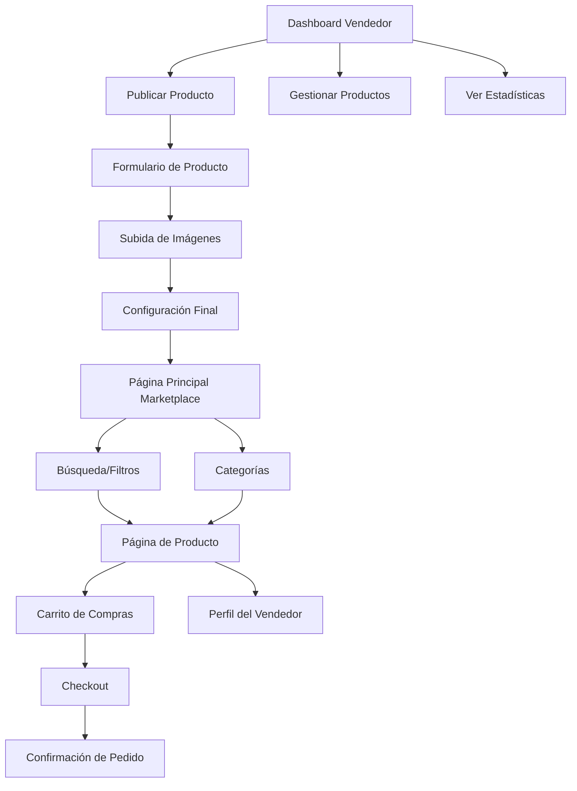

# Sistema de Marketplace Moderno - Especificaciones del Producto

## 1. Visión General del Producto

Sistema de marketplace completo con diseño moderno tipo Facebook Marketplace y MercadoLibre, que permite a los usuarios comprar y vender cualquier tipo de producto desde artículos tecnológicos hasta bienes raíces. El sistema está optimizado para el mercado peruano con soporte inicial en soles peruanos y preparado para expansión internacional con múltiples monedas.

* **Objetivo Principal**: Crear una plataforma de comercio electrónico completa y moderna que facilite las transacciones entre usuarios universitarios y la comunidad en general.

* **Valor de Mercado**: Democratizar el comercio electrónico con una interfaz intuitiva y funcionalidades avanzadas de búsqueda, filtrado y gestión de productos.

## 2. Características Principales

### 2.1 Roles de Usuario

| Rol           | Método de Registro                  | Permisos Principales                                                                                   |
| ------------- | ----------------------------------- | ------------------------------------------------------------------------------------------------------ |
| Comprador     | Registro con email universitario    | Navegar productos, realizar compras, gestionar carrito, valorar productos                              |
| Vendedor      | Verificación adicional de identidad | Todos los permisos de comprador + publicar productos, gestionar inventario, ver estadísticas de ventas |
| Moderador     | Invitación del administrador        | Revisar productos reportados, moderar contenido, gestionar disputas                                    |
| Administrador | Acceso del sistema                  | Control total del marketplace, gestión de usuarios, configuración de categorías                        |

### 2.2 Módulos de Funcionalidad

Nuestro sistema de marketplace consta de las siguientes páginas principales:

1. **Página Principal del Marketplace**: hero section con búsqueda, grid de productos destacados, filtros avanzados, categorías principales.
2. **Página de Producto**: galería de imágenes, información detallada, reseñas, productos relacionados, botón de compra/carrito.
3. **Página de Búsqueda y Filtros**: resultados en grid, filtros por categoría/precio/ubicación, ordenamiento, paginación.
4. **Página de Publicar Producto**: formulario completo, subida múltiple de imágenes, configuración de precio y stock.
5. **Página de Gestión de Vendedor**: dashboard de productos, estadísticas de ventas, gestión de pedidos.
6. **Página de Carrito de Compras**: resumen de productos, cálculo de totales, proceso de checkout.
7. **Página de Perfil de Vendedor**: información del vendedor, productos en venta, valoraciones y reseñas.
8. **Página de Historial de Compras**: pedidos realizados, estado de envíos, opciones de valoración.

### 2.3 Detalles de Páginas

| Página                | Módulo                   | Descripción de Funcionalidad                                                                             |
| --------------------- | ------------------------ | -------------------------------------------------------------------------------------------------------- |
| Marketplace Principal | Hero Section             | Barra de búsqueda prominente, categorías destacadas, banner promocional                                  |
| Marketplace Principal | Grid de Productos        | Mostrar productos en cuadritos estilo Facebook/MercadoLibre, imagen principal, precio, título, ubicación |
| Marketplace Principal | Filtros Laterales        | Filtrar por categoría, rango de precios, ubicación, condición del producto                               |
| Marketplace Principal | Navegación de Categorías | Menú desplegable con todas las categorías desde tecnología hasta bienes raíces                           |
| Producto Individual   | Galería de Imágenes      | Carrusel de imágenes con zoom, vista previa en miniatura                                                 |
| Producto Individual   | Información del Producto | Título, descripción, precio en soles, especificaciones, condición                                        |
| Producto Individual   | Perfil del Vendedor      | Foto, nombre, valoración, productos vendidos, tiempo en la plataforma                                    |
| Producto Individual   | Sistema de Reseñas       | Valoraciones con estrellas, comentarios de compradores, fotos de reseñas                                 |
| Publicar Producto     | Formulario de Producto   | Título, descripción, categoría, subcategoría, precio, condición                                          |
| Publicar Producto     | Subida de Imágenes       | Drag & drop múltiple, preview, reordenamiento, compresión automática                                     |
| Publicar Producto     | Configuración Avanzada   | Stock, ubicación, opciones de envío, políticas de devolución                                             |
| Búsqueda y Filtros    | Resultados en Grid       | Productos mostrados en cuadritos responsivos con información clave                                       |
| Búsqueda y Filtros    | Filtros Avanzados        | Por precio, categoría, ubicación, condición, fecha de publicación                                        |
| Búsqueda y Filtros    | Ordenamiento             | Por relevancia, precio (menor/mayor), fecha, popularidad                                                 |
| Carrito de Compras    | Lista de Productos       | Productos seleccionados, cantidad, precio unitario, subtotal                                             |
| Carrito de Compras    | Cálculo de Totales       | Subtotal, impuestos, costos de envío, total final en soles                                               |
| Carrito de Compras    | Proceso de Checkout      | Información de envío, método de pago, confirmación de pedido                                             |
| Dashboard Vendedor    | Gestión de Productos     | Lista de productos publicados, editar, pausar, eliminar                                                  |
| Dashboard Vendedor    | Estadísticas de Ventas   | Gráficos de ventas, productos más vendidos, ingresos totales                                             |
| Dashboard Vendedor    | Gestión de Pedidos       | Pedidos pendientes, procesamiento, historial de ventas                                                   |

## 3. Flujo Principal de Procesos

### Flujo del Comprador:

1. El usuario ingresa al marketplace y navega por las categorías o utiliza la búsqueda
2. Aplica filtros para encontrar productos específicos
3. Selecciona un producto para ver los detalles completos
4. Agrega el producto al carrito o compra directamente
5. Completa el proceso de checkout con información de envío y pago
6. Recibe confirmación del pedido y puede rastrear el estado
7. Una vez recibido, puede valorar el producto y al vendedor

### Flujo del Vendedor:

1. El usuario se registra y verifica su cuenta para vender
2. Accede al dashboard de vendedor y selecciona "Publicar Producto"
3. Completa el formulario con información del producto
4. Sube múltiples imágenes del producto
5. Configura precio, stock y opciones de envío
6. Publica el producto para que aparezca en el marketplace
7. Gestiona pedidos y se comunica con compradores
8. Actualiza el estado de los envíos y recibe valoraciones

## 4. Diseño de Interfaz de Usuario

### 4.1 Estilo de Diseño

* **Colores Primarios**:

  * Azul principal: #1877F2 (estilo Facebook)

  * Verde de acción: #42B883 (para botones de compra)

  * Naranja de alerta: #FF6B35 (para ofertas y descuentos)

* **Colores Secundarios**:

  * Gris claro: #F8F9FA (fondos)

  * Gris medio: #6C757D (texto secundario)

  * Blanco: #FFFFFF (tarjetas y contenedores)

* **Estilo de Botones**: Redondeados con radio de 8px, sombras sutiles, efectos hover suaves

* **Tipografía**:

  * Fuente principal: Inter, sans-serif

  * Tamaños: 32px (títulos), 18px (subtítulos), 16px (texto normal), 14px (texto pequeño)

* **Estilo de Layout**: Grid responsivo tipo Pinterest/MercadoLibre, tarjetas con sombras, navegación superior fija

* **Iconografía**: Iconos de Lucide React, estilo minimalista y consistente

### 4.2 Diseño de Páginas

| Página                | Módulo             | Elementos de UI                                                                                   |
| --------------------- | ------------------ | ------------------------------------------------------------------------------------------------- |
| Marketplace Principal | Hero Section       | Barra de búsqueda centrada con icono de lupa, fondo degradado azul-blanco, categorías en chips    |
| Marketplace Principal | Grid de Productos  | Tarjetas 280x320px, imagen 280x200px, título truncado, precio en negrita verde, ubicación en gris |
| Marketplace Principal | Filtros Laterales  | Sidebar 300px, acordeones colapsables, sliders para precios, checkboxes para categorías           |
| Producto Individual   | Galería            | Imagen principal 600x400px, thumbnails 80x80px, botones de navegación, zoom modal                 |
| Producto Individual   | Info del Producto  | Título h1 32px, precio 28px verde, descripción 16px, especificaciones en tabla                    |
| Publicar Producto     | Subida de Imágenes | Zona drag & drop 400x300px, previews 120x120px, botón "Agregar más" estilo dashed                 |
| Carrito               | Lista de Productos | Filas con imagen 80x80px, info del producto, controles de cantidad, precio alineado derecha       |
| Dashboard Vendedor    | Estadísticas       | Cards con métricas, gráficos Chart.js, colores consistentes con el tema                           |

### 4.3 Responsividad

El marketplace está diseñado con enfoque mobile-first y es completamente responsivo:

* **Desktop (1200px+)**: Grid de 4-5 productos por fila, sidebar de filtros visible

* **Tablet (768px-1199px)**: Grid de 2-3 productos por fila, filtros en modal

* **Mobile (320px-767px)**: Grid de 1-2 productos por fila, navegación hamburguesa, filtros en bottom sheet

* **Optimización táctil**: Botones mínimo 44px, espaciado adecuado, gestos swipe para galerías

