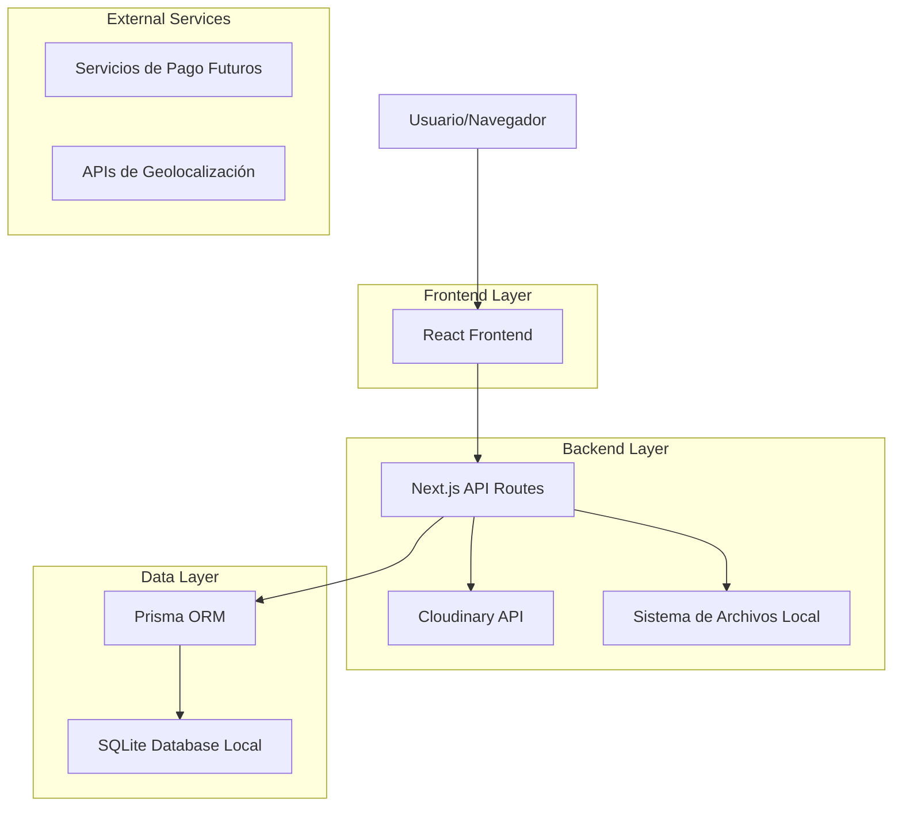
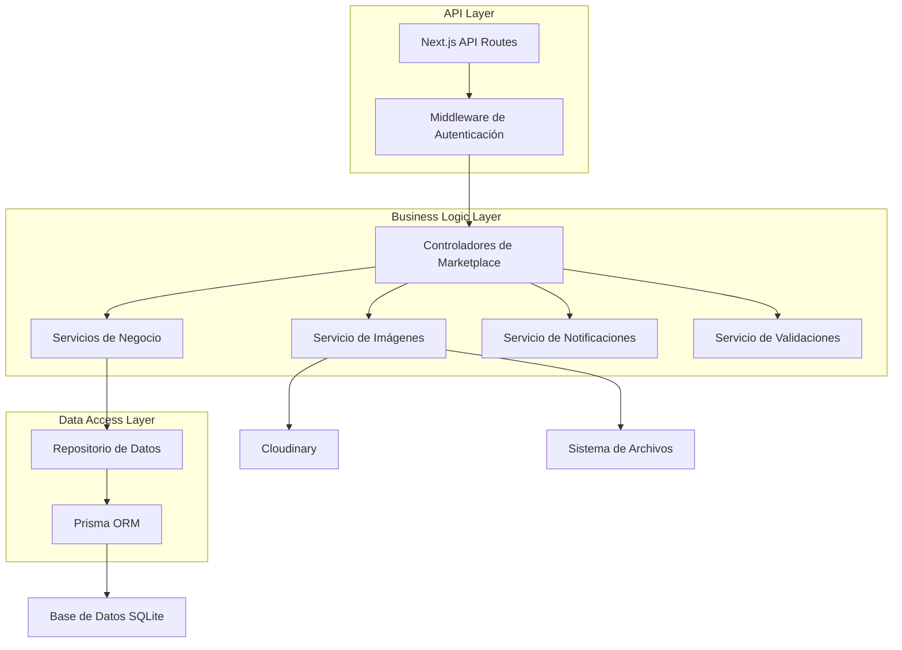
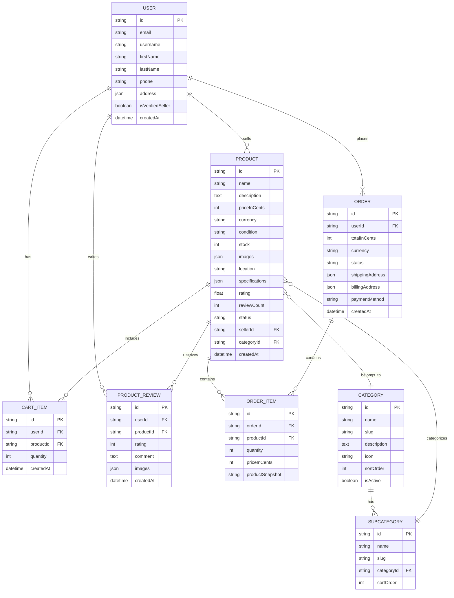

# Arquitectura Técnica del Sistema de Marketplace

## 1. Diseño de Arquitectura



## 2. Descripción de Tecnologías

* **Frontend**: React\@18 + Next.js\@14 + TypeScript + Tailwind CSS + Shadcn/ui

* **Backend**: Next.js API Routes + Prisma ORM

* **Base de Datos**: SQLite (local) con migración futura a PostgreSQL

* **Subida de Imágenes**: Cloudinary + sistema de respaldo local

* **Autenticación**: NextAuth.js integrado con el sistema existente

* **Validación**: Zod para validación de esquemas

* **Estado Global**: Zustand para gestión de carrito y estado del marketplace

## 3. Definiciones de Rutas

| Ruta                            | Propósito                                                        |
| ------------------------------- | ---------------------------------------------------------------- |
| /marketplace                    | Página principal del marketplace con grid de productos y filtros |
| /marketplace/search             | Página de búsqueda avanzada con filtros y resultados             |
| /marketplace/product/\[id]      | Página de detalle de producto individual                         |
| /marketplace/sell               | Página para publicar un nuevo producto                           |
| /marketplace/seller/\[id]       | Perfil público del vendedor                                      |
| /marketplace/dashboard          | Dashboard del vendedor para gestionar productos                  |
| /marketplace/cart               | Carrito de compras                                               |
| /marketplace/checkout           | Proceso de checkout y pago                                       |
| /marketplace/orders             | Historial de pedidos del usuario                                 |
| /marketplace/categories/\[slug] | Productos por categoría específica                               |

## 4. Definiciones de API

### 4.1 APIs Principales

**Gestión de Productos**

```
GET /api/marketplace/products
```

Request:

| Parámetro | Tipo   | Requerido | Descripción                                                  |
| --------- | ------ | --------- | ------------------------------------------------------------ |
| page      | number | false     | Número de página (default: 1)                                |
| limit     | number | false     | Productos por página (default: 20)                           |
| category  | string | false     | Filtrar por categoría                                        |
| minPrice  | number | false     | Precio mínimo en soles                                       |
| maxPrice  | number | false     | Precio máximo en soles                                       |
| search    | string | false     | Término de búsqueda                                          |
| sortBy    | string | false     | Ordenar por: price\_asc, price\_desc, date\_desc, popularity |

Response:

| Parámetro   | Tipo       | Descripción                    |
| ----------- | ---------- | ------------------------------ |
| products    | Product\[] | Array de productos             |
| totalCount  | number     | Total de productos encontrados |
| currentPage | number     | Página actual                  |
| totalPages  | number     | Total de páginas               |

```
POST /api/marketplace/products
```

Request:

| Parámetro   | Tipo      | Requerido | Descripción                                             |
| ----------- | --------- | --------- | ------------------------------------------------------- |
| name        | string    | true      | Nombre del producto                                     |
| description | string    | true      | Descripción detallada                                   |
| price       | number    | true      | Precio en soles (centavos)                              |
| category    | string    | true      | Categoría del producto                                  |
| subcategory | string    | false     | Subcategoría                                            |
| condition   | string    | true      | NUEVO, USADO\_COMO\_NUEVO, USADO\_BUENO, USADO\_REGULAR |
| stock       | number    | true      | Cantidad disponible                                     |
| images      | string\[] | true      | URLs de las imágenes                                    |
| location    | string    | true      | Ubicación del vendedor                                  |
| tags        | string\[] | false     | Etiquetas del producto                                  |

Response:

| Parámetro | Tipo    | Descripción             |
| --------- | ------- | ----------------------- |
| success   | boolean | Estado de la operación  |
| productId | string  | ID del producto creado  |
| message   | string  | Mensaje de confirmación |

**Gestión de Imágenes**

```
POST /api/marketplace/upload-images
```

Request:

| Parámetro | Tipo    | Requerido | Descripción                       |
| --------- | ------- | --------- | --------------------------------- |
| images    | File\[] | true      | Array de archivos de imagen       |
| productId | string  | false     | ID del producto (para actualizar) |

Response:

| Parámetro  | Tipo      | Descripción                  |
| ---------- | --------- | ---------------------------- |
| success    | boolean   | Estado de la operación       |
| imageUrls  | string\[] | URLs de las imágenes subidas |
| thumbnails | string\[] | URLs de las miniaturas       |

**Gestión del Carrito**

```
POST /api/marketplace/cart/add
```

Request:

| Parámetro | Tipo   | Requerido | Descripción        |
| --------- | ------ | --------- | ------------------ |
| productId | string | true      | ID del producto    |
| quantity  | number | true      | Cantidad a agregar |

Response:

| Parámetro     | Tipo    | Descripción                  |
| ------------- | ------- | ---------------------------- |
| success       | boolean | Estado de la operación       |
| cartItemCount | number  | Total de items en el carrito |

**Gestión de Pedidos**

```
POST /api/marketplace/orders
```

Request:

| Parámetro       | Tipo        | Requerido | Descripción        |
| --------------- | ----------- | --------- | ------------------ |
| items           | CartItem\[] | true      | Items del carrito  |
| shippingAddress | Address     | true      | Dirección de envío |
| paymentMethod   | string      | true      | Método de pago     |
| notes           | string      | false     | Notas adicionales  |

Response:

| Parámetro | Tipo    | Descripción               |
| --------- | ------- | ------------------------- |
| success   | boolean | Estado de la operación    |
| orderId   | string  | ID del pedido creado      |
| total     | number  | Total del pedido en soles |

## 5. Arquitectura del Servidor



## 6. Modelo de Datos

### 6.1 Definición del Modelo de Datos



### 6.2 Lenguaje de Definición de Datos (DDL)

**Extensiones al Schema Prisma Existente**

```sql
-- Actualizar modelo Product existente
ALTER TABLE products ADD COLUMN condition TEXT DEFAULT 'USADO_BUENO';
ALTER TABLE products ADD COLUMN location TEXT;
ALTER TABLE products ADD COLUMN specifications TEXT; -- JSON
ALTER TABLE products ADD COLUMN currency TEXT DEFAULT 'PEN';
ALTER TABLE products ADD COLUMN priceInCents INTEGER; -- Precio en centavos
ALTER TABLE products ADD COLUMN subcategoryId TEXT;
ALTER TABLE products ADD COLUMN viewCount INTEGER DEFAULT 0;
ALTER TABLE products ADD COLUMN favoriteCount INTEGER DEFAULT 0;

-- Crear tabla de categorías del marketplace
CREATE TABLE marketplace_categories (
    id TEXT PRIMARY KEY,
    name TEXT NOT NULL,
    slug TEXT UNIQUE NOT NULL,
    description TEXT,
    icon TEXT,
    parentId TEXT,
    sortOrder INTEGER DEFAULT 0,
    isActive BOOLEAN DEFAULT true,
    createdAt DATETIME DEFAULT CURRENT_TIMESTAMP,
    updatedAt DATETIME DEFAULT CURRENT_TIMESTAMP,
    FOREIGN KEY (parentId) REFERENCES marketplace_categories(id)
);

-- Crear tabla de reseñas de productos
CREATE TABLE product_reviews (
    id TEXT PRIMARY KEY,
    userId TEXT NOT NULL,
    productId TEXT NOT NULL,
    orderId TEXT,
    rating INTEGER NOT NULL CHECK (rating >= 1 AND rating <= 5),
    title TEXT,
    comment TEXT,
    images TEXT, -- JSON array de URLs
    isVerifiedPurchase BOOLEAN DEFAULT false,
    helpfulCount INTEGER DEFAULT 0,
    createdAt DATETIME DEFAULT CURRENT_TIMESTAMP,
    updatedAt DATETIME DEFAULT CURRENT_TIMESTAMP,
    FOREIGN KEY (userId) REFERENCES users(id),
    FOREIGN KEY (productId) REFERENCES products(id),
    FOREIGN KEY (orderId) REFERENCES orders(id)
);

-- Crear tabla de favoritos
CREATE TABLE product_favorites (
    id TEXT PRIMARY KEY,
    userId TEXT NOT NULL,
    productId TEXT NOT NULL,
    createdAt DATETIME DEFAULT CURRENT_TIMESTAMP,
    FOREIGN KEY (userId) REFERENCES users(id),
    FOREIGN KEY (productId) REFERENCES products(id),
    UNIQUE(userId, productId)
);

-- Crear tabla de historial de precios
CREATE TABLE price_history (
    id TEXT PRIMARY KEY,
    productId TEXT NOT NULL,
    priceInCents INTEGER NOT NULL,
    currency TEXT DEFAULT 'PEN',
    changeReason TEXT,
    createdAt DATETIME DEFAULT CURRENT_TIMESTAMP,
    FOREIGN KEY (productId) REFERENCES products(id)
);

-- Crear índices para optimización
CREATE INDEX idx_products_category ON products(category);
CREATE INDEX idx_products_price ON products(priceInCents);
CREATE INDEX idx_products_location ON products(location);
CREATE INDEX idx_products_created_at ON products(createdAt DESC);
CREATE INDEX idx_products_rating ON products(rating DESC);
CREATE INDEX idx_products_seller ON products(sellerId);
CREATE INDEX idx_product_reviews_product ON product_reviews(productId);
CREATE INDEX idx_product_reviews_rating ON product_reviews(rating);
CREATE INDEX idx_marketplace_categories_parent ON marketplace_categories(parentId);

-- Insertar categorías principales del marketplace
INSERT INTO marketplace_categories (id, name, slug, description, icon, sortOrder) VALUES
('cat_tech', 'Tecnología', 'tecnologia', 'Computadoras, celulares, electrónicos', 'Laptop', 1),
('cat_vehicles', 'Vehículos', 'vehiculos', 'Autos, motos, bicicletas', 'Car', 2),
('cat_realestate', 'Inmuebles', 'inmuebles', 'Casas, departamentos, terrenos', 'Home', 3),
('cat_fashion', 'Moda y Belleza', 'moda-belleza', 'Ropa, zapatos, accesorios', 'Shirt', 4),
('cat_home', 'Hogar y Jardín', 'hogar-jardin', 'Muebles, decoración, herramientas', 'Sofa', 5),
('cat_sports', 'Deportes y Fitness', 'deportes-fitness', 'Equipos deportivos, gimnasio', 'Dumbbell', 6),
('cat_books', 'Libros y Educación', 'libros-educacion', 'Libros, cursos, material educativo', 'Book', 7),
('cat_services', 'Servicios', 'servicios', 'Servicios profesionales y personales', 'Briefcase', 8),
('cat_pets', 'Mascotas', 'mascotas', 'Accesorios y cuidado de mascotas', 'Heart', 9),
('cat_other', 'Otros', 'otros', 'Productos diversos', 'Package', 10);

-- Insertar subcategorías de tecnología
INSERT INTO marketplace_categories (id, name, slug, description, parentId, sortOrder) VALUES
('subcat_computers', 'Computadoras', 'computadoras', 'Laptops, PCs, componentes', 'cat_tech', 1),
('subcat_phones', 'Celulares y Tablets', 'celulares-tablets', 'Smartphones, tablets, accesorios', 'cat_tech', 2),
('subcat_gaming', 'Gaming', 'gaming', 'Consolas, videojuegos, accesorios', 'cat_tech', 3),
('subcat_audio', 'Audio y Video', 'audio-video', 'Audífonos, parlantes, cámaras', 'cat_tech', 4);

-- Insertar subcategorías de vehículos
INSERT INTO marketplace_categories (id, name, slug, description, parentId, sortOrder) VALUES
('subcat_cars', 'Automóviles', 'automoviles', 'Autos nuevos y usados', 'cat_vehicles', 1),
('subcat_motorcycles', 'Motocicletas', 'motocicletas', 'Motos, scooters, repuestos', 'cat_vehicles', 2),
('subcat_bicycles', 'Bicicletas', 'bicicletas', 'Bicicletas, accesorios', 'cat_vehicles', 3);
```

