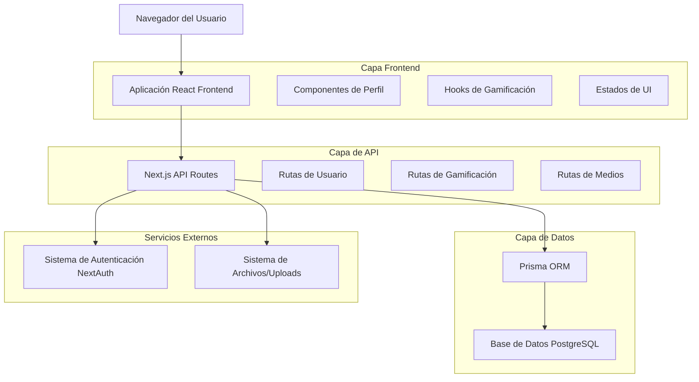
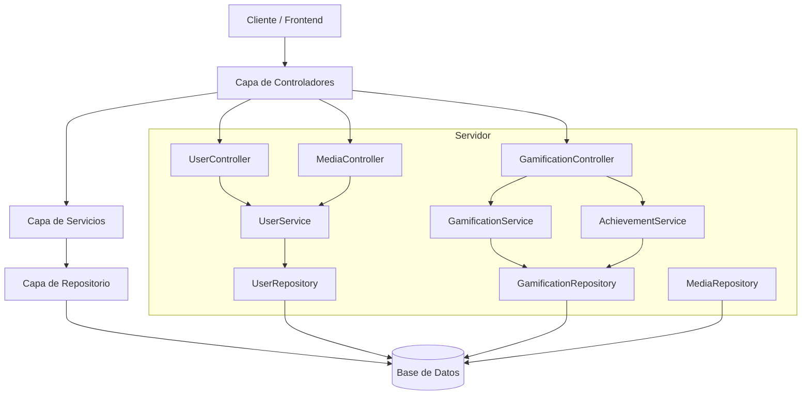
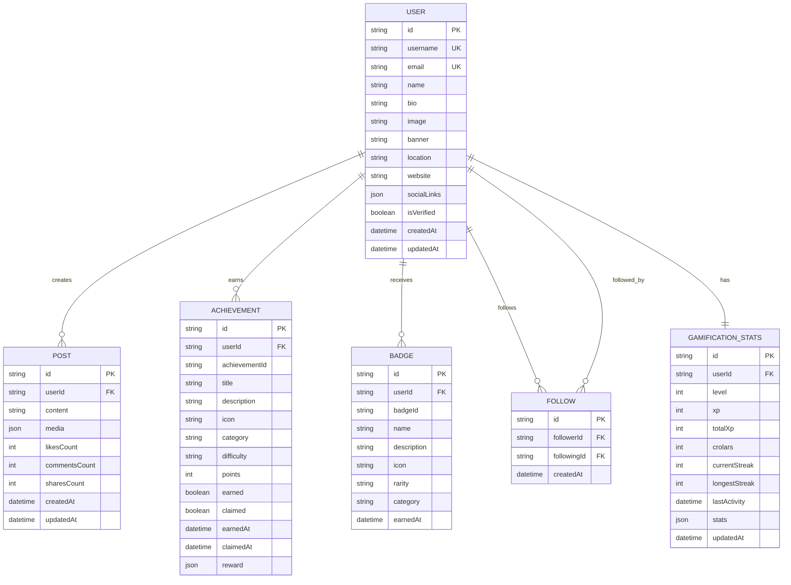

# Arquitectura Técnica: Migración del Sistema de Perfiles

## 1. Diseño de Arquitectura



## 2. Descripción de Tecnologías

* **Frontend**: React\@18 + Next.js\@14 + TypeScript + Tailwind CSS\@3

* **Backend**: Next.js API Routes + Prisma ORM

* **Base de Datos**: PostgreSQL (via Prisma)

* **Autenticación**: NextAuth.js

* **UI Components**: Radix UI + Lucide React

* **Gestión de Estado**: React Query + Zustand

* **Validación**: Zod + React Hook Form

## 3. Definiciones de Rutas

| Ruta                      | Propósito                                                     |
| ------------------------- | ------------------------------------------------------------- |
| /\[username]              | Página principal del perfil de usuario con tabs de navegación |
| /\[username]/edit         | Modo de edición del perfil (solo propietario)                 |
| /\[username]/achievements | Vista detallada de logros y insignias                         |
| /\[username]/stats        | Dashboard completo de estadísticas de gamificación            |
| /\[username]/activity     | Feed de actividad y posts del usuario                         |
| /perfil                   | Redirección automática a /\[username] del usuario actual      |
| /perfil/\*                | Redirecciones de compatibilidad hacia nuevas rutas            |

## 4. Definiciones de API

### 4.1 APIs Principales

**Gestión de Perfiles de Usuario**

```
GET /api/users/[username]
```

Request:

| Nombre del Parámetro | Tipo   | Requerido | Descripción             |
| -------------------- | ------ | --------- | ----------------------- |
| username             | string | true      | Nombre de usuario único |

Response:

| Nombre del Parámetro | Tipo   | Descripción              |
| -------------------- | ------ | ------------------------ |
| id                   | string | ID único del usuario     |
| name                 | string | Nombre completo          |
| username             | string | Nombre de usuario        |
| bio                  | string | Biografía del usuario    |
| image                | string | URL del avatar           |
| banner               | string | URL del banner           |
| stats                | object | Estadísticas del usuario |
| gamification         | object | Datos de gamificación    |

Ejemplo:

```json
{
  "id": "user-123",
  "name": "María González",
  "username": "maria_gonzalez",
  "bio": "Estudiante de Educación en La Cantuta",
  "image": "/uploads/avatars/user-123.jpg",
  "banner": "/uploads/banners/user-123.jpg",
  "stats": {
    "followers": 150,
    "following": 89,
    "posts": 45
  },
  "gamification": {
    "level": 8,
    "xp": 3250,
    "crolars": 1850
  }
}
```

**Actualización de Perfil**

```
PUT /api/users/profile
```

Request:

| Nombre del Parámetro | Tipo   | Requerido | Descripción      |
| -------------------- | ------ | --------- | ---------------- |
| name                 | string | false     | Nombre completo  |
| bio                  | string | false     | Biografía        |
| location             | string | false     | Ubicación        |
| website              | string | false     | Sitio web        |
| socialLinks          | object | false     | Enlaces sociales |

**Sistema de Gamificación**

```
GET /api/gamification/user/[userId]
```

Response:

| Nombre del Parámetro | Tipo   | Descripción                 |
| -------------------- | ------ | --------------------------- |
| level                | number | Nivel actual del usuario    |
| xp                   | number | Experiencia actual          |
| totalXp              | number | Experiencia total acumulada |
| crolars              | number | Moneda virtual              |
| achievements         | array  | Lista de logros             |
| badges               | array  | Lista de insignias          |
| streak               | object | Información de racha        |

**Logros y Insignias**

```
GET /api/achievements/user/[userId]
```

```
POST /api/achievements/claim
```

Request:

| Nombre del Parámetro | Tipo   | Requerido | Descripción             |
| -------------------- | ------ | --------- | ----------------------- |
| achievementId        | string | true      | ID del logro a reclamar |

## 5. Diagrama de Arquitectura del Servidor



## 6. Modelo de Datos

### 6.1 Definición del Modelo de Datos



### 6.2 Lenguaje de Definición de Datos

**Tabla de Usuarios (users)**

```sql
-- Crear tabla de usuarios
CREATE TABLE users (
    id UUID PRIMARY KEY DEFAULT gen_random_uuid(),
    username VARCHAR(50) UNIQUE NOT NULL,
    email VARCHAR(255) UNIQUE NOT NULL,
    name VARCHAR(100) NOT NULL,
    bio TEXT,
    image TEXT,
    banner TEXT,
    location VARCHAR(100),
    website VARCHAR(255),
    social_links JSONB DEFAULT '{}',
    is_verified BOOLEAN DEFAULT false,
    created_at TIMESTAMP WITH TIME ZONE DEFAULT NOW(),
    updated_at TIMESTAMP WITH TIME ZONE DEFAULT NOW()
);

-- Crear índices
CREATE INDEX idx_users_username ON users(username);
CREATE INDEX idx_users_email ON users(email);
CREATE INDEX idx_users_created_at ON users(created_at DESC);
```

**Tabla de Estadísticas de Gamificación (gamification\_stats)**

```sql
-- Crear tabla de estadísticas de gamificación
CREATE TABLE gamification_stats (
    id UUID PRIMARY KEY DEFAULT gen_random_uuid(),
    user_id UUID NOT NULL REFERENCES users(id) ON DELETE CASCADE,
    level INTEGER DEFAULT 1,
    xp INTEGER DEFAULT 0,
    total_xp INTEGER DEFAULT 0,
    crolars INTEGER DEFAULT 0,
    current_streak INTEGER DEFAULT 0,
    longest_streak INTEGER DEFAULT 0,
    last_activity TIMESTAMP WITH TIME ZONE DEFAULT NOW(),
    stats JSONB DEFAULT '{}',
    updated_at TIMESTAMP WITH TIME ZONE DEFAULT NOW()
);

-- Crear índices
CREATE UNIQUE INDEX idx_gamification_stats_user_id ON gamification_stats(user_id);
CREATE INDEX idx_gamification_stats_level ON gamification_stats(level DESC);
CREATE INDEX idx_gamification_stats_xp ON gamification_stats(xp DESC);
```

**Tabla de Logros (achievements)**

```sql
-- Crear tabla de logros
CREATE TABLE achievements (
    id UUID PRIMARY KEY DEFAULT gen_random_uuid(),
    user_id UUID NOT NULL REFERENCES users(id) ON DELETE CASCADE,
    achievement_id VARCHAR(50) NOT NULL,
    title VARCHAR(100) NOT NULL,
    description TEXT,
    icon VARCHAR(50),
    category VARCHAR(50),
    difficulty VARCHAR(20),
    points INTEGER DEFAULT 0,
    earned BOOLEAN DEFAULT false,
    claimed BOOLEAN DEFAULT false,
    earned_at TIMESTAMP WITH TIME ZONE,
    claimed_at TIMESTAMP WITH TIME ZONE,
    reward JSONB DEFAULT '{}'
);

-- Crear índices
CREATE INDEX idx_achievements_user_id ON achievements(user_id);
CREATE INDEX idx_achievements_earned ON achievements(earned, earned_at DESC);
CREATE UNIQUE INDEX idx_achievements_user_achievement ON achievements(user_id, achievement_id);
```

**Tabla de Insignias (badges)**

```sql
-- Crear tabla de insignias
CREATE TABLE badges (
    id UUID PRIMARY KEY DEFAULT gen_random_uuid(),
    user_id UUID NOT NULL REFERENCES users(id) ON DELETE CASCADE,
    badge_id VARCHAR(50) NOT NULL,
    name VARCHAR(100) NOT NULL,
    description TEXT,
    icon VARCHAR(50),
    rarity VARCHAR(20) DEFAULT 'common',
    category VARCHAR(50),
    earned_at TIMESTAMP WITH TIME ZONE DEFAULT NOW()
);

-- Crear índices
CREATE INDEX idx_badges_user_id ON badges(user_id);
CREATE INDEX idx_badges_rarity ON badges(rarity);
CREATE UNIQUE INDEX idx_badges_user_badge ON badges(user_id, badge_id);
```

**Datos Iniciales**

```sql
-- Insertar logros predefinidos
INSERT INTO achievement_templates (id, title, description, icon, category, difficulty, points, reward) VALUES
('welcome', 'Bienvenido a CRUNEVO', 'Completaste tu registro', 'Trophy', 'milestone', 'easy', 50, '{"xp": 50, "crolars": 10}'),
('first_post', 'Primera Publicación', 'Creaste tu primera publicación', 'Edit', 'social', 'easy', 25, '{"xp": 25, "crolars": 5}'),
('level_5', 'Nivel 5 Alcanzado', 'Llegaste al nivel 5', 'Star', 'progression', 'medium', 100, '{"xp": 100, "crolars": 25}');

-- Insertar insignias predefinidas
INSERT INTO badge_templates (id, name, description, icon, rarity, category) VALUES
('early_adopter', 'Adoptador Temprano', 'Uno de los primeros usuarios', 'Crown', 'legendary', 'special'),
('helpful', 'Usuario Útil', 'Ayudó a otros usuarios', 'Heart', 'rare', 'social'),
('consistent', 'Constante', 'Mantiene actividad regular', 'Calendar', 'common', 'engagement');
```

