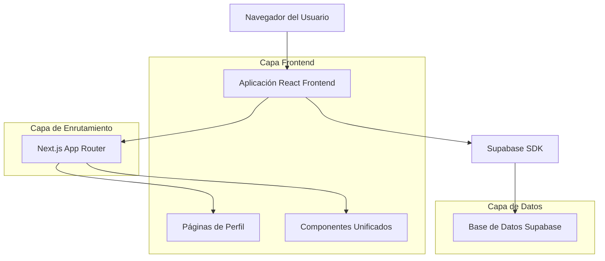
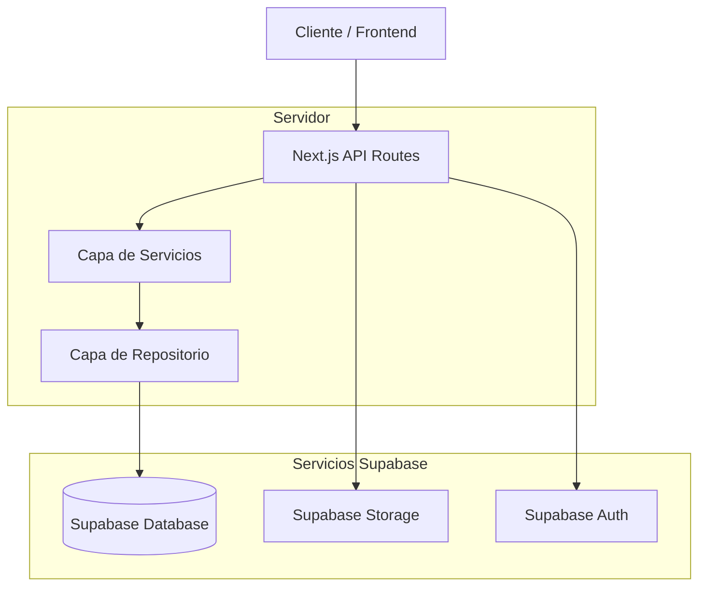
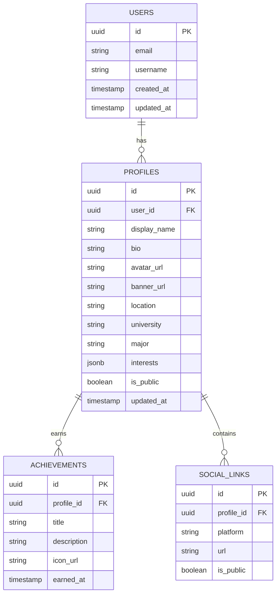

# Arquitectura Técnica - Unificación del Sistema de Perfiles

## 1. Diseño de Arquitectura



## 2. Descripción de Tecnologías

- Frontend: React@18 + Next.js@14 + TypeScript + Tailwind CSS@3
- Backend: Supabase (PostgreSQL + Auth + Storage)
- UI Components: Lucide React + Radix UI primitives
- Estado: React hooks + Zustand (para estado global si es necesario)

## 3. Definiciones de Rutas

| Ruta | Propósito |
|------|----------|
| /perfil | Página de perfil privado del usuario autenticado con pestañas completas |
| /u/[username] | Página de perfil público de cualquier usuario, vista de solo lectura |
| /perfil/edit | Página de edición de perfil con iconos de cámara y formularios |
| /api/users/[username] | API endpoint para obtener datos públicos de usuario |
| /api/profile/upload | API endpoint para subir imágenes de avatar y banner |

## 4. Definiciones de API

### 4.1 API Principal

**Obtener perfil público de usuario**
```
GET /api/users/[username]
```

Request:
| Nombre del Parámetro | Tipo | Requerido | Descripción |
|---------------------|------|-----------|-------------|
| username | string | true | Nombre de usuario único |

Response:
| Nombre del Parámetro | Tipo | Descripción |
|---------------------|------|-------------|
| id | string | ID único del usuario |
| username | string | Nombre de usuario |
| displayName | string | Nombre completo para mostrar |
| bio | string | Biografía del usuario |
| avatarUrl | string | URL de la imagen de avatar |
| bannerUrl | string | URL de la imagen de banner |
| location | string | Ubicación del usuario |
| university | string | Universidad del usuario |
| major | string | Carrera o especialidad |
| interests | string[] | Lista de intereses |
| joinDate | string | Fecha de registro |
| isPublic | boolean | Si el perfil es público |

Ejemplo:
```json
{
  "id": "user_123",
  "username": "johndoe",
  "displayName": "John Doe",
  "bio": "Estudiante de Ingeniería",
  "avatarUrl": "https://example.com/avatar.jpg",
  "bannerUrl": "https://example.com/banner.jpg",
  "location": "Lima, Perú",
  "university": "Universidad Nacional Mayor de San Marcos",
  "major": "Ingeniería de Sistemas",
  "interests": ["Programación", "IA", "Videojuegos"],
  "joinDate": "2024-01-15T00:00:00Z",
  "isPublic": true
}
```

**Subir imagen de perfil**
```
POST /api/profile/upload
```

Request:
| Nombre del Parámetro | Tipo | Requerido | Descripción |
|---------------------|------|-----------|-------------|
| file | File | true | Archivo de imagen (avatar o banner) |
| type | string | true | Tipo de imagen: "avatar" o "banner" |

Response:
| Nombre del Parámetro | Tipo | Descripción |
|---------------------|------|-------------|
| url | string | URL de la imagen subida |
| success | boolean | Estado de la operación |

## 5. Arquitectura del Servidor



## 6. Modelo de Datos

### 6.1 Definición del Modelo de Datos



### 6.2 Lenguaje de Definición de Datos

**Tabla de Perfiles (profiles)**
```sql
-- Crear tabla de perfiles
CREATE TABLE profiles (
    id UUID PRIMARY KEY DEFAULT gen_random_uuid(),
    user_id UUID REFERENCES auth.users(id) ON DELETE CASCADE,
    display_name VARCHAR(100),
    bio TEXT,
    avatar_url TEXT,
    banner_url TEXT,
    location VARCHAR(100),
    university VARCHAR(200),
    major VARCHAR(100),
    interests JSONB DEFAULT '[]'::jsonb,
    is_public BOOLEAN DEFAULT true,
    created_at TIMESTAMP WITH TIME ZONE DEFAULT NOW(),
    updated_at TIMESTAMP WITH TIME ZONE DEFAULT NOW(),
    UNIQUE(user_id)
);

-- Crear índices
CREATE INDEX idx_profiles_user_id ON profiles(user_id);
CREATE INDEX idx_profiles_username ON profiles(user_id) WHERE is_public = true;
CREATE INDEX idx_profiles_updated_at ON profiles(updated_at DESC);

-- Políticas de seguridad RLS
ALTER TABLE profiles ENABLE ROW LEVEL SECURITY;

-- Permitir lectura pública de perfiles públicos
CREATE POLICY "Public profiles are viewable by everyone" ON profiles
    FOR SELECT USING (is_public = true);

-- Permitir a usuarios ver y editar su propio perfil
CREATE POLICY "Users can view and edit own profile" ON profiles
    FOR ALL USING (auth.uid() = user_id);

-- Permisos básicos
GRANT SELECT ON profiles TO anon;
GRANT ALL PRIVILEGES ON profiles TO authenticated;
```

**Tabla de Enlaces Sociales (social_links)**
```sql
-- Crear tabla de enlaces sociales
CREATE TABLE social_links (
    id UUID PRIMARY KEY DEFAULT gen_random_uuid(),
    profile_id UUID REFERENCES profiles(id) ON DELETE CASCADE,
    platform VARCHAR(50) NOT NULL,
    url TEXT NOT NULL,
    is_public BOOLEAN DEFAULT true,
    created_at TIMESTAMP WITH TIME ZONE DEFAULT NOW()
);

-- Crear índices
CREATE INDEX idx_social_links_profile_id ON social_links(profile_id);

-- Políticas RLS
ALTER TABLE social_links ENABLE ROW LEVEL SECURITY;

CREATE POLICY "Public social links are viewable by everyone" ON social_links
    FOR SELECT USING (is_public = true);

CREATE POLICY "Users can manage own social links" ON social_links
    FOR ALL USING (profile_id IN (
        SELECT id FROM profiles WHERE user_id = auth.uid()
    ));

-- Permisos
GRANT SELECT ON social_links TO anon;
GRANT ALL PRIVILEGES ON social_links TO authenticated;
```

**Datos iniciales**
```sql
-- Insertar perfiles de ejemplo para testing
INSERT INTO profiles (user_id, display_name, bio, location, university, major, interests, is_public)
VALUES 
    ('user-uuid-1', 'Juan Pérez', 'Estudiante de Ingeniería de Sistemas apasionado por la tecnología', 'Lima, Perú', 'UNMSM', 'Ingeniería de Sistemas', '["Programación", "IA", "Videojuegos"]'::jsonb, true),
    ('user-uuid-2', 'María García', 'Desarrolladora Full Stack con experiencia en React y Node.js', 'Arequipa, Perú', 'UNSA', 'Ingeniería Informática', '["React", "Node.js", "UI/UX"]'::jsonb, true);
```