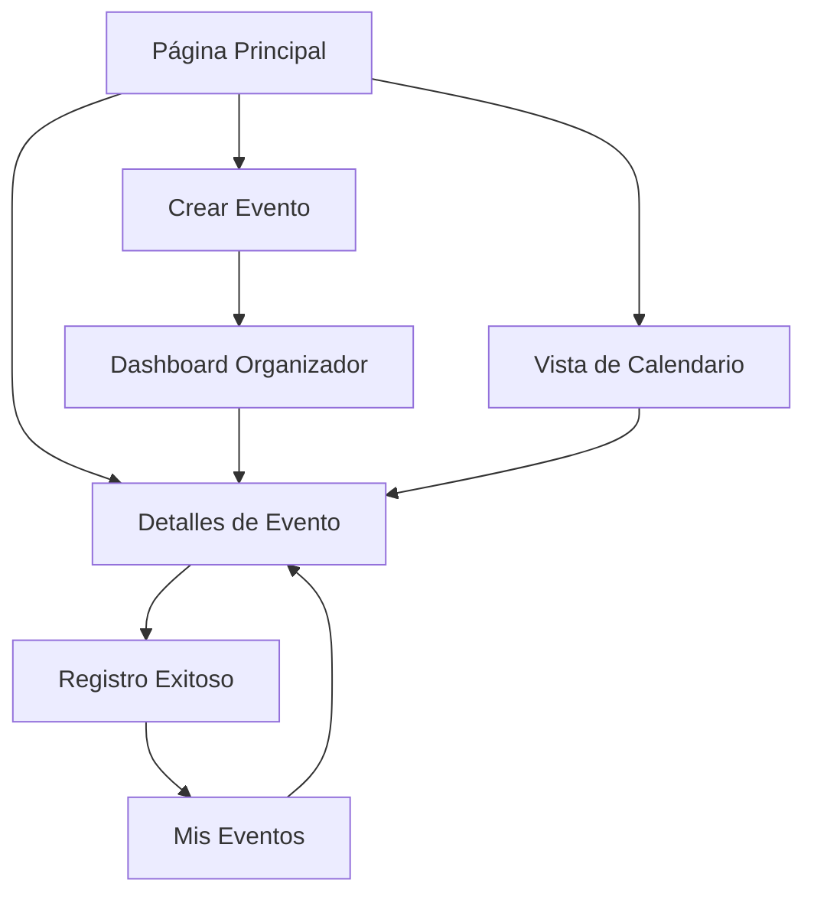

# Sistema de Eventos Académicos - Documento de Requerimientos del Producto

## 1. Visión General del Producto

Sistema integral de gestión de eventos académicos que permite a estudiantes y organizadores crear, descubrir y participar en eventos universitarios. La plataforma integra gamificación, gestión de asistencias y un sistema de recompensas para fomentar la participación estudiantil.

El sistema resuelve la necesidad de centralizar la información de eventos académicos, facilitar el registro de asistencias y motivar la participación estudiantil a través de recompensas. Dirigido principalmente a estudiantes universitarios, profesores y organizadores de eventos académicos.

## 2. Características Principales

### 2.1 Roles de Usuario

| Rol | Método de Registro | Permisos Principales |
|-----|-------------------|---------------------|
| Estudiante | Registro con email universitario | Explorar eventos, registrarse, crear eventos básicos |
| Organizador | Verificación por administrador | Crear eventos avanzados, gestionar asistencias, acceso a métricas |
| Administrador | Asignación manual | Gestión completa del sistema, moderación, configuración |

### 2.2 Módulos de Funcionalidad

Nuestro sistema de eventos académicos consta de las siguientes páginas principales:

1. **Página Principal de Eventos**: exploración de eventos, filtros avanzados, eventos destacados, estadísticas generales
2. **Vista de Calendario**: visualización mensual/semanal, navegación por fechas, vista de agenda
3. **Detalles de Evento**: información completa, registro/cancelación, compartir evento, comentarios
4. **Mis Eventos**: eventos registrados, historial de asistencias, eventos creados
5. **Crear/Editar Evento**: formulario completo, configuración avanzada, vista previa
6. **Dashboard de Organizador**: métricas de eventos, gestión de asistentes, reportes

### 2.3 Detalles de Páginas

| Página | Módulo | Descripción de Funcionalidad |
|--------|--------|------------------------------|
| Página Principal | Exploración de Eventos | Mostrar eventos destacados y próximos. Filtros por categoría, tipo, fecha, ubicación. Búsqueda por texto. Ordenamiento por relevancia, fecha, popularidad |
| Página Principal | Sistema de Filtros | Filtros dinámicos: categoría (Académico, Tecnología, Arte, Deportivo), tipo (Conferencia, Taller, Competencia), modalidad (Presencial, Virtual, Híbrido), precio (Gratuito, Pago) |
| Página Principal | Estadísticas | Mostrar total de eventos, próximos eventos, mis eventos registrados, total de participantes |
| Vista de Calendario | Calendario Interactivo | Vista mensual con eventos marcados. Navegación entre meses. Vista de agenda diaria. Filtros aplicables a la vista de calendario |
| Detalles de Evento | Información Completa | Mostrar título, descripción, fecha/hora, ubicación, organizador, categoría, tags, requisitos, premios (si aplica) |
| Detalles de Evento | Gestión de Asistencia | Botón de registro/cancelación. Mostrar cupos disponibles. Lista de asistentes (si es público). Estado de registro del usuario |
| Detalles de Evento | Interacciones Sociales | Sistema de comentarios. Compartir en redes sociales. Marcar como favorito. Calificación post-evento |
| Mis Eventos | Eventos Registrados | Lista de eventos donde el usuario está registrado. Filtros por estado (próximos, pasados, cancelados). Acciones rápidas (cancelar registro, ver detalles) |
| Mis Eventos | Historial | Eventos pasados con calificaciones. Certificados de asistencia descargables. Estadísticas personales de participación |
| Crear Evento | Formulario Básico | Campos: título, descripción, fecha/hora inicio/fin, ubicación, modalidad, categoría, tags, imagen |
| Crear Evento | Configuración Avanzada | Límite de asistentes, precio, requisitos, agenda detallada, recursos necesarios, política de cancelación |
| Dashboard Organizador | Métricas | Estadísticas de eventos creados. Tasa de asistencia. Feedback recibido. Ingresos generados (si aplica) |
| Dashboard Organizador | Gestión | Lista de eventos creados. Gestión de asistentes. Comunicación con participantes. Exportar listas de asistencia |

## 3. Proceso Principal

**Flujo del Estudiante:**
El estudiante accede a la página principal, explora eventos usando filtros y búsqueda, selecciona un evento de interés, revisa los detalles completos, se registra si cumple requisitos, recibe confirmación y notificaciones, asiste al evento, recibe recompensas en Crolars y puede calificar la experiencia.

**Flujo del Organizador:**
El organizador accede al dashboard, crea un nuevo evento completando toda la información, configura opciones avanzadas como límites y precios, publica el evento para que sea visible, gestiona registros y comunicaciones, realiza el evento registrando asistencias, y finalmente revisa métricas y feedback recibido.

## 4. Diseño de Interfaz de Usuario

### 4.1 Estilo de Diseño

- **Colores primarios**: Gradiente púrpura a azul (#8B5CF6 a #3B82F6)
- **Colores secundarios**: Grises suaves (#F8FAFC, #E2E8F0) para fondos
- **Estilo de botones**: Redondeados con efectos hover y gradientes
- **Tipografía**: Inter o similar, tamaños 14px-32px según jerarquía
- **Layout**: Cards con backdrop-blur, espaciado generoso, diseño en grid responsivo
- **Iconografía**: Lucide React icons, estilo minimalista y consistente

### 4.2 Resumen de Diseño de Páginas

| Página | Módulo | Elementos de UI |
|--------|--------|-----------------|
| Página Principal | Header | Título con gradiente, descripción, estadísticas en cards con backdrop-blur |
| Página Principal | Filtros | Barra de búsqueda con icono, selects para categoría/tipo, botones de filtro activo |
| Página Principal | Lista de Eventos | Grid responsivo de cards, imágenes con overlay, badges para categorías, botones de acción |
| Vista de Calendario | Calendario | Componente de calendario personalizado, eventos como dots de colores, modal de detalles |
| Detalles de Evento | Hero Section | Imagen grande, título superpuesto, badges de categoría y tipo |
| Detalles de Evento | Información | Layout de dos columnas, iconos para fecha/ubicación/organizador, botón CTA prominente |
| Crear Evento | Formulario | Steps wizard, campos con validación visual, preview en tiempo real |
| Dashboard | Métricas | Cards con estadísticas, gráficos simples, tabla de eventos con acciones |

### 4.3 Responsividad

Diseño mobile-first con breakpoints estándar. Optimización táctil para dispositivos móviles. Navegación adaptativa con menú hamburguesa en móvil. Grid responsivo que se adapta de 1 columna (móvil) a 4 columnas (desktop).