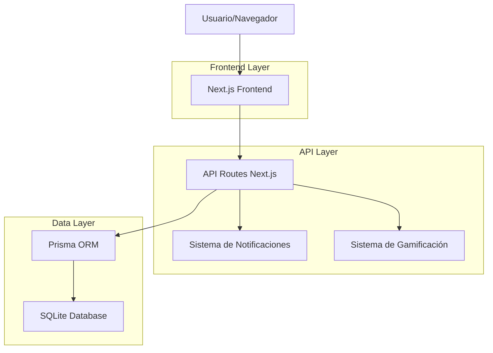
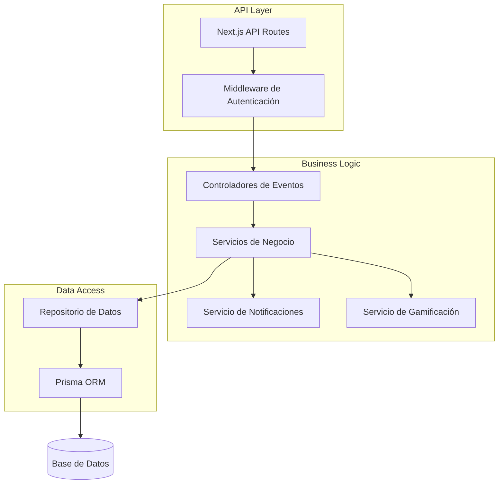
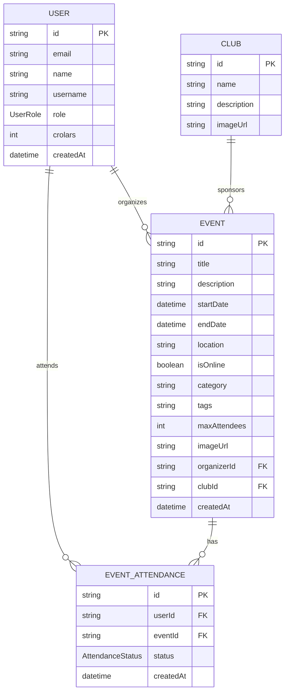

# Sistema de Eventos Académicos - Documento de Arquitectura Técnica

## 1. Diseño de Arquitectura



## 2. Descripción de Tecnologías

* Frontend: React\@18 + Next.js\@14 + TypeScript + Tailwind CSS + Lucide React

* Backend: Next.js API Routes + Prisma ORM

* Base de datos: SQLite (desarrollo) / PostgreSQL (producción)

* Autenticación: NextAuth.js integrado

* UI Components: Shadcn/ui + Radix UI

* Validación: Zod para schemas

* Estado: React hooks + Context API

## 3. Definiciones de Rutas

| Ruta                 | Propósito                                             |
| -------------------- | ----------------------------------------------------- |
| /events              | Página principal de eventos con exploración y filtros |
| /events/\[id]        | Página de detalles de un evento específico            |
| /events/create       | Formulario para crear nuevos eventos                  |
| /events/edit/\[id]   | Formulario para editar eventos existentes             |
| /events/my-events    | Dashboard personal de eventos del usuario             |
| /events/calendar     | Vista de calendario de eventos                        |
| /events/manage/\[id] | Dashboard de gestión para organizadores               |

## 4. Definiciones de API

### 4.1 APIs Principales

**Gestión de Eventos**

```
GET /api/events
```

Request:

| Parámetro | Tipo   | Requerido | Descripción                      |
| --------- | ------ | --------- | -------------------------------- |
| page      | number | false     | Número de página para paginación |
| limit     | number | false     | Límite de eventos por página     |
| category  | string | false     | Filtro por categoría             |
| type      | string | false     | Filtro por tipo de evento        |
| search    | string | false     | Búsqueda por texto               |
| startDate | string | false     | Filtro por fecha de inicio       |
| endDate   | string | false     | Filtro por fecha de fin          |

Response:

| Parámetro  | Tipo     | Descripción      |
| ---------- | -------- | ---------------- |
| events     | Event\[] | Lista de eventos |
| total      | number   | Total de eventos |
| page       | number   | Página actual    |
| totalPages | number   | Total de páginas |

Ejemplo:

```json
{
  "events": [
    {
      "id": "evt_123",
      "title": "Hackathon IA 2024",
      "description": "Competencia de desarrollo con IA",
      "startDate": "2024-03-15T09:00:00Z",
      "endDate": "2024-03-17T18:00:00Z",
      "location": "Auditorio Principal",
      "category": "Tecnología",
      "maxAttendees": 200,
      "currentAttendees": 156,
      "isRegistered": false,
      "organizer": {
        "id": "usr_456",
        "name": "Club de Programación",
        "image": "/images/club-prog.jpg"
      }
    }
  ],
  "total": 25,
  "page": 1,
  "totalPages": 3
}
```

**Crear Evento**

```
POST /api/events
```

Request:

| Parámetro    | Tipo    | Requerido | Descripción              |
| ------------ | ------- | --------- | ------------------------ |
| title        | string  | true      | Título del evento        |
| description  | string  | true      | Descripción detallada    |
| startDate    | string  | true      | Fecha y hora de inicio   |
| endDate      | string  | false     | Fecha y hora de fin      |
| location     | string  | false     | Ubicación del evento     |
| isOnline     | boolean | false     | Si es evento virtual     |
| category     | string  | true      | Categoría del evento     |
| maxAttendees | number  | false     | Límite de asistentes     |
| imageUrl     | string  | false     | URL de imagen del evento |
| tags         | string  | false     | Tags separados por comas |

Response:

| Parámetro | Tipo    | Descripción             |
| --------- | ------- | ----------------------- |
| success   | boolean | Estado de la operación  |
| event     | Event   | Evento creado           |
| message   | string  | Mensaje de confirmación |

**Gestión de Asistencias**

```
POST /api/events/[id]/register
```

Request:

| Parámetro | Tipo   | Requerido | Descripción   |
| --------- | ------ | --------- | ------------- |
| eventId   | string | true      | ID del evento |

Response:

| Parámetro     | Tipo            | Descripción                  |
| ------------- | --------------- | ---------------------------- |
| success       | boolean         | Estado del registro          |
| attendance    | EventAttendance | Registro de asistencia       |
| crolarsEarned | number          | Crolars ganados por registro |

**Cancelar Registro**

```
DELETE /api/events/[id]/register
```

**Obtener Mis Eventos**

```
GET /api/events/my-events
```

Response:

| Parámetro  | Tipo     | Descripción                    |
| ---------- | -------- | ------------------------------ |
| registered | Event\[] | Eventos donde está registrado  |
| organized  | Event\[] | Eventos que ha organizado      |
| past       | Event\[] | Eventos pasados con asistencia |

## 5. Arquitectura del Servidor



## 6. Modelo de Datos

### 6.1 Definición del Modelo de Datos



### 6.2 Lenguaje de Definición de Datos

**Tabla de Eventos (events)**

```sql
-- La tabla ya existe en el schema de Prisma
-- Estructura actual:
CREATE TABLE events (
    id TEXT PRIMARY KEY,
    title TEXT NOT NULL,
    description TEXT NOT NULL,
    imageUrl TEXT,
    startDate DATETIME NOT NULL,
    endDate DATETIME,
    location TEXT,
    isOnline BOOLEAN DEFAULT FALSE,
    category TEXT NOT NULL,
    tags TEXT,
    maxAttendees INTEGER,
    organizerId TEXT,
    clubId TEXT,
    createdAt DATETIME DEFAULT CURRENT_TIMESTAMP,
    updatedAt DATETIME DEFAULT CURRENT_TIMESTAMP,
    FOREIGN KEY (organizerId) REFERENCES users(id),
    FOREIGN KEY (clubId) REFERENCES clubs(id)
);

-- Índices para optimización
CREATE INDEX idx_events_start_date ON events(startDate);
CREATE INDEX idx_events_category ON events(category);
CREATE INDEX idx_events_organizer ON events(organizerId);
CREATE INDEX idx_events_club ON events(clubId);
```

**Tabla de Asistencias (event\_attendances)**

```sql
-- La tabla ya existe en el schema de Prisma
CREATE TABLE event_attendances (
    id TEXT PRIMARY KEY,
    userId TEXT NOT NULL,
    eventId TEXT NOT NULL,
    status TEXT DEFAULT 'INTERESTED',
    createdAt DATETIME DEFAULT CURRENT_TIMESTAMP,
    FOREIGN KEY (userId) REFERENCES users(id) ON DELETE CASCADE,
    FOREIGN KEY (eventId) REFERENCES events(id) ON DELETE CASCADE,
    UNIQUE(userId, eventId)
);

-- Índices
CREATE INDEX idx_event_attendances_user ON event_attendances(userId);
CREATE INDEX idx_event_attendances_event ON event_attendances(eventId);
```

**Datos de Ejemplo**

```sql
-- Eventos de ejemplo
INSERT INTO events (id, title, description, startDate, location, category, maxAttendees, organizerId) VALUES
('evt_001', 'Hackathon de IA 2024', 'Competencia de 48 horas para desarrollar soluciones con IA', '2024-03-15 09:00:00', 'Auditorio Principal', 'Tecnología', 200, 'usr_admin'),
('evt_002', 'Conferencia de Sostenibilidad', 'Charlas sobre medio ambiente y desarrollo sostenible', '2024-03-20 14:00:00', 'Sala de Conferencias', 'Académico', 150, 'usr_admin'),
('evt_003', 'Torneo de Debate', 'Competencia de debate sobre temas de actualidad', '2024-03-25 10:00:00', 'Aula Magna', 'Extracurricular', 60, 'usr_admin');

-- Categorías predefinidas para referencia
-- 'Académico', 'Tecnología', 'Arte', 'Deportivo', 'Extracurricular', 'Social'
```

