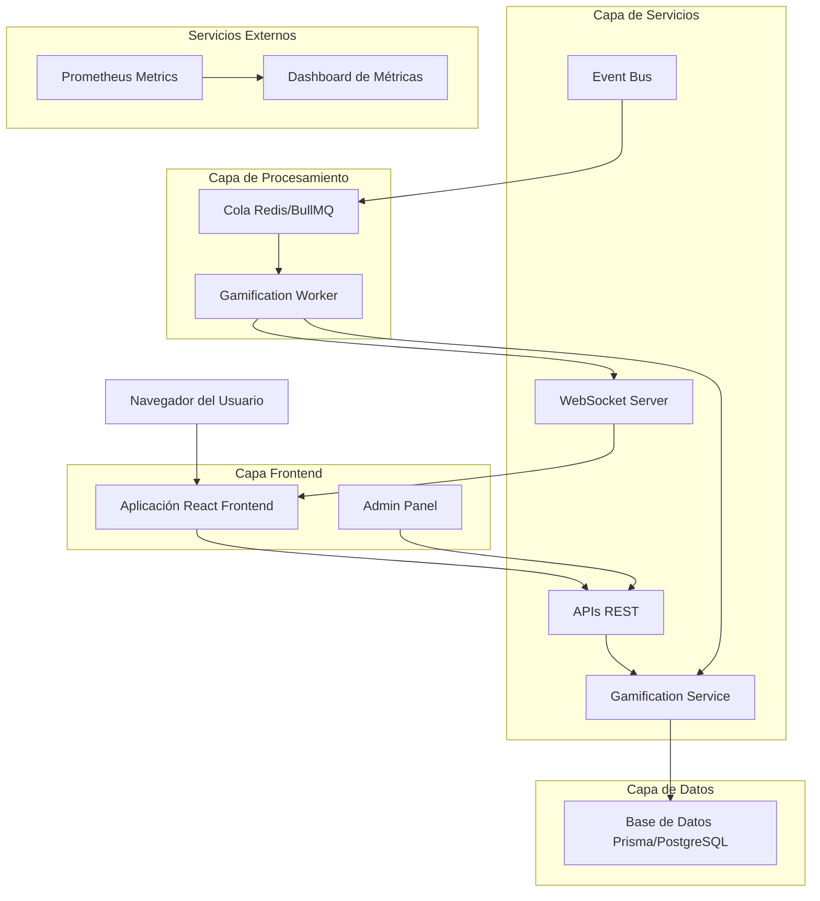
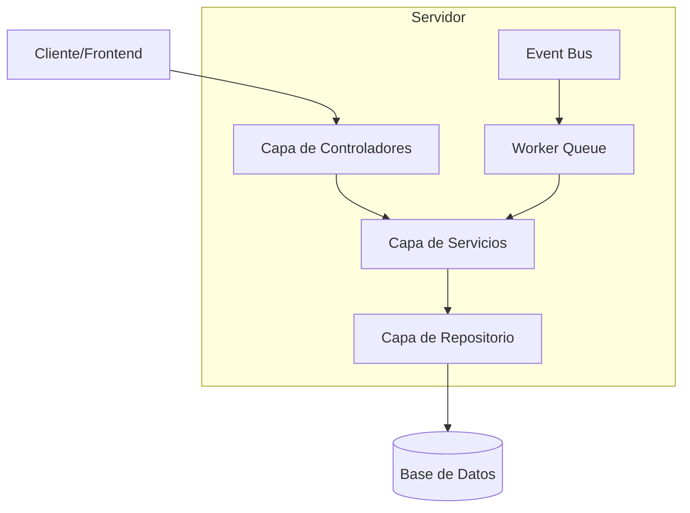
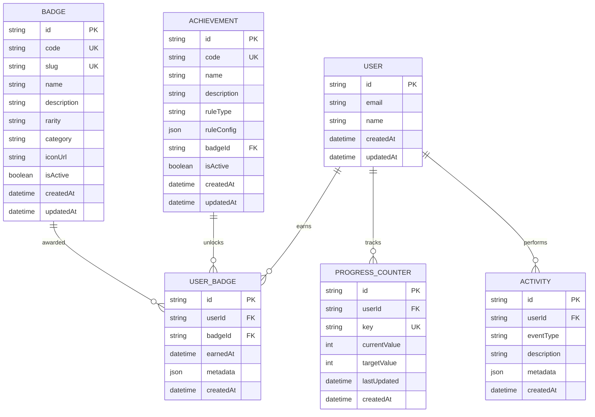

# Sistema de Gamificación - Documento de Arquitectura Técnica

## 1. Diseño de Arquitectura



## 2. Descripción de Tecnologías

* Frontend: React\@18 + TypeScript + TailwindCSS + Vite

* Backend: Next.js API Routes + Prisma ORM

* Base de Datos: Supabase (PostgreSQL)

* Cola de Mensajes: Redis + BullMQ

* WebSockets: Socket.io

* Métricas: Prometheus + Grafana

* Testing: Vitest + Playwright

## 3. Definiciones de Rutas

| Ruta                                | Propósito                                                                  |
| ----------------------------------- | -------------------------------------------------------------------------- |
| /perfil                             | Página de perfil del usuario con catálogo de insignias y progreso personal |
| /admin/gamification                 | Panel de administración para gestión CRUD de logros y métricas             |
| /api/gamification/catalog           | API para obtener catálogo completo de insignias disponibles                |
| /api/gamification/user/:id/badges   | API para consultar insignias obtenidas por usuario específico              |
| /api/gamification/user/:id/progress | API para obtener progreso actual y contadores del usuario                  |
| /api/gamification/emit              | API administrativa para inyectar eventos de prueba                         |

## 4. Definiciones de API

### 4.1 APIs Principales

**Catálogo de Insignias**

```
GET /api/gamification/catalog
```

Request: Sin parámetros

Response:

| Nombre del Parámetro | Tipo de Parámetro | Descripción                              |
| -------------------- | ----------------- | ---------------------------------------- |
| badges               | Badge\[]          | Array de todas las insignias disponibles |
| achievements         | Achievement\[]    | Array de todos los logros configurados   |

Ejemplo:

```json
{
  "badges": [
    {
      "id": "badge_1",
      "code": "STARTER",
      "name": "Bienvenido",
      "description": "Primer logro al registrarse",
      "rarity": "common",
      "category": "onboarding",
      "isActive": true
    }
  ]
}
```

**Insignias del Usuario**

```
GET /api/gamification/user/:id/badges
```

Request:

| Nombre del Parámetro | Tipo de Parámetro | Es Requerido | Descripción    |
| -------------------- | ----------------- | ------------ | -------------- |
| id                   | string            | true         | ID del usuario |

Response:

| Nombre del Parámetro | Tipo de Parámetro | Descripción                        |
| -------------------- | ----------------- | ---------------------------------- |
| userBadges           | UserBadge\[]      | Insignias obtenidas por el usuario |
| totalEarned          | number            | Total de insignias obtenidas       |

**Progreso del Usuario**

```
GET /api/gamification/user/:id/progress
```

Request:

| Nombre del Parámetro | Tipo de Parámetro | Es Requerido | Descripción    |
| -------------------- | ----------------- | ------------ | -------------- |
| id                   | string            | true         | ID del usuario |

Response:

| Nombre del Parámetro | Tipo de Parámetro  | Descripción                         |
| -------------------- | ------------------ | ----------------------------------- |
| counters             | ProgressCounter\[] | Contadores actuales del usuario     |
| streaks              | object             | Rachas activas (login, posts, etc.) |

**Emisión de Eventos (Solo Admin)**

```
POST /api/gamification/emit
```

Request:

| Nombre del Parámetro | Tipo de Parámetro | Es Requerido | Descripción                                          |
| -------------------- | ----------------- | ------------ | ---------------------------------------------------- |
| eventType            | string            | true         | Tipo de evento (post.created, user.registered, etc.) |
| userId               | string            | true         | ID del usuario que realizó la acción                 |
| metadata             | object            | false        | Datos adicionales del evento                         |

Response:

| Nombre del Parámetro | Tipo de Parámetro | Descripción             |
| -------------------- | ----------------- | ----------------------- |
| success              | boolean           | Estado de la operación  |
| eventId              | string            | ID del evento procesado |

## 5. Arquitectura del Servidor



## 6. Modelo de Datos

### 6.1 Definición del Modelo de Datos



### 6.2 Lenguaje de Definición de Datos

**Tabla de Insignias (badges)**

```sql
-- Crear tabla
CREATE TABLE badges (
    id UUID PRIMARY KEY DEFAULT gen_random_uuid(),
    code VARCHAR(50) UNIQUE NOT NULL,
    slug VARCHAR(100) UNIQUE NOT NULL,
    name VARCHAR(200) NOT NULL,
    description TEXT,
    rarity VARCHAR(20) DEFAULT 'common' CHECK (rarity IN ('common', 'rare', 'epic', 'legendary')),
    category VARCHAR(50) NOT NULL,
    icon_url VARCHAR(500),
    is_active BOOLEAN DEFAULT true,
    created_at TIMESTAMP WITH TIME ZONE DEFAULT NOW(),
    updated_at TIMESTAMP WITH TIME ZONE DEFAULT NOW()
);

-- Crear índices
CREATE INDEX idx_badges_category ON badges(category);
CREATE INDEX idx_badges_rarity ON badges(rarity);
CREATE INDEX idx_badges_active ON badges(is_active);
```

**Tabla de Logros (achievements)**

```sql
-- Crear tabla
CREATE TABLE achievements (
    id UUID PRIMARY KEY DEFAULT gen_random_uuid(),
    code VARCHAR(50) UNIQUE NOT NULL,
    name VARCHAR(200) NOT NULL,
    description TEXT,
    rule_type VARCHAR(50) NOT NULL,
    rule_config JSONB NOT NULL,
    badge_id UUID REFERENCES badges(id),
    is_active BOOLEAN DEFAULT true,
    created_at TIMESTAMP WITH TIME ZONE DEFAULT NOW(),
    updated_at TIMESTAMP WITH TIME ZONE DEFAULT NOW()
);

-- Crear índices
CREATE INDEX idx_achievements_rule_type ON achievements(rule_type);
CREATE INDEX idx_achievements_badge_id ON achievements(badge_id);
CREATE INDEX idx_achievements_active ON achievements(is_active);
```

**Tabla de Insignias de Usuario (user\_badges)**

```sql
-- Crear tabla
CREATE TABLE user_badges (
    id UUID PRIMARY KEY DEFAULT gen_random_uuid(),
    user_id UUID NOT NULL,
    badge_id UUID REFERENCES badges(id),
    earned_at TIMESTAMP WITH TIME ZONE DEFAULT NOW(),
    metadata JSONB,
    created_at TIMESTAMP WITH TIME ZONE DEFAULT NOW(),
    UNIQUE(user_id, badge_id)
);

-- Crear índices
CREATE INDEX idx_user_badges_user_id ON user_badges(user_id);
CREATE INDEX idx_user_badges_earned_at ON user_badges(earned_at DESC);
CREATE INDEX idx_user_badges_badge_id ON user_badges(badge_id);

-- Permisos Supabase
GRANT SELECT ON user_badges TO anon;
GRANT ALL PRIVILEGES ON user_badges TO authenticated;
```

**Tabla de Contadores de Progreso (progress\_counters)**

```sql
-- Crear tabla
CREATE TABLE progress_counters (
    id UUID PRIMARY KEY DEFAULT gen_random_uuid(),
    user_id UUID NOT NULL,
    key VARCHAR(100) NOT NULL,
    current_value INTEGER DEFAULT 0,
    target_value INTEGER,
    last_updated TIMESTAMP WITH TIME ZONE DEFAULT NOW(),
    created_at TIMESTAMP WITH TIME ZONE DEFAULT NOW(),
    UNIQUE(user_id, key)
);

-- Crear índices
CREATE INDEX idx_progress_counters_user_id ON progress_counters(user_id);
CREATE INDEX idx_progress_counters_key ON progress_counters(key);
CREATE INDEX idx_progress_counters_last_updated ON progress_counters(last_updated DESC);

-- Permisos Supabase
GRANT SELECT ON progress_counters TO anon;
GRANT ALL PRIVILEGES ON progress_counters TO authenticated;
```

**Tabla de Actividades (activities)**

```sql
-- Crear tabla
CREATE TABLE activities (
    id UUID PRIMARY KEY DEFAULT gen_random_uuid(),
    user_id UUID NOT NULL,
    event_type VARCHAR(100) NOT NULL,
    description TEXT,
    metadata JSONB,
    created_at TIMESTAMP WITH TIME ZONE DEFAULT NOW()
);

-- Crear índices
CREATE INDEX idx_activities_user_id ON activities(user_id);
CREATE INDEX idx_activities_event_type ON activities(event_type);
CREATE INDEX idx_activities_created_at ON activities(created_at DESC);

-- Datos iniciales
INSERT INTO badges (code, slug, name, description, rarity, category) VALUES
('STARTER', 'bienvenido', 'Bienvenido', 'Primer logro al registrarse en la plataforma', 'common', 'onboarding'),
('PROFILE_COMPLETE', 'perfil-completo', 'Perfil Completo', 'Completar toda la información del perfil', 'common', 'profile'),
('FIRST_POST', 'primer-post', 'Primer Post', 'Crear tu primera publicación', 'common', 'content'),
('FIVE_POSTS', 'cinco-posts', 'Creador Activo', 'Crear 5 publicaciones', 'rare', 'content'),
('STREAK_7', 'racha-7-dias', 'Constancia', '7 días consecutivos de login', 'epic', 'engagement');

-- Permisos Supabase
GRANT SELECT ON badges TO anon;
GRANT ALL PRIVILEGES ON badges TO authenticated;
GRANT SELECT ON achievements TO anon;
GRANT ALL PRIVILEGES ON achievements TO authenticated;
GRANT SELECT ON activities TO anon;
GRANT ALL PRIVILEGES ON activities TO authenticated;
```

