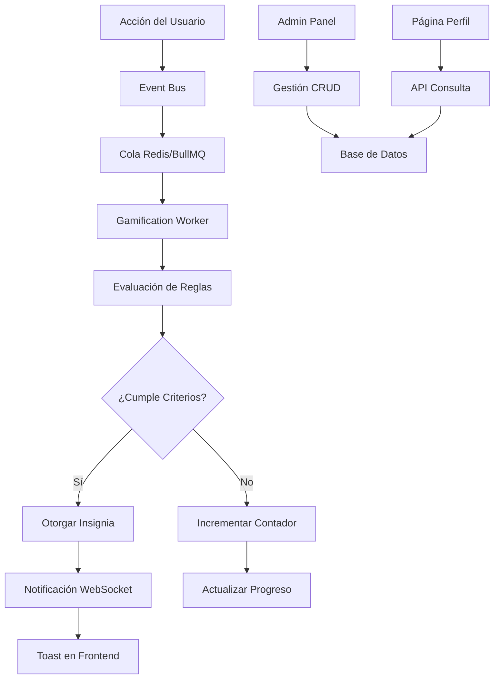

# Sistema de Gamificación - Documento de Requerimientos del Producto

## 1. Descripción General del Producto

Sistema integral de gamificación que convierte acciones reales de usuarios en recompensas visibles mediante logros, insignias y medallas. Motiva la participación activa, fideliza usuarios y genera métricas de engagement detalladas para optimizar la experiencia de la plataforma.

- Transforma comportamientos específicos en reconocimientos tangibles para impulsar el compromiso del usuario
- Dirigido a plataformas educativas, redes sociales y comunidades que buscan aumentar la retención y participación
- Genera valor mediante el incremento del tiempo de permanencia, frecuencia de uso y calidad de las interacciones

## 2. Características Principales

### 2.1 Roles de Usuario

| Rol | Método de Registro | Permisos Principales |
|-----|-------------------|---------------------|
| Usuario Regular | Registro estándar por email | Puede ganar logros, ver progreso personal, consultar catálogo de insignias |
| Administrador | Acceso mediante rol asignado | Gestión completa de logros, emisión de eventos, acceso a métricas y auditoría |

### 2.2 Módulos de Funcionalidad

Nuestro sistema de gamificación consta de las siguientes páginas principales:

1. **Página de Perfil**: catálogo de insignias, progreso personal, logros obtenidos
2. **Panel de Administración**: gestión CRUD de logros, emisión de eventos, auditoría
3. **Dashboard de Métricas**: telemetría, estadísticas de engagement, reportes de actividad

### 2.3 Detalles de Páginas

| Nombre de Página | Nombre del Módulo | Descripción de Funcionalidad |
|------------------|-------------------|-----------------------------|
| Página de Perfil | Catálogo de Insignias | Mostrar todas las insignias disponibles con estado (obtenida/pendiente), fecha de obtención y descripción |
| Página de Perfil | Progreso Personal | Visualizar contadores actuales, rachas activas y próximos logros por desbloquear |
| Página de Perfil | Notificaciones en Tiempo Real | Recibir toasts automáticos cuando se obtienen nuevos logros mediante WebSocket |
| Panel de Administración | Gestión de Logros | Crear, editar, activar/desactivar insignias y achievements con validación de unicidad |
| Panel de Administración | Emisión de Eventos | Inyectar eventos de prueba para testing y validación del sistema |
| Panel de Administración | Búsqueda de Usuarios | Consultar logros obtenidos por usuario específico con filtros por fecha y estado |
| Dashboard de Métricas | Telemetría | Visualizar métricas de Prometheus: awards_total, events_processed_total, rule_eval_ms |
| Dashboard de Métricas | Auditoría | Consultar historial completo de actividades con logs estructurados y trazabilidad |

## 3. Proceso Principal

**Flujo del Usuario Regular:**
El usuario realiza acciones en la plataforma (crear posts, reaccionar, completar perfil) → El sistema detecta automáticamente estas acciones → Se procesan mediante workers en segundo plano → Se evalúan reglas de logros → Se otorgan insignias correspondientes → El usuario recibe notificación en tiempo real → Puede consultar su progreso en el perfil.

**Flujo del Administrador:**
El administrador accede al panel → Gestiona catálogo de logros (crear/editar/desactivar) → Configura reglas de otorgamiento → Emite eventos de prueba → Monitorea métricas y auditoría → Realiza mantenimiento del sistema.

## 4. Diseño de Interfaz de Usuario

### 4.1 Estilo de Diseño

- **Colores primarios:** Azul (#3B82F6) para logros obtenidos, Gris (#9CA3AF) para logros pendientes
- **Colores secundarios:** Verde (#10B981) para notificaciones de éxito, Dorado (#F59E0B) para logros especiales
- **Estilo de botones:** Redondeados con sombras sutiles, estados hover y active bien definidos
- **Tipografía:** Inter como fuente principal, tamaños 14px para texto base, 18px para títulos de sección
- **Layout:** Diseño basado en cards con navegación superior, grid responsive para insignias
- **Iconografía:** Iconos de Heroicons para consistencia, emojis para categorías de logros (🏆 🎯 ⭐)

### 4.2 Resumen de Diseño por Página

| Nombre de Página | Nombre del Módulo | Elementos de UI |
|------------------|-------------------|----------------|
| Página de Perfil | Catálogo de Insignias | Grid responsive 3-4 columnas, cards con imagen, título, descripción y estado visual (color/opacidad) |
| Página de Perfil | Progreso Personal | Barras de progreso animadas, contadores numéricos destacados, indicadores de racha con iconos |
| Página de Perfil | Notificaciones | Toast emergente esquina superior derecha, animación slide-in, auto-dismiss 5 segundos |
| Panel de Administración | Gestión de Logros | Tabla con filtros, modal para edición, formularios con validación en tiempo real |
| Panel de Administración | Métricas | Gráficos con Chart.js, cards de estadísticas, filtros de fecha con date picker |

### 4.3 Responsividad

Diseño mobile-first con breakpoints en 768px y 1024px. Optimizado para interacción táctil con botones mínimo 44px. Grid de insignias se adapta de 2 columnas en móvil a 4 en desktop. Navegación colapsable en dispositivos pequeños.