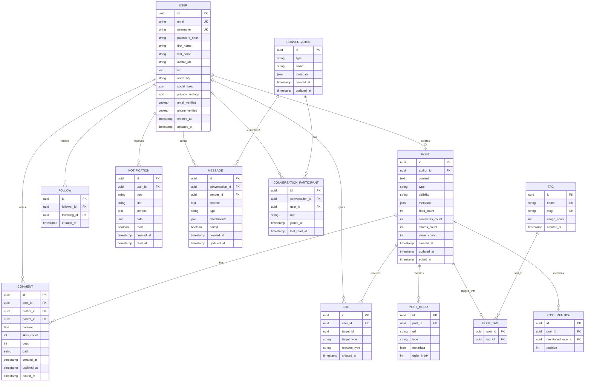

# Arquitectura Técnica - Sistema Integral de Usuarios CRUNEVO

## 1. Diseño de Arquitectura


## 2. Stack Tecnológico

### Frontend

* **Framework**: Next.js 14 + React 18 + TypeScript

* **Styling**: Tailwind CSS + shadcn/ui components

* **State Management**: TanStack Query + Zustand

* **Real-time**: Socket.io-client

* **Forms**: React Hook Form + Zod validation

### Backend

* **Runtime**: Node.js 20+ con TypeScript

* **Framework**: Next.js API Routes + Express.js para microservicios

* **ORM**: Prisma con PostgreSQL

* **Authentication**: NextAuth.js + JWT

* **Real-time**: Socket.io

* **Queue**: Bull/BullMQ con Redis

### Base de Datos

* **Principal**: PostgreSQL 15+ con extensiones (uuid, full-text search)

* **Cache**: Redis 7+ para sesiones y cache de aplicación

* **Búsqueda**: ElasticSearch 8+ para búsqueda avanzada

* **Mensajería**: PostgreSQL separada para escalabilidad

### Infraestructura

* **Containerización**: Docker + Docker Compose

* **Orquestación**: Kubernetes (producción)

* **Load Balancer**: Nginx

* **CDN**: Cloudflare para assets estáticos

* **Monitoring**: Prometheus + Grafana

* **Logging**: ELK Stack (Elasticsearch, Logstash, Kibana)

## 3. Definición de Rutas

### Frontend Routes

| Ruta                   | Propósito                      | Componente Principal |
| ---------------------- | ------------------------------ | -------------------- |
| `/`                    | Página principal con feed      | HomePage             |
| `/auth/login`          | Inicio de sesión               | LoginPage            |
| `/auth/register`       | Registro de usuario            | RegisterPage         |
| `/auth/verify`         | Verificación de email/teléfono | VerifyPage           |
| `/auth/reset-password` | Recuperación de contraseña     | ResetPasswordPage    |
| `/profile/[username]`  | Perfil público de usuario      | ProfilePage          |
| `/profile/settings`    | Configuración de perfil        | ProfileSettingsPage  |
| `/feed`                | Feed principal personalizado   | FeedPage             |
| `/notifications`       | Centro de notificaciones       | NotificationsPage    |
| `/messages`            | Lista de conversaciones        | MessagesPage         |
| `/messages/[chatId]`   | Chat específico                | ChatPage             |
| `/search`              | Página de búsqueda avanzada    | SearchPage           |
| `/admin`               | Panel de administración        | AdminDashboard       |
| `/admin/moderation`    | Panel de moderación            | ModerationPanel      |

## 4. Definición de APIs

### 4.1 Autenticación y Usuarios

#### Registro de Usuario

```
POST /api/auth/register
```

**Request:**

| Campo      | Tipo   | Requerido | Descripción                    |
| ---------- | ------ | --------- | ------------------------------ |
| email      | string | true      | Email del usuario              |
| password   | string | true      | Contraseña (mín. 8 caracteres) |
| firstName  | string | true      | Nombre del usuario             |
| lastName   | string | true      | Apellido del usuario           |
| username   | string | true      | Nombre de usuario único        |
| phone      | string | false     | Número de teléfono             |
| university | string | false     | Universidad del usuario        |

**Response:**

| Campo                | Tipo    | Descripción              |
| -------------------- | ------- | ------------------------ |
| success              | boolean | Estado de la operación   |
| message              | string  | Mensaje descriptivo      |
| userId               | string  | ID del usuario creado    |
| verificationRequired | boolean | Si requiere verificación |

**Ejemplo:**

```json
{
  "email": "usuario@universidad.edu",
  "password": "password123",
  "firstName": "Juan",
  "lastName": "Pérez",
  "username": "juanperez",
  "university": "Universidad Nacional"
}
```

#### Inicio de Sesión

```
POST /api/auth/login
```

**Request:**

| Campo      | Tipo    | Requerido | Descripción            |
| ---------- | ------- | --------- | ---------------------- |
| email      | string  | true      | Email o username       |
| password   | string  | true      | Contraseña del usuario |
| rememberMe | boolean | false     | Sesión persistente     |

**Response:**

| Campo        | Tipo    | Descripción                      |
| ------------ | ------- | -------------------------------- |
| success      | boolean | Estado de la operación           |
| accessToken  | string  | JWT token de acceso              |
| refreshToken | string  | Token para renovar sesión        |
| user         | object  | Datos básicos del usuario        |
| expiresIn    | number  | Tiempo de expiración en segundos |

### 4.2 Gestión de Perfiles

#### Obtener Perfil de Usuario

```
GET /api/users/[username]
```

**Response:**

| Campo          | Tipo    | Descripción                   |
| -------------- | ------- | ----------------------------- |
| id             | string  | ID único del usuario          |
| username       | string  | Nombre de usuario             |
| firstName      | string  | Nombre del usuario            |
| lastName       | string  | Apellido del usuario          |
| avatar         | string  | URL del avatar                |
| bio            | string  | Biografía del usuario         |
| university     | string  | Universidad                   |
| followersCount | number  | Número de seguidores          |
| followingCount | number  | Número de seguidos            |
| postsCount     | number  | Número de publicaciones       |
| isFollowing    | boolean | Si el usuario actual lo sigue |
| socialLinks    | object  | Enlaces a redes sociales      |
| joinedAt       | string  | Fecha de registro             |

#### Actualizar Perfil

```
PUT /api/users/profile
```

**Request:**

| Campo           | Tipo   | Requerido | Descripción                     |
| --------------- | ------ | --------- | ------------------------------- |
| firstName       | string | false     | Nombre del usuario              |
| lastName        | string | false     | Apellido del usuario            |
| bio             | string | false     | Biografía (máx. 500 caracteres) |
| avatar          | string | false     | URL del avatar                  |
| socialLinks     | object | false     | Enlaces sociales                |
| privacySettings | object | false     | Configuración de privacidad     |

### 4.3 Sistema de Feed

#### Obtener Feed Personalizado

```
GET /api/feed
```

**Query Parameters:**

| Parámetro | Tipo    | Descripción                                              |
| --------- | ------- | -------------------------------------------------------- |
| page      | number  | Número de página (default: 1)                            |
| limit     | number  | Elementos por página (default: 20, max: 50)              |
| type      | string  | Tipo de contenido (post, note, question, event, product) |
| following | boolean | Solo contenido de usuarios seguidos                      |
| tags      | string  | Filtrar por etiquetas (separadas por coma)               |

**Response:**

| Campo      | Tipo    | Descripción                     |
| ---------- | ------- | ------------------------------- |
| posts      | array   | Lista de publicaciones          |
| pagination | object  | Información de paginación       |
| hasMore    | boolean | Si hay más contenido disponible |

#### Crear Publicación

```
POST /api/feed/posts
```

**Request:**

| Campo      | Tipo   | Requerido | Descripción                          |
| ---------- | ------ | --------- | ------------------------------------ |
| content    | string | true      | Contenido de la publicación          |
| type       | string | true      | Tipo: post, note, question           |
| visibility | string | true      | public, friends, university, private |
| tags       | array  | false     | Etiquetas de la publicación          |
| mentions   | array  | false     | Usuarios mencionados                 |
| media      | array  | false     | Archivos multimedia                  |
| location   | string | false     | Ubicación geográfica                 |

### 4.4 Sistema de Notificaciones

#### Obtener Notificaciones

```
GET /api/notifications
```

**Query Parameters:**

| Parámetro | Tipo    | Descripción          |
| --------- | ------- | -------------------- |
| page      | number  | Número de página     |
| limit     | number  | Elementos por página |
| type      | string  | Tipo de notificación |
| unread    | boolean | Solo no leídas       |

**Response:**

| Campo         | Tipo   | Descripción               |
| ------------- | ------ | ------------------------- |
| notifications | array  | Lista de notificaciones   |
| unreadCount   | number | Cantidad de no leídas     |
| pagination    | object | Información de paginación |

#### Marcar como Leída

```
PUT /api/notifications/[id]/read
```

### 4.5 Sistema de Mensajería

#### Obtener Conversaciones

```
GET /api/messages/conversations
```

**Response:**

| Campo         | Tipo   | Descripción                 |
| ------------- | ------ | --------------------------- |
| conversations | array  | Lista de conversaciones     |
| totalUnread   | number | Total de mensajes no leídos |

#### Obtener Mensajes de Conversación

```
GET /api/messages/conversations/[id]
```

**Query Parameters:**

| Parámetro | Tipo   | Descripción                      |
| --------- | ------ | -------------------------------- |
| page      | number | Número de página                 |
| limit     | number | Mensajes por página              |
| before    | string | Mensajes anteriores a esta fecha |

#### Enviar Mensaje

```
POST /api/messages/conversations/[id]/messages
```

**Request:**

| Campo       | Tipo   | Requerido | Descripción                       |
| ----------- | ------ | --------- | --------------------------------- |
| content     | string | true      | Contenido del mensaje             |
| type        | string | false     | text, image, file (default: text) |
| attachments | array  | false     | Archivos adjuntos                 |

### 4.6 Sistema de Búsqueda

#### Búsqueda Global

```
GET /api/search
```

**Query Parameters:**

| Parámetro | Tipo   | Descripción                |
| --------- | ------ | -------------------------- |
| q         | string | Consulta de búsqueda       |
| type      | string | Tipo de contenido a buscar |
| page      | number | Número de página           |
| limit     | number | Resultados por página      |
| dateFrom  | string | Fecha desde (ISO 8601)     |
| dateTo    | string | Fecha hasta (ISO 8601)     |
| tags      | string | Filtrar por etiquetas      |
| author    | string | Filtrar por autor          |

**Response:**

| Campo       | Tipo   | Descripción              |
| ----------- | ------ | ------------------------ |
| results     | array  | Resultados de búsqueda   |
| totalCount  | number | Total de resultados      |
| suggestions | array  | Sugerencias de búsqueda  |
| facets      | object | Facetas para filtrado    |
| searchTime  | number | Tiempo de búsqueda en ms |

#### Sugerencias de Búsqueda

```
GET /api/search/suggestions
```

**Query Parameters:**

| Parámetro | Tipo   | Descripción                         |
| --------- | ------ | ----------------------------------- |
| q         | string | Texto parcial para autocompletado   |
| limit     | number | Número de sugerencias (default: 10) |

## 5. Arquitectura del Servidor


## 6. Modelo de Datos

### 6.1 Diagrama de Entidad-Relación



### 6.2 Definición de Tablas (DDL)

#### Tabla de Usuarios

```sql
-- Tabla principal de usuarios
CREATE TABLE users (
    id UUID PRIMARY KEY DEFAULT gen_random_uuid(),
    email VARCHAR(255) UNIQUE NOT NULL,
    username VARCHAR(50) UNIQUE NOT NULL,
    password_hash VARCHAR(255) NOT NULL,
    first_name VARCHAR(100) NOT NULL,
    last_name VARCHAR(100) NOT NULL,
    avatar_url TEXT,
    bio TEXT,
    university VARCHAR(200),
    social_links JSONB DEFAULT '{}',
    privacy_settings JSONB DEFAULT '{}',
    email_verified BOOLEAN DEFAULT FALSE,
    phone_verified BOOLEAN DEFAULT FALSE,
    phone VARCHAR(20),
    role VARCHAR(20) DEFAULT 'user' CHECK (role IN ('user', 'moderator', 'admin')),
    status VARCHAR(20) DEFAULT 'active' CHECK (status IN ('active', 'suspended', 'banned')),
    last_login_at TIMESTAMP WITH TIME ZONE,
    created_at TIMESTAMP WITH TIME ZONE DEFAULT NOW(),
    updated_at TIMESTAMP WITH TIME ZONE DEFAULT NOW()
);

-- Índices para optimización
CREATE INDEX idx_users_email ON users(email);
CREATE INDEX idx_users_username ON users(username);
CREATE INDEX idx_users_university ON users(university);
CREATE INDEX idx_users_created_at ON users(created_at DESC);
```

#### Tabla de Publicaciones

```sql
-- Tabla de publicaciones del feed
CREATE TABLE posts (
    id UUID PRIMARY KEY DEFAULT gen_random_uuid(),
    author_id UUID NOT NULL REFERENCES users(id) ON DELETE CASCADE,
    content TEXT NOT NULL,
    type VARCHAR(20) NOT NULL CHECK (type IN ('post', 'note', 'question', 'event', 'product')),
    visibility VARCHAR(20) DEFAULT 'public' CHECK (visibility IN ('public', 'friends', 'university', 'private')),
    metadata JSONB DEFAULT '{}',
    likes_count INTEGER DEFAULT 0,
    comments_count INTEGER DEFAULT 0,
    shares_count INTEGER DEFAULT 0,
    views_count INTEGER DEFAULT 0,
    created_at TIMESTAMP WITH TIME ZONE DEFAULT NOW(),
    updated_at TIMESTAMP WITH TIME ZONE DEFAULT NOW(),
    edited_at TIMESTAMP WITH TIME ZONE
);

-- Índices para optimización
CREATE INDEX idx_posts_author_id ON posts(author_id);
CREATE INDEX idx_posts_created_at ON posts(created_at DESC);
CREATE INDEX idx_posts_type ON posts(type);
CREATE INDEX idx_posts_visibility ON posts(visibility);
CREATE INDEX idx_posts_author_created ON posts(author_id, created_at DESC);
```

#### Tabla de Comentarios

```sql
-- Tabla de comentarios con soporte para threading
CREATE TABLE comments (
    id UUID PRIMARY KEY DEFAULT gen_random_uuid(),
    post_id UUID NOT NULL REFERENCES posts(id) ON DELETE CASCADE,
    author_id UUID NOT NULL REFERENCES users(id) ON DELETE CASCADE,
    parent_id UUID REFERENCES comments(id) ON DELETE CASCADE,
    content TEXT NOT NULL,
    likes_count INTEGER DEFAULT 0,
    depth INTEGER DEFAULT 0,
    path TEXT, -- Para consultas eficientes de threading
    created_at TIMESTAMP WITH TIME ZONE DEFAULT NOW(),
    updated_at TIMESTAMP WITH TIME ZONE DEFAULT NOW(),
    edited_at TIMESTAMP WITH TIME ZONE
);

-- Índices para optimización
CREATE INDEX idx_comments_post_id ON comments(post_id);
CREATE INDEX idx_comments_author_id ON comments(author_id);
CREATE INDEX idx_comments_parent_id ON comments(parent_id);
CREATE INDEX idx_comments_path ON comments(path);
CREATE INDEX idx_comments_created_at ON comments(created_at DESC);
```

#### Tabla de Notificaciones

```sql
-- Tabla de notificaciones del sistema
CREATE TABLE notifications (
    id UUID PRIMARY KEY DEFAULT gen_random_uuid(),
    user_id UUID NOT NULL REFERENCES users(id) ON DELETE CASCADE,
    type VARCHAR(50) NOT NULL,
    title VARCHAR(255) NOT NULL,
    content TEXT,
    data JSONB DEFAULT '{}',
    read BOOLEAN DEFAULT FALSE,
    created_at TIMESTAMP WITH TIME ZONE DEFAULT NOW(),
    read_at TIMESTAMP WITH TIME ZONE
);

-- Índices para optimización
CREATE INDEX idx_notifications_user_id ON notifications(user_id);
CREATE INDEX idx_notifications_read ON notifications(read);
CREATE INDEX idx_notifications_created_at ON notifications(created_at DESC);
CREATE INDEX idx_notifications_user_unread ON notifications(user_id, read, created_at DESC);
```

#### Tabla de Conversaciones

```sql
-- Tabla de conversaciones para mensajería
CREATE TABLE conversations (
    id UUID PRIMARY KEY DEFAULT gen_random_uuid(),
    type VARCHAR(20) DEFAULT 'direct' CHECK (type IN ('direct', 'group')),
    name VARCHAR(255),
    metadata JSONB DEFAULT '{}',
    created_at TIMESTAMP WITH TIME ZONE DEFAULT NOW(),
    updated_at TIMESTAMP WITH TIME ZONE DEFAULT NOW()
);

-- Tabla de mensajes
CREATE TABLE messages (
    id UUID PRIMARY KEY DEFAULT gen_random_uuid(),
    conversation_id UUID NOT NULL REFERENCES conversations(id) ON DELETE CASCADE,
    sender_id UUID NOT NULL REFERENCES users(id) ON DELETE CASCADE,
    content TEXT NOT NULL,
    type VARCHAR(20) DEFAULT 'text' CHECK (type IN ('text', 'image', 'file', 'system')),
    attachments JSONB DEFAULT '[]',
    edited BOOLEAN DEFAULT FALSE,
    created_at TIMESTAMP WITH TIME ZONE DEFAULT NOW(),
    updated_at TIMESTAMP WITH TIME ZONE DEFAULT NOW()
);

-- Tabla de participantes en conversaciones
CREATE TABLE conversation_participants (
    id UUID PRIMARY KEY DEFAULT gen_random_uuid(),
    conversation_id UUID NOT NULL REFERENCES conversations(id) ON DELETE CASCADE,
    user_id UUID NOT NULL REFERENCES users(id) ON DELETE CASCADE,
    role VARCHAR(20) DEFAULT 'member' CHECK (role IN ('member', 'admin')),
    joined_at TIMESTAMP WITH TIME ZONE DEFAULT NOW(),
    last_read_at TIMESTAMP WITH TIME ZONE,
    UNIQUE(conversation_id, user_id)
);

-- Índices para mensajería
CREATE INDEX idx_messages_conversation_id ON messages(conversation_id);
CREATE INDEX idx_messages_sender_id ON messages(sender_id);
CREATE INDEX idx_messages_created_at ON messages(created_at DESC);
CREATE INDEX idx_conversation_participants_user_id ON conversation_participants(user_id);
```

## 7. Consideraciones de Seguridad

### 7.1 Autenticación y Autorización

* **JWT Tokens**: Access tokens con expiración corta (15 min), refresh tokens con expiración larga (7 días)

* **Password Hashing**: bcrypt con salt rounds configurables (mínimo 12)

* **Rate Limiting**: Límites por endpoint y por usuario

* **Session Management**: Invalidación de tokens en logout, detección de sesiones concurrentes

### 7.2 Validación y Sanitización

* **Input Validation**: Zod schemas para validación de tipos

* **SQL Injection**: Uso exclusivo de queries parametrizadas con Prisma

* **XSS Protection**: Sanitización de contenido HTML, CSP headers

* **CSRF Protection**: Tokens CSRF para formularios críticos

### 7.3 Privacidad de Datos

* **Cifrado en Tránsito**: HTTPS obligatorio, TLS 1.3

* **Cifrado en Reposo**: Cifrado de base de datos, campos sensibles con AES-256

* **Anonimización**: Logs sin información personal identificable

* **GDPR Compliance**: Derecho al olvido, exportación de datos

## 8. Monitoreo y Observabilidad

### 8.1 Métricas de Aplicación

* **Performance**: Tiempo de respuesta, throughput, error rate

* **Business**: Usuarios activos, engagement, conversiones

* **Infrastructure**: CPU, memoria, disco, red

### 8.2 Logging

* **Structured Logging**: JSON format con contexto

* **Log Levels**: Error, Warn, Info, Debug

* **Correlation IDs**: Trazabilidad de requests

### 8.3 Alertas

* **Error Rate**: >5% en 5 minutos

* **Response Time**: >2s percentil 95

* **Database**: Conexiones, queries lentas

* **Security**: Intentos de login fallidos, rate limiting

## 9. Plan de Despliegue

### 9.1 Ambientes

* **Development**: Local con Docker Compose

* **Staging**: Kubernetes cluster con datos de prueba

* **Production**: Kubernetes con alta disponibilidad

### 9.2 CI/CD Pipeline

1. **Code Push**: Trigger automático en git push
2. **Tests**: Unit tests, integration tests, e2e tests
3. **Build**: Docker images con tags semánticos
4. **Security Scan**: Vulnerabilidades en dependencias
5. **Deploy**: Rolling deployment con health checks
6. **Smoke Tests**: Verificación post-deployment

### 9.3 Rollback Strategy

* **Blue-Green Deployment**: Switch instantáneo entre versiones

* **Database Migrations**: Backward compatible, rollback scripts

* **Feature Flags**: Desactivación rápida de funcionalidades

## 10. Escalabilidad y Performance

### 10.1 Estrategias de Escalado

* **Horizontal Scaling**: Auto-scaling basado en métricas

* **Database Sharding**: Por usuario o región geográfica

* **Read Replicas**: Para consultas de solo lectura

* **CDN**: Para assets estáticos y media files

### 10.2 Optimizaciones

* **Database Indexing**: Índices compuestos para queries frecuentes

* **Query Optimization**: N+1 prevention, eager loading

* **Caching Strategy**: Multi-layer cache (Redis, CDN, browser)

* **Image Optimization**: Compresión, lazy loading, responsive images

### 10.3 Límites de Capacidad

* **Concurrent Users**: 10,000+ usuarios simultáneos

* **Database**: 1M+ usuarios, 10M+ posts

* **Messages**: 100M+ mensajes con retención de 1 año

* **Search Index**: 50M+ documentos indexados

