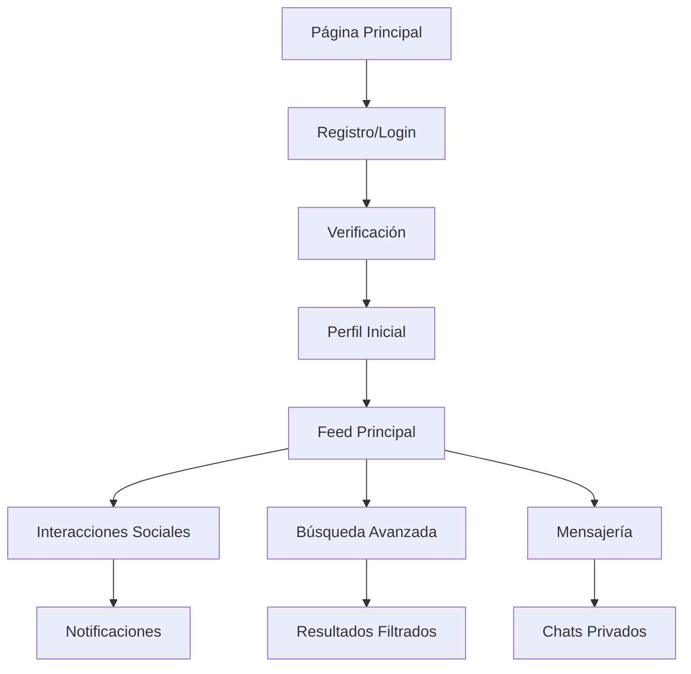

# Sistema Integral de Usuarios - CRUNEVO

## 1. Visión General del Producto

Sistema integral de usuarios diseñado para crear un ecosistema social completo con capacidades avanzadas de búsqueda, interacción y gestión de contenido. El sistema integra autenticación robusta, perfiles públicos, feed social, notificaciones en tiempo real, mensajería privada y un buscador avanzado preparado para escalar.

Objetivo principal: Crear una plataforma social universitaria que unifique todas las interacciones de usuarios (publicaciones, apuntes, foros, clubes, eventos, marketplace) con un sistema de búsqueda inteligente y experiencia de usuario fluida.

## 2. Funcionalidades Principales

### 2.1 Roles de Usuario

| Rol              | Método de Registro            | Permisos Principales                          |
| ---------------- | ----------------------------- | --------------------------------------------- |
| Usuario Estándar | Email/teléfono/redes sociales | Crear contenido, interactuar, seguir usuarios |
| Moderador        | Invitación por admin          | Moderar contenido, gestionar reportes         |
| Administrador    | Acceso directo                | Control total del sistema, analytics          |

### 2.2 Módulos del Sistema

Nuestro sistema integral consta de los siguientes módulos principales:

1. **Autenticación y Registro**: Sistema completo de alta de usuarios, verificación y recuperación de credenciales
2. **Gestión de Perfiles**: Perfiles públicos personalizables con configuración de privacidad granular
3. **Feed Social Integrado**: Agregación de contenido de múltiples fuentes con filtros avanzados
4. **Sistema de Notificaciones**: Centro de notificaciones con agrupación inteligente y push notifications
5. **Mensajería Privada**: Sistema de chat cifrado con funciones avanzadas
6. **Buscador Avanzado**: Motor de búsqueda con ElasticSearch y sugerencias inteligentes
7. **Sistema de Moderación**: Herramientas de reporte y moderación de contenido
8. **Panel de Administración**: Dashboard para gestión y analytics del sistema

### 2.3 Detalles de Funcionalidades

| Módulo         | Componente               | Descripción de Funcionalidad                                                            |
| -------------- | ------------------------ | --------------------------------------------------------------------------------------- |
| Autenticación  | Registro Multi-canal     | Alta por email, teléfono, Google, Facebook, GitHub con verificación obligatoria         |
| Autenticación  | Gestión de Sesiones      | JWT + refresh tokens, sesiones persistentes, logout remoto                              |
| Autenticación  | Recuperación Segura      | Reset de contraseña con tokens temporales, verificación por múltiples canales           |
| Perfiles       | Perfil Público           | URL única, foto, biografía, estadísticas, enlaces sociales, configuración de privacidad |
| Perfiles       | Sistema de Seguimiento   | Follow/unfollow usuarios, feed personalizado basado en seguimientos                     |
| Feed           | Agregación de Contenido  | Integra posts, apuntes, preguntas de foro, eventos de clubes, productos de tienda       |
| Feed           | Filtros y Ordenación     | Cronológico, por relevancia, filtros por tipo, etiquetas, amigos                        |
| Feed           | Interacciones            | Like, compartir, guardar, comentarios anidados con reacciones                           |
| Notificaciones | Centro de Notificaciones | Agrupación por tipo: menciones, respuestas, follows, mensajes, compras                  |
| Notificaciones | Push Notifications       | Web push, notificaciones móviles, email notifications                                   |
| Mensajería     | Chats Privados           | 1:1 y grupales, cifrado end-to-end, historial paginado                                  |
| Mensajería     | Funciones Avanzadas      | Indicadores de escritura/lectura, búsqueda de mensajes, archivos adjuntos               |
| Buscador       | Motor de Búsqueda        | ElasticSearch con búsquedas difusas, filtros por categorías                             |
| Buscador       | Sugerencias Inteligentes | Autocompletado, búsquedas populares, historial personal                                 |
| Moderación     | Sistema de Reportes      | Reporte de usuarios/contenido, clasificación automática                                 |
| Moderación     | Panel de Moderación      | Queue de reportes, acciones disciplinarias, logs de auditoría                           |

## 3. Flujos de Usuario Principales

### Flujo de Registro y Autenticación

1. Usuario accede a página de registro
2. Selecciona método de registro (email/teléfono/social)
3. Completa información básica y acepta términos
4. Recibe email/SMS de verificación
5. Confirma cuenta y accede al sistema
6. Completa perfil inicial (opcional)

### Flujo de Interacción Social

1. Usuario navega al feed principal
2. Ve contenido agregado de múltiples fuentes
3. Interactúa con publicaciones (like, comentar, compartir)
4. Sigue a otros usuarios de interés
5. Recibe notificaciones de interacciones
6. Accede a mensajería para conversaciones privadas

### Flujo de Búsqueda Avanzada

1. Usuario ingresa consulta en buscador
2. Sistema muestra sugerencias en tiempo real
3. Usuario aplica filtros por categoría/fecha/etiquetas
4. Ve resultados con resumen contextual
5. Accede a contenido completo desde resultados
6. Sistema registra búsqueda para analytics

## 4. Diseño de Interfaz de Usuario

### 4.1 Estilo de Diseño

* **Colores primarios**: Azul (#3B82F6), Verde (#10B981) para acciones positivas

* **Colores secundarios**: Gris (#6B7280) para texto secundario, Rojo (#EF4444) para alertas

* **Tipografía**: Inter para UI, tamaños 12px-24px según jerarquía

* **Estilo de botones**: Redondeados (8px border-radius), sombras sutiles

* **Layout**: Grid responsivo, sidebar colapsible, navegación superior fija

* **Iconografía**: Lucide React icons, consistencia en tamaños 16px-24px

### 4.2 Componentes de Interfaz

| Página/Módulo  | Componente               | Elementos de UI                                                   |
| -------------- | ------------------------ | ----------------------------------------------------------------- |
| Autenticación  | Formulario de Login      | Campos email/password, botones sociales, enlaces de recuperación  |
| Autenticación  | Formulario de Registro   | Campos múltiples, validación en tiempo real, progress indicator   |
| Feed Principal | Lista de Posts           | Cards con avatar, contenido, botones de interacción, timestamps   |
| Feed Principal | Composer                 | Modal expandible, botones de media, selector de privacidad        |
| Perfil         | Header de Perfil         | Avatar grande, estadísticas, botón follow, enlaces sociales       |
| Perfil         | Configuración            | Tabs organizados, toggles de privacidad, formularios de edición   |
| Notificaciones | Centro de Notificaciones | Lista agrupada, badges de no leído, filtros por tipo              |
| Mensajería     | Lista de Chats           | Avatares, últimos mensajes, timestamps, badges de no leído        |
| Mensajería     | Ventana de Chat          | Burbujas de mensaje, indicadores de estado, input con attachments |
| Buscador       | Barra de Búsqueda        | Input con autocompletado, filtros desplegables, shortcuts         |
| Buscador       | Resultados               | Cards con preview, metadata, botones de acción                    |
| Moderación     | Panel de Reportes        | Tabla con filtros, acciones rápidas, detalles expandibles         |

### 4.3 Responsividad

* **Desktop-first**: Optimizado para pantallas 1200px+

* **Tablet**: Adaptación para 768px-1199px con sidebar colapsible

* **Mobile**: Layout vertical para <768px, navegación bottom tabs

* **Touch optimization**: Botones mínimo 44px, gestos swipe para navegación

* **Accesibilidad**: Contraste WCAG AA, navegación por teclado, screen readers

## 5. Integración con Módulos Existentes

### 5.1 Módulos del Ecosistema CRUNEVO

* **Feed**: Integración nativa como módulo central

* **Workspace**: Colaboración en proyectos, notificaciones de cambios

* **Notes**: Apuntes en feed, búsqueda de contenido académico

* **Forum**: Preguntas y respuestas integradas en feed social

* **Clubs**: Eventos y actividades de clubes en timeline

* **Events**: Calendario social, invitaciones, recordatorios

* **Courses**: Progreso académico, interacción con compañeros

* **Store**: Productos en feed, notificaciones de compras

* **Gamification**: Logros sociales, rankings de usuarios

* **Tools**: Herramientas integradas en composer y chat

### 5.2 Puntos de Integración

* **API unificada**: Endpoints consistentes para todos los módulos

* **Sistema de eventos**: Event bus para comunicación entre módulos

* **Base de datos compartida**: Modelos relacionados con foreign keys

* **Autenticación centralizada**: Single sign-on para todos los módulos

* **Notificaciones cross-module**: Sistema unificado de alertas

* **Búsqueda global**: Índices de todos los tipos de contenido

## 6. Consideraciones Técnicas

### 6.1 Escalabilidad

* **Arquitectura modular**: Microservicios independientes con APIs REST

* **Base de datos**: PostgreSQL con réplicas de lectura, sharding por usuario

* **Cache**: Redis para sesiones, feed cache, búsquedas frecuentes

* **CDN**: Cloudflare para assets estáticos y media files

* **Load balancing**: Nginx con múltiples instancias de aplicación

### 6.2 Seguridad

* **Autenticación**: JWT con refresh tokens, expiración configurable

* **Autorización**: RBAC (Role-Based Access Control) granular

* **Cifrado**: bcrypt para passwords, AES-256 para datos sensibles

* **Rate limiting**: Por IP y por usuario, límites configurables

* **Validación**: Sanitización de inputs, protección XSS/CSRF

* **Auditoría**: Logs de todas las acciones críticas

### 6.3 Performance

* **Lazy loading**: Carga progresiva de feed y búsquedas

* **Optimistic updates**: UI responsiva con rollback en errores

* **Image optimization**: Compresión automática, múltiples tamaños

* **Database indexing**: Índices optimizados para consultas frecuentes

* **Caching strategy**: Cache de queries, invalidación inteligente

## 7. Plan de Implementación

### Fase 1: Fundación (4-6 semanas)

* Sistema de autenticación completo

* Gestión básica de perfiles

* Feed básico con posts simples

* Infraestructura de base de datos

### Fase 2: Interacción Social (4-5 semanas)

* Sistema de seguimiento de usuarios

* Notificaciones básicas

* Comentarios y reacciones

* Mensajería 1:1

### Fase 3: Funciones Avanzadas (5-6 semanas)

* Buscador con ElasticSearch

* Mensajería grupal

* Sistema de moderación

* Panel de administración

### Fase 4: Optimización y Lanzamiento (3-4 semanas)

* Performance optimization

* Testing exhaustivo

* Documentación completa

* Deployment y monitoreo

## 8. Métricas de Éxito

### 8.1 Métricas de Usuario

* **Registro**: Tasa de conversión de visitante a usuario registrado

* **Activación**: Usuarios que completan perfil y realizan primera interacción

* **Retención**: Usuarios activos diarios/semanales/mensuales

* **Engagement**: Interacciones por usuario, tiempo en plataforma

### 8.2 Métricas Técnicas

* **Performance**: Tiempo de carga <2s, uptime >99.9%

* **Escalabilidad**: Soporte para 10K+ usuarios concurrentes

* **Seguridad**: Zero vulnerabilidades críticas, auditorías regulares

* **Calidad**: Cobertura de tests >80%, bugs críticos <1%

### 8.3 Métricas de Negocio

* **Crecimiento**: Tasa de crecimiento mensual de usuarios

* **Satisfacción**: NPS >50, rating en stores >4.5

* **Monetización**: Preparación para modelos de ingresos futuros

* **Ecosistema**: Integración exitosa con módulos existentes

