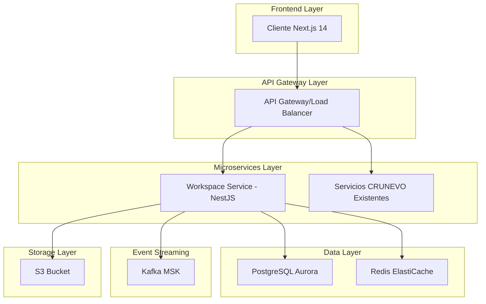
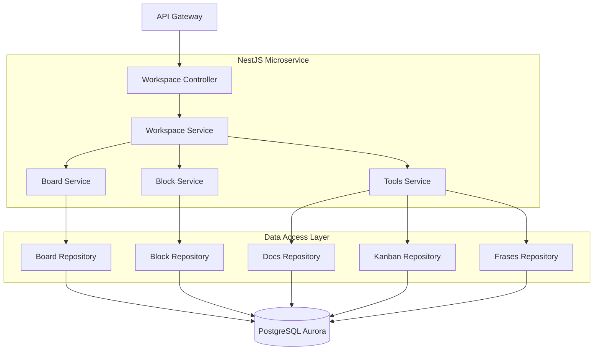
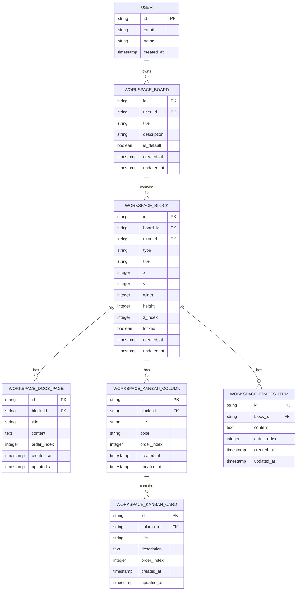

# Arquitectura Técnica - Integración Workspace en CRUNEVO

## 1. Diseño de Arquitectura



## 2. Descripción de Tecnologías

- **Frontend**: Next.js 14 + TypeScript + Tailwind CSS + Zustand
- **Backend**: NestJS + TypeScript + Prisma ORM
- **Base de Datos**: PostgreSQL (Aurora) con índices optimizados
- **Cache**: Redis (ElastiCache) para sesiones y datos temporales
- **Eventos**: Apache Kafka (MSK) para comunicación asíncrona
- **Storage**: S3 para archivos adjuntos (futuro)
- **Infraestructura**: EKS + Terraform + ArgoCD
- **Autenticación**: Auth0 + NextAuth (reutilizar existente)

## 3. Definiciones de Rutas

| Ruta | Propósito |
|------|----------|
| /workspace | Página principal del workspace con canvas infinito |
| /workspace/board/[id] | Vista específica de un board |
| /workspace/block/[id]/docs | Editor de documentos del bloque |
| /workspace/block/[id]/kanban | Board Kanban del bloque |
| /workspace/block/[id]/frases | Lista de frases del bloque |
| /notes | **PRESERVAR** - Página de notas existente |
| /forum | **PRESERVAR** - Foro existente |
| /marketplace | **PRESERVAR** - Marketplace existente |
| /profile | **PRESERVAR** - Perfil de usuario |
| /gamification | **PRESERVAR** - Sistema de gamificación |
| /notifications | **PRESERVAR** - Centro de notificaciones |
| /admin | **PRESERVAR** - Panel administrativo |

## 4. Definiciones de API

### 4.1 API Principal del Workspace

**Gestión de Boards**
```
GET /api/workspace/boards
```

Request: Headers con JWT token

Response:
| Nombre Parámetro | Tipo Parámetro | Descripción |
|------------------|----------------|--------------|
| boards | Board[] | Lista de boards del usuario |
| defaultBoardId | string | ID del board por defecto |

Ejemplo:
```json
{
  "boards": [
    {
      "id": "board-123",
      "title": "Mi Workspace",
      "isDefault": true,
      "blockCount": 15,
      "createdAt": "2024-01-15T10:00:00Z"
    }
  ],
  "defaultBoardId": "board-123"
}
```

**Creación de Board**
```
POST /api/workspace/boards
```

Request:
| Nombre Parámetro | Tipo Parámetro | Requerido | Descripción |
|------------------|----------------|-----------|-------------|
| title | string | true | Título del board |
| description | string | false | Descripción opcional |

Response:
| Nombre Parámetro | Tipo Parámetro | Descripción |
|------------------|----------------|--------------|
| board | Board | Board creado |
| success | boolean | Estado de la operación |

**Gestión de Bloques**
```
GET /api/workspace/boards/{boardId}/blocks
```

Response:
| Nombre Parámetro | Tipo Parámetro | Descripción |
|------------------|----------------|--------------|
| blocks | Block[] | Lista de bloques del board |
| totalCount | number | Total de bloques (máximo 100) |

```
POST /api/workspace/blocks
```

Request:
| Nombre Parámetro | Tipo Parámetro | Requerido | Descripción |
|------------------|----------------|-----------|-------------|
| boardId | string | true | ID del board padre |
| type | 'docs'\|'kanban'\|'frases' | true | Tipo de bloque |
| title | string | true | Título del bloque |
| x | number | true | Posición X en canvas |
| y | number | true | Posición Y en canvas |
| width | number | true | Ancho del bloque |
| height | number | true | Alto del bloque |

```
PATCH /api/workspace/blocks/{id}
```

Request:
| Nombre Parámetro | Tipo Parámetro | Requerido | Descripción |
|------------------|----------------|-----------|-------------|
| x | number | false | Nueva posición X |
| y | number | false | Nueva posición Y |
| width | number | false | Nuevo ancho |
| height | number | false | Nueva altura |
| zIndex | number | false | Nuevo índice Z |
| locked | boolean | false | Estado de bloqueo |
| title | string | false | Nuevo título |

**APIs de Herramientas**

```
GET /api/workspace/blocks/{blockId}/docs/pages
POST /api/workspace/blocks/{blockId}/docs/pages
PATCH /api/workspace/blocks/{blockId}/docs/pages/{pageId}
DELETE /api/workspace/blocks/{blockId}/docs/pages/{pageId}
```

```
GET /api/workspace/blocks/{blockId}/kanban/columns
POST /api/workspace/blocks/{blockId}/kanban/columns
PATCH /api/workspace/blocks/{blockId}/kanban/columns/{columnId}
DELETE /api/workspace/blocks/{blockId}/kanban/columns/{columnId}
```

```
GET /api/workspace/blocks/{blockId}/kanban/cards
POST /api/workspace/blocks/{blockId}/kanban/cards
PATCH /api/workspace/blocks/{blockId}/kanban/cards/{cardId}
DELETE /api/workspace/blocks/{blockId}/kanban/cards/{cardId}
```

```
GET /api/workspace/blocks/{blockId}/frases/items
POST /api/workspace/blocks/{blockId}/frases/items
PATCH /api/workspace/blocks/{blockId}/frases/items/{itemId}
DELETE /api/workspace/blocks/{blockId}/frases/items/{itemId}
```

## 5. Arquitectura del Servidor



## 6. Modelo de Datos

### 6.1 Definición del Modelo de Datos



### 6.2 Lenguaje de Definición de Datos

**Tabla de Boards**
```sql
-- Crear tabla workspace_boards
CREATE TABLE workspace_boards (
    id UUID PRIMARY KEY DEFAULT gen_random_uuid(),
    user_id UUID NOT NULL,
    title VARCHAR(255) NOT NULL,
    description TEXT,
    is_default BOOLEAN DEFAULT false,
    created_at TIMESTAMP WITH TIME ZONE DEFAULT NOW(),
    updated_at TIMESTAMP WITH TIME ZONE DEFAULT NOW(),
    CONSTRAINT fk_workspace_boards_user FOREIGN KEY (user_id) REFERENCES users(id) ON DELETE CASCADE
);

-- Crear índices
CREATE INDEX idx_workspace_boards_user_id ON workspace_boards(user_id);
CREATE UNIQUE INDEX idx_workspace_boards_user_default ON workspace_boards(user_id) WHERE is_default = true;
```

**Tabla de Bloques**
```sql
-- Crear tabla workspace_blocks
CREATE TABLE workspace_blocks (
    id UUID PRIMARY KEY DEFAULT gen_random_uuid(),
    board_id UUID NOT NULL,
    user_id UUID NOT NULL,
    type VARCHAR(20) NOT NULL CHECK (type IN ('docs', 'kanban', 'frases')),
    title VARCHAR(255) NOT NULL,
    x INTEGER NOT NULL DEFAULT 0,
    y INTEGER NOT NULL DEFAULT 0,
    width INTEGER NOT NULL DEFAULT 300,
    height INTEGER NOT NULL DEFAULT 200,
    z_index INTEGER NOT NULL DEFAULT 0,
    locked BOOLEAN DEFAULT false,
    created_at TIMESTAMP WITH TIME ZONE DEFAULT NOW(),
    updated_at TIMESTAMP WITH TIME ZONE DEFAULT NOW(),
    CONSTRAINT fk_workspace_blocks_board FOREIGN KEY (board_id) REFERENCES workspace_boards(id) ON DELETE CASCADE,
    CONSTRAINT fk_workspace_blocks_user FOREIGN KEY (user_id) REFERENCES users(id) ON DELETE CASCADE
);

-- Crear índices
CREATE INDEX idx_workspace_blocks_board_id ON workspace_blocks(board_id);
CREATE INDEX idx_workspace_blocks_user_id ON workspace_blocks(user_id);
CREATE INDEX idx_workspace_blocks_z_index ON workspace_blocks(z_index);

-- Trigger para límite de 100 bloques por board
CREATE OR REPLACE FUNCTION check_block_limit()
RETURNS TRIGGER AS $$
BEGIN
    IF (SELECT COUNT(*) FROM workspace_blocks WHERE board_id = NEW.board_id) >= 100 THEN
        RAISE EXCEPTION 'Maximum of 100 blocks per board exceeded';
    END IF;
    RETURN NEW;
END;
$$ LANGUAGE plpgsql;

CREATE TRIGGER trigger_block_limit
    BEFORE INSERT ON workspace_blocks
    FOR EACH ROW
    EXECUTE FUNCTION check_block_limit();
```

**Tablas de Herramientas**
```sql
-- Tabla de páginas de documentos
CREATE TABLE workspace_docs_pages (
    id UUID PRIMARY KEY DEFAULT gen_random_uuid(),
    block_id UUID NOT NULL,
    title VARCHAR(255) NOT NULL,
    content TEXT,
    order_index INTEGER NOT NULL DEFAULT 0,
    created_at TIMESTAMP WITH TIME ZONE DEFAULT NOW(),
    updated_at TIMESTAMP WITH TIME ZONE DEFAULT NOW(),
    CONSTRAINT fk_workspace_docs_pages_block FOREIGN KEY (block_id) REFERENCES workspace_blocks(id) ON DELETE CASCADE
);

CREATE INDEX idx_workspace_docs_pages_block_id ON workspace_docs_pages(block_id);
CREATE INDEX idx_workspace_docs_pages_order ON workspace_docs_pages(block_id, order_index);

-- Tabla de columnas Kanban
CREATE TABLE workspace_kanban_columns (
    id UUID PRIMARY KEY DEFAULT gen_random_uuid(),
    block_id UUID NOT NULL,
    title VARCHAR(255) NOT NULL,
    color VARCHAR(7) DEFAULT '#6366f1',
    order_index INTEGER NOT NULL DEFAULT 0,
    created_at TIMESTAMP WITH TIME ZONE DEFAULT NOW(),
    updated_at TIMESTAMP WITH TIME ZONE DEFAULT NOW(),
    CONSTRAINT fk_workspace_kanban_columns_block FOREIGN KEY (block_id) REFERENCES workspace_blocks(id) ON DELETE CASCADE
);

CREATE INDEX idx_workspace_kanban_columns_block_id ON workspace_kanban_columns(block_id);
CREATE INDEX idx_workspace_kanban_columns_order ON workspace_kanban_columns(block_id, order_index);

-- Tabla de tarjetas Kanban
CREATE TABLE workspace_kanban_cards (
    id UUID PRIMARY KEY DEFAULT gen_random_uuid(),
    column_id UUID NOT NULL,
    title VARCHAR(255) NOT NULL,
    description TEXT,
    order_index INTEGER NOT NULL DEFAULT 0,
    created_at TIMESTAMP WITH TIME ZONE DEFAULT NOW(),
    updated_at TIMESTAMP WITH TIME ZONE DEFAULT NOW(),
    CONSTRAINT fk_workspace_kanban_cards_column FOREIGN KEY (column_id) REFERENCES workspace_kanban_columns(id) ON DELETE CASCADE
);

CREATE INDEX idx_workspace_kanban_cards_column_id ON workspace_kanban_cards(column_id);
CREATE INDEX idx_workspace_kanban_cards_order ON workspace_kanban_cards(column_id, order_index);

-- Tabla de elementos de frases
CREATE TABLE workspace_frases_items (
    id UUID PRIMARY KEY DEFAULT gen_random_uuid(),
    block_id UUID NOT NULL,
    content TEXT NOT NULL,
    order_index INTEGER NOT NULL DEFAULT 0,
    created_at TIMESTAMP WITH TIME ZONE DEFAULT NOW(),
    updated_at TIMESTAMP WITH TIME ZONE DEFAULT NOW(),
    CONSTRAINT fk_workspace_frases_items_block FOREIGN KEY (block_id) REFERENCES workspace_blocks(id) ON DELETE CASCADE
);

CREATE INDEX idx_workspace_frases_items_block_id ON workspace_frases_items(block_id);
CREATE INDEX idx_workspace_frases_items_order ON workspace_frases_items(block_id, order_index);

-- Datos iniciales
INSERT INTO workspace_boards (user_id, title, is_default)
SELECT id, 'Mi Workspace', true
FROM users
WHERE NOT EXISTS (
    SELECT 1 FROM workspace_boards WHERE user_id = users.id AND is_default = true
);
```

## 7. Estrategia de Despliegue y Feature Flags

### 7.1 Patrón Strangler

1. **Fase 1**: Desplegar workspace-service y crear tablas
2. **Fase 2**: Configurar enrutamiento /api/workspace en API Gateway
3. **Fase 3**: Habilitar UI /workspace para 10% de usuarios
4. **Fase 4**: Monitorear métricas y expandir gradualmente
5. **Fase 5**: Rollout completo tras validación

### 7.2 Feature Flags

```typescript
// Frontend Feature Flag
const FEATURE_WORKSPACE = process.env.NEXT_PUBLIC_FEATURE_WORKSPACE === 'true';

// API Gateway Feature Flag
const WORKSPACE_ENABLED = process.env.WORKSPACE_SERVICE_ENABLED === 'true';

// User-based Rollout
const isWorkspaceEnabledForUser = (userId: string) => {
  const rolloutPercentage = parseInt(process.env.WORKSPACE_ROLLOUT_PERCENTAGE || '0');
  const hash = hashUserId(userId);
  return (hash % 100) < rolloutPercentage;
};
```

## 8. Observabilidad y Monitoreo

### 8.1 Métricas Clave

- **Latencia**: p95 de operaciones block:move, board:switch
- **Throughput**: Requests por segundo en /api/workspace/*
- **Errores**: Rate de errores 5xx por endpoint
- **Negocio**: Bloques creados por usuario, tiempo en workspace

### 8.2 Logs Estructurados

```json
{
  "timestamp": "2024-01-15T10:00:00Z",
  "level": "info",
  "service": "workspace-service",
  "requestId": "req-123",
  "userId": "user-456",
  "action": "block:move",
  "blockId": "block-789",
  "duration": 45,
  "success": true
}
```

### 8.3 Dashboards y Alertas

- **Dashboard Principal**: Latencia, throughput, errores por endpoint
- **Dashboard de Negocio**: Adopción, uso por herramienta, límites alcanzados
- **Alertas**: Latencia p95 > 500ms, error rate > 1%, servicio down

## 9. Seguridad y Autorización

### 9.1 Validación JWT

```typescript
@Injectable()
export class WorkspaceAuthGuard implements CanActivate {
  canActivate(context: ExecutionContext): boolean {
    const request = context.switchToHttp().getRequest();
    const user = request.user; // Extraído del JWT por middleware
    
    // Validar que el usuario solo accede a sus recursos
    const resourceUserId = this.extractResourceUserId(request);
    return user.id === resourceUserId;
  }
}
```

### 9.2 Ownership Validation

- Todos los boards pertenecen al usuario autenticado
- Todos los blocks pertenecen al usuario y al board correcto
- Validación en cada operación CRUD
- Rate limiting por usuario para prevenir abuso
