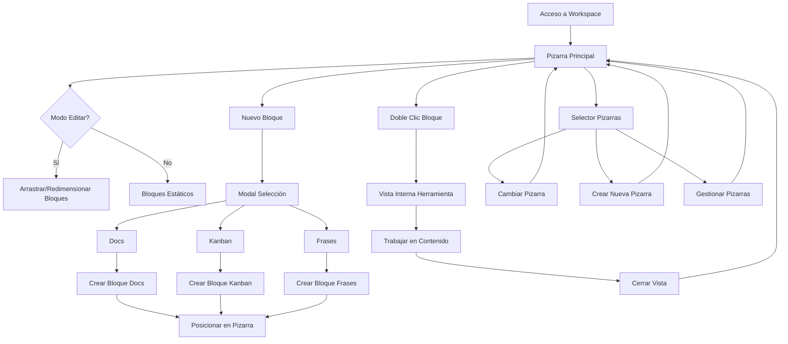

# CRUNEVO Workspace - Sistema de Pizarra Infinita

## 1. Product Overview

Workspace es un sistema de pizarra infinita que reemplaza el "Espacio Personal" de CRUNEVO, permitiendo a los estudiantes crear y organizar bloques de herramientas educativas en un lienzo interactivo y personalizable.

- Resuelve la necesidad de los estudiantes de tener un espacio de trabajo flexible y organizado donde puedan combinar diferentes herramientas educativas (documentos, planificación y notas) en una sola interfaz intuitiva.
- Dirigido a estudiantes universitarios que buscan un workspace personalizado para gestionar sus proyectos académicos, con capacidad de crear múltiples pizarras temáticas y organizar hasta 100 bloques por pizarra.

## 2. Core Features

### 2.1 User Roles

| Role | Registration Method | Core Permissions |
|------|---------------------|------------------|
| Estudiante | Cuenta CRUNEVO existente | Puede crear pizarras, bloques, usar todas las herramientas, gestionar contenido personal |
| Moderador | Acceso heredado de CRUNEVO | Puede ver estadísticas de uso, moderar contenido reportado |
| Administrador | Acceso heredado de CRUNEVO | Control total del sistema, configuración de límites, analytics |

### 2.2 Feature Module

Nuestro sistema Workspace consta de las siguientes páginas principales:

1. **Workspace Principal**: pizarra infinita con bloques arrastrables, barra de herramientas, selector de pizarras
2. **Vista Interna de Docs**: editor de texto enriquecido tipo Notion con páginas y contenido estructurado
3. **Vista Interna de Kanban**: tablero tipo Trello con columnas y tarjetas arrastrables
4. **Vista Interna de Frases**: lista simple de frases con etiquetas y función de copiado
5. **Gestión de Pizarras**: modal para crear, renombrar y eliminar pizarras múltiples

### 2.3 Page Details

| Page Name | Module Name | Feature description |
|-----------|-------------|---------------------|
| Workspace Principal | Barra Lateral | Renombrar "Espacio Personal" a "Workspace" en navegación izquierda |
| Workspace Principal | Encabezado de Control | Botones Nuevo bloque, Editar (toggle), Completar y selector de Pizarra con contador de bloques |
| Workspace Principal | Modal Nuevo Bloque | Mostrar 3 opciones (Docs, Kanban, Frases) sin usar marcas registradas, crear bloque al seleccionar |
| Workspace Principal | Pizarra Infinita | Superficie grande con scroll, posicionamiento x,y,z-index de bloques, límites visuales |
| Workspace Principal | Sistema de Arrastre | Mover bloques reales (sin ghost/sombra) solo con Editar=ON, autoscroll en bordes, límites del lienzo |
| Workspace Principal | Control de Estados | Alternar locked=true/false con botones Editar/Completar, bloquear arrastre cuando locked=true |
| Workspace Principal | Gestión de Bloques | Doble clic abre vista interna, redimensionar solo con Editar=ON, eliminar con confirmación |
| Workspace Principal | Límites y Contadores | Mostrar contador actual/100 bloques, deshabilitar "Nuevo bloque" al llegar al límite |
| Workspace Principal | Múltiples Pizarras | Menú para CRUD de pizarras, "Pizarra 1" por defecto, cambio de contexto de bloques |
| Vista Docs | Editor Enriquecido | Títulos, listas, checklists, enlaces, bloques de código, citas con formato básico |
| Vista Docs | Gestión de Páginas | CRUD de páginas dentro del bloque, navegación entre páginas, estructura jerárquica |
| Vista Docs | Autosave y Historial | Guardar automático al escribir, undo/redo local, indicador de estado guardado |
| Vista Kanban | Gestión de Columnas | CRUD de columnas con títulos, reordenamiento, contador de tarjetas por columna |
| Vista Kanban | Gestión de Tarjetas | CRUD de tarjetas con título/descripción, drag & drop entre columnas, orden persistente |
| Vista Kanban | Interacciones | Arrastre fluido de tarjetas, indicadores visuales de drop zones, validación de movimientos |
| Vista Frases | Lista de Frases | CRUD de frases simples, campo de texto principal, etiquetas opcionales |
| Vista Frases | Funciones Auxiliares | Botón "Copiar" por frase, búsqueda/filtrado por etiquetas, ordenamiento |
| Gestión Pizarras | CRUD de Pizarras | Crear nueva pizarra, renombrar existente, eliminar con confirmación, límites de nombre |

## 3. Core Process

**Flujo Principal del Estudiante:**
1. El usuario accede a Workspace desde la barra lateral renombrada
2. Ve la pizarra actual con bloques existentes o mensaje de bienvenida
3. Puede alternar entre modo Editar (bloques arrastrables) y Completar (bloques fijos)
4. Crea nuevos bloques mediante modal con 3 opciones de herramientas
5. Arrastra y redimensiona bloques solo en modo Editar
6. Doble clic en bloque abre vista interna de la herramienta correspondiente
7. Trabaja dentro de cada herramienta (Docs/Kanban/Frases) con autosave
8. Cierra vista interna para volver a la pizarra principal
9. Puede crear múltiples pizarras y cambiar entre ellas
10. Sistema respeta límite de 100 bloques por pizarra

**Flujo de Gestión de Pizarras:**
1. Usuario selecciona dropdown de pizarras en encabezado
2. Puede crear nueva pizarra con nombre personalizado
3. Cambiar entre pizarras existentes (cada una con sus bloques)
4. Renombrar o eliminar pizarras con confirmaciones
5. Sistema mantiene "Pizarra 1" como predeterminada

## 4. User Interface Design

### 4.1 Design Style

- **Colores primarios:** Azul CRUNEVO (#1E40AF) para elementos de control, gris neutro (#F8FAFC) para pizarra
- **Colores secundarios:** Verde (#059669) para estados activos, naranja (#EA580C) para alertas y límites
- **Estilo de botones:** Redondeados con sombras sutiles, estados hover/active claros, iconografía minimalista
- **Tipografía:** Inter 14px para UI, 16px para contenido de bloques, 18-24px para títulos de herramientas
- **Layout:** Pizarra de fondo claro, bloques con sombras card, barra de herramientas fija superior
- **Iconografía:** Lucide icons para herramientas, sin referencias a marcas (evitar logos Notion/Trello)

### 4.2 Page Design Overview

| Page Name | Module Name | UI Elements |
|-----------|-------------|-------------|
| Workspace Principal | Barra Lateral | Ítem "Workspace" con icono de grid, hover azul, indicador activo |
| Workspace Principal | Encabezado | Fondo blanco, botones con iconos, toggle Editar/Completar, dropdown pizarras, contador "X/100" |
| Workspace Principal | Pizarra | Fondo gris claro con patrón de puntos sutil, scroll infinito, indicadores de límites |
| Workspace Principal | Bloques | Cards con sombra, bordes redondeados, handle de arrastre visible en modo Editar |
| Modal Nuevo Bloque | Selector Herramientas | 3 cards grandes con iconos, títulos descriptivos, hover effects, botón cancelar |
| Vista Docs | Editor | Toolbar superior, área de contenido limpia, sidebar páginas, botones guardar/cerrar |
| Vista Kanban | Tablero | Columnas con headers, tarjetas arrastrables, botones + para agregar, colores suaves |
| Vista Frases | Lista | Items con texto principal, etiquetas como badges, botón copiar por frase, campo agregar |

### 4.3 Responsiveness

El sistema es desktop-first optimizado para pantallas grandes (mínimo 1024px) donde el arrastre de bloques es más efectivo. Incluye adaptación a tablet (768px+) con controles táctiles mejorados. En móvil (<768px) se muestra vista simplificada de lista con acceso directo a herramientas sin funcionalidad de arrastre.

## 5. Criterios de Aceptación

### 5.1 Funcionalidad Core
1. **Control de Estados**: "Editar = ON" permite arrastrar/redimensionar bloques; "Completar = OFF" los hace estáticos
2. **Navegación de Bloques**: Doble clic abre la herramienta correcta (Docs/Kanban/Frases) en vista interna
3. **Límites de Bloques**: No se pueden crear más de 100 bloques por pizarra, botón deshabilitado con mensaje
4. **Gestión de Pizarras**: Cambiar pizarra muestra únicamente los bloques correspondientes a esa pizarra
5. **Persistencia**: Al recargar página, posiciones de bloques y contenidos se mantienen correctamente

### 5.2 Funcionalidad por Herramienta
6. **Kanban**: Permite mover tarjetas entre columnas con drag & drop, guarda orden correctamente
7. **Docs**: Guarda formato de texto enriquecido y estructura de páginas con autosave
8. **Frases**: Permite CRUD completo de frases y función copiar al clipboard funciona

### 5.3 Interacciones y UX
9. **Arrastre Real**: Al arrastrar se mueve el bloque real sin ghost/sombra, feedback visual claro
10. **Límites de Pizarra**: No es posible soltar bloques fuera de límites visibles, autoscroll en bordes
11. **Accesibilidad**: Atajos de teclado funcionan (E=Editar, N=Nuevo, Del=Eliminar con confirmación)
12. **Estados Vacíos**: Pizarra vacía muestra call-to-action "Crea tu primer bloque" correctamente

### 5.4 Rendimiento y Estabilidad
13. **Performance**: Sistema maneja 100 bloques sin caídas de FPS usando requestAnimationFrame
14. **Autosave**: Posición/tamaño se guarda al terminar arrastre, contenido se guarda al modificar
15. **Carga Lazy**: Bloques cargan marcos primero, contenido interno al abrir cada herramienta