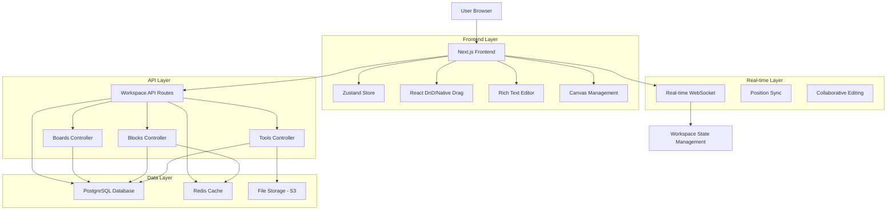
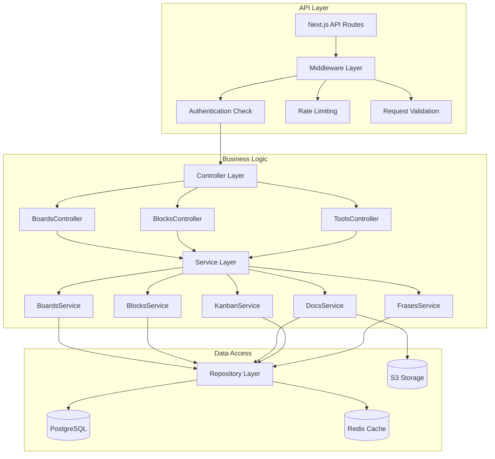
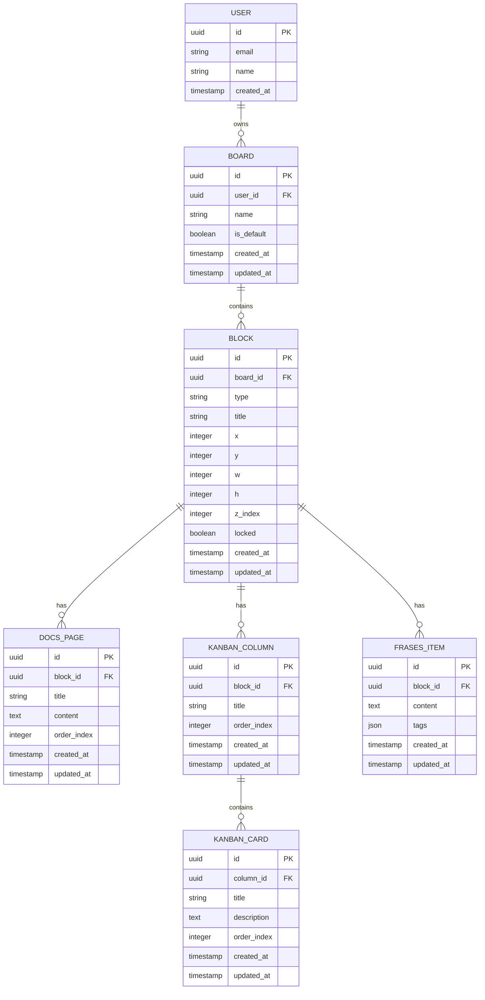

# CRUNEVO Workspace - Arquitectura Técnica

## 1. Architecture Design



## 2. Technology Description

- **Frontend:** Next.js@14 + TypeScript@5 + Tailwind CSS@3 + Zustand@4
- **Drag & Drop:** React DnD@16 o implementación nativa con touch support
- **Rich Text:** Tiptap@2 o Slate.js para editor Docs
- **Database:** PostgreSQL@16 (integrado con CRUNEVO existente)
- **Cache:** Redis@7 para posiciones de bloques y estado de sesión
- **Storage:** AWS S3 para archivos adjuntos en Docs
- **Real-time:** WebSocket nativo o Socket.io para sincronización
- **State Management:** Zustand para estado global del workspace

## 3. Route Definitions

| Route | Purpose |
|-------|----------|
| /workspace | Página principal del workspace con pizarra infinita |
| /workspace/board/[id] | Pizarra específica con sus bloques |
| /workspace/block/[id]/docs | Vista interna del editor Docs |
| /workspace/block/[id]/kanban | Vista interna del tablero Kanban |
| /workspace/block/[id]/frases | Vista interna de la herramienta Frases |

## 4. API Definitions

### 4.1 Core API

**Boards Management**

```
GET /api/workspace/boards
```

Response:
| Param Name | Param Type | Description |
|------------|------------|-------------|
| boards | Board[] | Lista de pizarras del usuario |
| defaultBoard | string | ID de la pizarra por defecto |

```
POST /api/workspace/boards
```

Request:
| Param Name | Param Type | isRequired | Description |
|------------|------------|------------|-------------|
| name | string | true | Nombre de la nueva pizarra |

Response:
| Param Name | Param Type | Description |
|------------|------------|-------------|
| board | Board | Pizarra creada |

```
PATCH /api/workspace/boards/:id
```

Request:
| Param Name | Param Type | isRequired | Description |
|------------|------------|------------|-------------|
| name | string | false | Nuevo nombre de la pizarra |

```
DELETE /api/workspace/boards/:id
```

**Blocks Management**

```
GET /api/workspace/boards/:boardId/blocks
```

Response:
| Param Name | Param Type | Description |
|------------|------------|-------------|
| blocks | Block[] | Bloques de la pizarra |
| count | number | Número total de bloques |

```
POST /api/workspace/blocks
```

Request:
| Param Name | Param Type | isRequired | Description |
|------------|------------|------------|-------------|
| boardId | string | true | ID de la pizarra |
| type | 'docs'\|'kanban'\|'frases' | true | Tipo de herramienta |
| title | string | true | Título del bloque |
| x | number | true | Posición X inicial |
| y | number | true | Posición Y inicial |

```
PATCH /api/workspace/blocks/:id
```

Request:
| Param Name | Param Type | isRequired | Description |
|------------|------------|------------|-------------|
| x | number | false | Nueva posición X |
| y | number | false | Nueva posición Y |
| w | number | false | Nuevo ancho |
| h | number | false | Nueva altura |
| zIndex | number | false | Nuevo z-index |
| locked | boolean | false | Estado de bloqueo |
| title | string | false | Nuevo título |

**Docs Tool API**

```
GET /api/workspace/docs/:blockId/pages
POST /api/workspace/docs/pages
PATCH /api/workspace/docs/pages/:id
DELETE /api/workspace/docs/pages/:id
```

**Kanban Tool API**

```
GET /api/workspace/kanban/:blockId/columns
POST /api/workspace/kanban/columns
PATCH /api/workspace/kanban/columns/:id
DELETE /api/workspace/kanban/columns/:id

GET /api/workspace/kanban/:columnId/cards
POST /api/workspace/kanban/cards
PATCH /api/workspace/kanban/cards/:id
DELETE /api/workspace/kanban/cards/:id
```

**Frases Tool API**

```
GET /api/workspace/frases/:blockId/items
POST /api/workspace/frases/items
PATCH /api/workspace/frases/items/:id
DELETE /api/workspace/frases/items/:id
```

### 4.2 WebSocket Events

```typescript
// Eventos de sincronización en tiempo real
interface WorkspaceEvents {
  'block:move': { blockId: string, x: number, y: number, zIndex: number }
  'block:resize': { blockId: string, w: number, h: number }
  'block:create': { block: Block }
  'block:delete': { blockId: string }
  'board:switch': { boardId: string }
}
```

## 5. Server Architecture Diagram



## 6. Data Model

### 6.1 Data Model Definition



### 6.2 Data Definition Language

**Boards Table**
```sql
-- Tabla de pizarras
CREATE TABLE workspace_boards (
    id UUID PRIMARY KEY DEFAULT gen_random_uuid(),
    user_id UUID NOT NULL REFERENCES users(id) ON DELETE CASCADE,
    name VARCHAR(100) NOT NULL,
    is_default BOOLEAN DEFAULT false,
    created_at TIMESTAMP WITH TIME ZONE DEFAULT NOW(),
    updated_at TIMESTAMP WITH TIME ZONE DEFAULT NOW()
);

-- Índices
CREATE INDEX idx_workspace_boards_user_id ON workspace_boards(user_id);
CREATE INDEX idx_workspace_boards_default ON workspace_boards(user_id, is_default) WHERE is_default = true;

-- Datos iniciales
INSERT INTO workspace_boards (user_id, name, is_default)
SELECT id, 'Pizarra 1', true FROM users WHERE id NOT IN (SELECT user_id FROM workspace_boards WHERE is_default = true);
```

**Blocks Table**
```sql
-- Tabla de bloques
CREATE TABLE workspace_blocks (
    id UUID PRIMARY KEY DEFAULT gen_random_uuid(),
    board_id UUID NOT NULL REFERENCES workspace_boards(id) ON DELETE CASCADE,
    type VARCHAR(20) NOT NULL CHECK (type IN ('docs', 'kanban', 'frases')),
    title VARCHAR(200) NOT NULL,
    x INTEGER NOT NULL DEFAULT 0,
    y INTEGER NOT NULL DEFAULT 0,
    w INTEGER NOT NULL DEFAULT 300,
    h INTEGER NOT NULL DEFAULT 200,
    z_index INTEGER NOT NULL DEFAULT 1,
    locked BOOLEAN DEFAULT false,
    created_at TIMESTAMP WITH TIME ZONE DEFAULT NOW(),
    updated_at TIMESTAMP WITH TIME ZONE DEFAULT NOW()
);

-- Índices
CREATE INDEX idx_workspace_blocks_board_id ON workspace_blocks(board_id);
CREATE INDEX idx_workspace_blocks_type ON workspace_blocks(type);
CREATE INDEX idx_workspace_blocks_z_index ON workspace_blocks(board_id, z_index);

-- Constraint para límite de 100 bloques por pizarra
CREATE OR REPLACE FUNCTION check_blocks_limit()
RETURNS TRIGGER AS $$
BEGIN
    IF (SELECT COUNT(*) FROM workspace_blocks WHERE board_id = NEW.board_id) >= 100 THEN
        RAISE EXCEPTION 'Límite de 100 bloques por pizarra alcanzado';
    END IF;
    RETURN NEW;
END;
$$ LANGUAGE plpgsql;

CREATE TRIGGER trigger_blocks_limit
    BEFORE INSERT ON workspace_blocks
    FOR EACH ROW EXECUTE FUNCTION check_blocks_limit();
```

**Docs Pages Table**
```sql
-- Tabla de páginas de documentos
CREATE TABLE workspace_docs_pages (
    id UUID PRIMARY KEY DEFAULT gen_random_uuid(),
    block_id UUID NOT NULL REFERENCES workspace_blocks(id) ON DELETE CASCADE,
    title VARCHAR(200) NOT NULL DEFAULT 'Sin título',
    content TEXT DEFAULT '',
    order_index INTEGER NOT NULL DEFAULT 0,
    created_at TIMESTAMP WITH TIME ZONE DEFAULT NOW(),
    updated_at TIMESTAMP WITH TIME ZONE DEFAULT NOW()
);

-- Índices
CREATE INDEX idx_docs_pages_block_id ON workspace_docs_pages(block_id);
CREATE INDEX idx_docs_pages_order ON workspace_docs_pages(block_id, order_index);
```

**Kanban Tables**
```sql
-- Tabla de columnas Kanban
CREATE TABLE workspace_kanban_columns (
    id UUID PRIMARY KEY DEFAULT gen_random_uuid(),
    block_id UUID NOT NULL REFERENCES workspace_blocks(id) ON DELETE CASCADE,
    title VARCHAR(100) NOT NULL,
    order_index INTEGER NOT NULL DEFAULT 0,
    created_at TIMESTAMP WITH TIME ZONE DEFAULT NOW(),
    updated_at TIMESTAMP WITH TIME ZONE DEFAULT NOW()
);

-- Tabla de tarjetas Kanban
CREATE TABLE workspace_kanban_cards (
    id UUID PRIMARY KEY DEFAULT gen_random_uuid(),
    column_id UUID NOT NULL REFERENCES workspace_kanban_columns(id) ON DELETE CASCADE,
    title VARCHAR(200) NOT NULL,
    description TEXT DEFAULT '',
    order_index INTEGER NOT NULL DEFAULT 0,
    created_at TIMESTAMP WITH TIME ZONE DEFAULT NOW(),
    updated_at TIMESTAMP WITH TIME ZONE DEFAULT NOW()
);

-- Índices
CREATE INDEX idx_kanban_columns_block_id ON workspace_kanban_columns(block_id);
CREATE INDEX idx_kanban_columns_order ON workspace_kanban_columns(block_id, order_index);
CREATE INDEX idx_kanban_cards_column_id ON workspace_kanban_cards(column_id);
CREATE INDEX idx_kanban_cards_order ON workspace_kanban_cards(column_id, order_index);

-- Datos iniciales para nuevos bloques Kanban
CREATE OR REPLACE FUNCTION create_default_kanban_columns()
RETURNS TRIGGER AS $$
BEGIN
    IF NEW.type = 'kanban' THEN
        INSERT INTO workspace_kanban_columns (block_id, title, order_index) VALUES
        (NEW.id, 'Por hacer', 0),
        (NEW.id, 'En progreso', 1),
        (NEW.id, 'Completado', 2);
    END IF;
    RETURN NEW;
END;
$$ LANGUAGE plpgsql;

CREATE TRIGGER trigger_default_kanban_columns
    AFTER INSERT ON workspace_blocks
    FOR EACH ROW EXECUTE FUNCTION create_default_kanban_columns();
```

**Frases Table**
```sql
-- Tabla de frases
CREATE TABLE workspace_frases_items (
    id UUID PRIMARY KEY DEFAULT gen_random_uuid(),
    block_id UUID NOT NULL REFERENCES workspace_blocks(id) ON DELETE CASCADE,
    content TEXT NOT NULL,
    tags JSONB DEFAULT '[]'::jsonb,
    created_at TIMESTAMP WITH TIME ZONE DEFAULT NOW(),
    updated_at TIMESTAMP WITH TIME ZONE DEFAULT NOW()
);

-- Índices
CREATE INDEX idx_frases_items_block_id ON workspace_frases_items(block_id);
CREATE INDEX idx_frases_items_tags ON workspace_frases_items USING GIN(tags);
CREATE INDEX idx_frases_items_content ON workspace_frases_items USING GIN(to_tsvector('spanish', content));
```

**Permissions (Supabase RLS)**
```sql
-- Habilitar RLS en todas las tablas
ALTER TABLE workspace_boards ENABLE ROW LEVEL SECURITY;
ALTER TABLE workspace_blocks ENABLE ROW LEVEL SECURITY;
ALTER TABLE workspace_docs_pages ENABLE ROW LEVEL SECURITY;
ALTER TABLE workspace_kanban_columns ENABLE ROW LEVEL SECURITY;
ALTER TABLE workspace_kanban_cards ENABLE ROW LEVEL SECURITY;
ALTER TABLE workspace_frases_items ENABLE ROW LEVEL SECURITY;

-- Políticas de acceso (usuarios solo ven sus propios datos)
CREATE POLICY "Users can manage their own boards" ON workspace_boards
    FOR ALL USING (auth.uid() = user_id);

CREATE POLICY "Users can manage blocks in their boards" ON workspace_blocks
    FOR ALL USING (board_id IN (SELECT id FROM workspace_boards WHERE user_id = auth.uid()));

CREATE POLICY "Users can manage their docs pages" ON workspace_docs_pages
    FOR ALL USING (block_id IN (
        SELECT b.id FROM workspace_blocks b 
        JOIN workspace_boards wb ON b.board_id = wb.id 
        WHERE wb.user_id = auth.uid()
    ));

-- Políticas similares para kanban y frases...
```

## 7. Frontend Architecture

### 7.1 Component Structure

```
src/components/workspace/
├── WorkspaceLayout.tsx          # Layout principal con sidebar
├── WorkspaceHeader.tsx          # Encabezado con controles
├── InfiniteCanvas.tsx           # Pizarra infinita
├── DraggableBlock.tsx           # Bloque arrastrable
├── BlockTypeSelector.tsx        # Modal selector de herramientas
├── BoardSelector.tsx            # Dropdown de pizarras
├── tools/
│   ├── DocsEditor/
│   │   ├── DocsEditor.tsx       # Editor principal
│   │   ├── PagesList.tsx        # Lista de páginas
│   │   └── RichTextEditor.tsx   # Editor de texto enriquecido
│   ├── KanbanBoard/
│   │   ├── KanbanBoard.tsx      # Tablero principal
│   │   ├── KanbanColumn.tsx     # Columna individual
│   │   └── KanbanCard.tsx       # Tarjeta individual
│   └── FrasesList/
│       ├── FrasesList.tsx       # Lista principal
│       ├── FraseItem.tsx        # Item individual
│       └── FraseForm.tsx        # Formulario agregar/editar
└── hooks/
    ├── useWorkspaceStore.ts     # Store Zustand
    ├── useDragAndDrop.ts        # Lógica de arrastre
    ├── useAutoSave.ts           # Autosave functionality
    └── useKeyboardShortcuts.ts  # Atajos de teclado
```

### 7.2 State Management

```typescript
// Zustand store para estado global del workspace
interface WorkspaceStore {
  // Estado actual
  currentBoard: Board | null
  blocks: Block[]
  isEditMode: boolean
  selectedBlock: string | null
  
  // Acciones
  setCurrentBoard: (board: Board) => void
  toggleEditMode: () => void
  addBlock: (block: Omit<Block, 'id'>) => void
  updateBlock: (id: string, updates: Partial<Block>) => void
  deleteBlock: (id: string) => void
  selectBlock: (id: string | null) => void
  
  // Persistencia
  saveBlockPosition: (id: string, x: number, y: number, zIndex?: number) => void
  autoSave: (blockId: string, content: any) => void
}
```

### 7.3 Performance Optimizations

- **Virtualization**: Renderizar solo bloques visibles en viewport
- **RequestAnimationFrame**: Para animaciones de arrastre suaves
- **Debounced Autosave**: Guardar cambios cada 2 segundos o al perder foco
- **Lazy Loading**: Cargar contenido de herramientas solo al abrir
- **Memoization**: React.memo en componentes de bloques
- **Canvas Optimization**: Usar transform CSS en lugar de re-render para posiciones